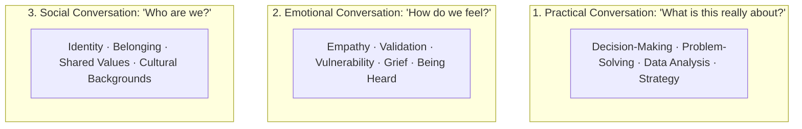
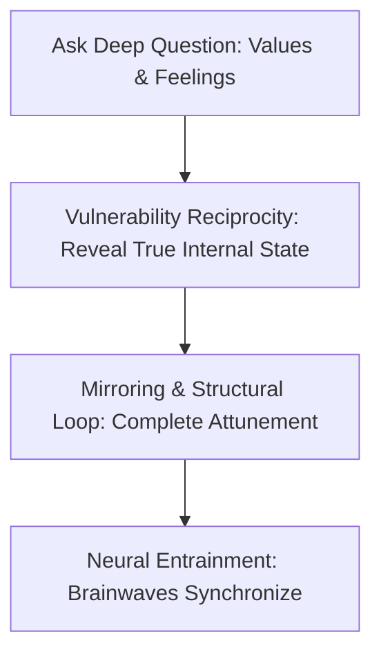
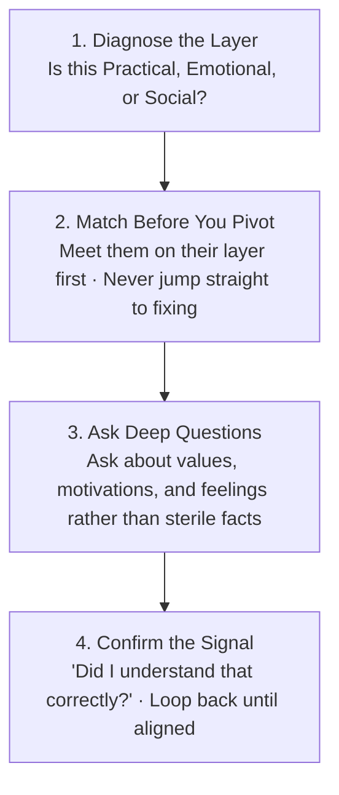

Most communication breakdowns in marriage, business, leadership, and friendship do not happen because people are inarticulate.

They happen because **two people are unknowingly having completely different types of conversations at the exact same time**.

For example, when a partner comes home exhausted and vents about a difficult colleague, and the other person immediately offers a logical 3-step action plan (*"You should just email HR and schedule a meeting"*), the conversation explodes into resentment. The problem was not the quality of the advice; the problem was a catastrophic mismatch of layers. One person was having an **Emotional Conversation**, while the other was operating in a **Practical Conversation**.

In modern cognitive science and conversation dynamics, **Supercommunicators are not naturally gifted extroverts; they are masters of the Matching Principle and Neural Entrainment**.

When you learn to diagnose the three hidden layers of dialogue, deploy deep value-based questions, and match your conversational frequency, you unlock effortless psychological safety and profound relational influence.

---

### The Three Layers of Human Dialogue

Every conversation on earth takes place on one of three distinct psychological planes:



---

### The Matching Principle: The Core Law of Connection

```mermaid
graph LR
    subgraph The Mismatch Catastrophe (Resentment)
        A1[Person A: Emotional Layer<br>'I feel overwhelmed and unseen'] 
        <-->|MISMATCH| B1[Person B: Practical Layer<br>'Here is a 3-step fix to optimize your schedule']
    end

    subgraph The Matching Resonance (Neural Coupling)
        A2[Person A: Emotional Layer<br>'I feel overwhelmed and unseen'] 
        <-->|MATCHED| B2[Person B: Emotional Layer<br>'That sounds exhausting—I am right here with you']
    end
```

* **The Law**: Connection occurs only when both participants are operating within the **same conversation layer**.
* **The Engineer's Trap**: High-agency, analytical individuals naturally default to the **Practical Layer** (fixing, optimizing, solving). When someone approaches them with an emotional burden, offering practical fixes feels invalidating—it communicates: *"Your feelings are an annoying inefficiency that needs a mechanical patch."*
* **The Golden Diagnostic Question**: When you are unsure which layer the other person needs, make the goal explicit:
  > *"Do you want me to help you brainstorm solutions, or do you just want me to listen and hold space?"*

---

### Neural Synchronization: The Science of "Clicking"

Brain-imaging research at Princeton University demonstrates that when two people experience a deep, effective conversation, their brain waves physically align—a biological phenomenon called **Neural Entrainment (Brain-to-Brain Coupling)**.



* **Shallow Questions vs. Deep Questions**:
  * *Shallow (Fact-Based)*: *"Where do you work?"* $\to$ Triggers pre-packaged, automatic social scripts.
  * *Deep (Value-Based)*: *"What was the hardest decision you made in your career?"* or *"What part of your craft brings you the most peace?"* $\to$ Forces the speaker to reflect on their beliefs, values, and feelings.
* **The Vulnerability Loop**: When one person takes a small emotional risk (admitting self-doubt or sharing a failure) and the other person meets it with acceptance and reciprocal vulnerability, neural coupling locks in.

---

### The Supercommunicator's Operating Heuristic



1. **Diagnose Before Responding**: Before speaking, ask yourself: *Is this person looking for an engineer (Practical), a partner/witness (Emotional), or a tribe (Social)?*
2. **Meet on Their Layer First**: Even if practical problem-solving is ultimately necessary, **you cannot move to the Practical Layer until the Emotional Layer is validated**. Validate their feelings first; once emotional safety is established, they will voluntarily ask for practical advice.
3. **Ask About Meaning, Not Details**: Instead of asking *"What happened next?"*, ask *"How did that experience change how you see yourself?"*

---

### The Core Takeaway to Remember
> Great communicators do not impose their frequency onto the room; they match the frequency of the human soul in front of them. Never offer an engineer's checklist to an aching heart. Diagnose the layer, match with genuine empathy, ask about values rather than facts, and let neural synchronization do the rest.
