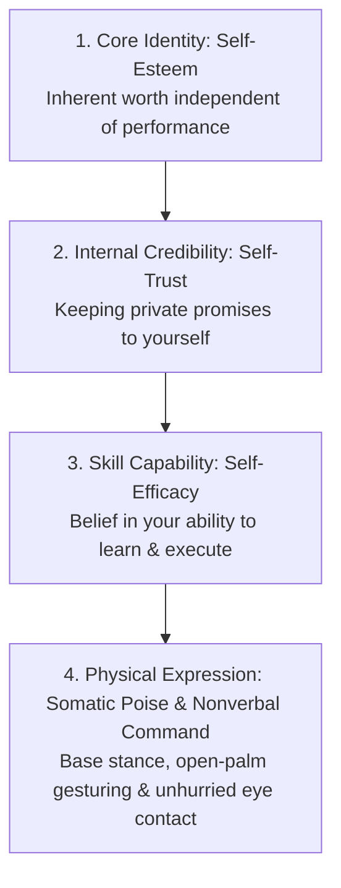
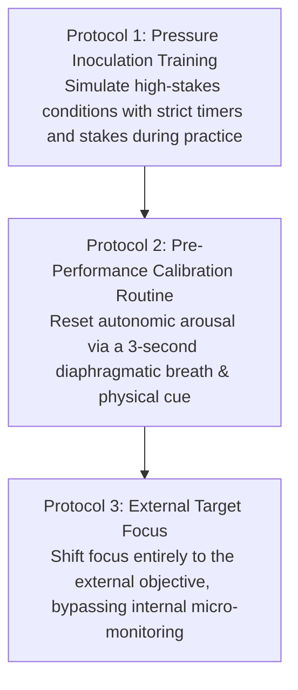
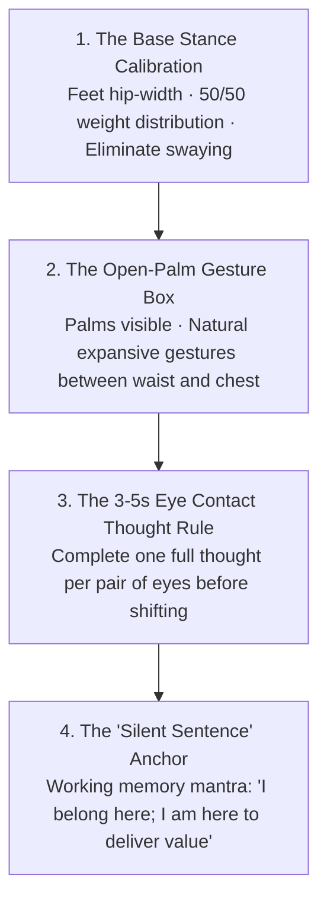
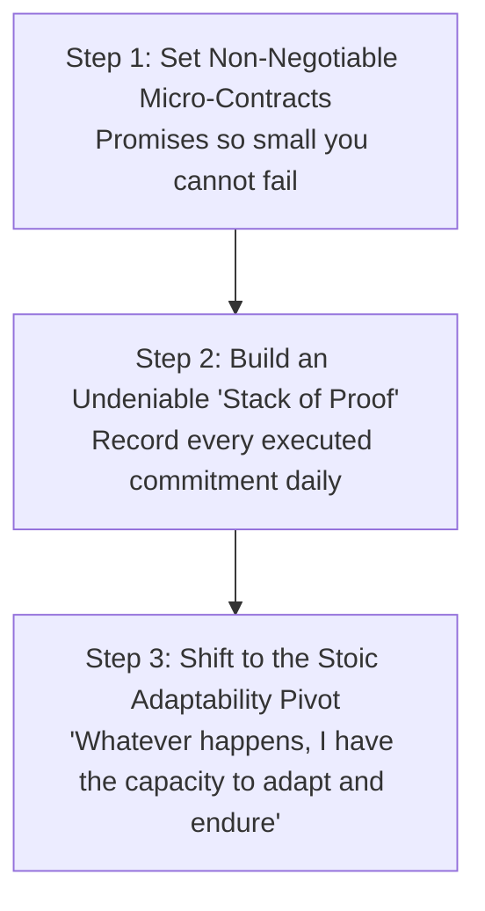

Confidence is one of the most misunderstood concepts in human psychology. Most people view confidence as a personality trait, an emotional state of fearlessness, or a feeling you must summon *before* attempting something difficult.

In cognitive science and empirical performance psychology, confidence is not a feeling; it is the **emergent result of a calibrated feedback loop between competence, self-trust, somatic poise, and evidence**.

True confidence is not the belief that you will never fail, freeze, or look foolish. It is the quiet, unshakeable internal conviction: **"Whatever happens, I have the capacity to handle it."**

---

### The Four Pillars of the Confident Self



1. **Self-Esteem (Inherent Worth)**: The fundamental belief that you possess value as a human being, completely detached from external accolades, status, or temporary setbacks.
2. **Self-Trust (Internal Credibility)**: The reputation you have with yourself. Every time you set an intention and keep it, self-trust compounds; every time you break a private promise, self-trust deteriorates.
3. **Self-Efficacy (Bandura’s Competence Metric)**: Your belief in your capacity to acquire skills, adapt to novel challenges, and master a specific domain through deliberate practice.
4. **Somatic Poise & Nonverbal Command**: The outward physical groundedness and biological poise displayed in real-time environments forged through deliberate nonverbal mechanics.

---

### The Neurobiology of Choking Under Pressure

Why do highly prepared students, athletes, and speakers suddenly freeze, stumble, or blank out during high-stakes moments? Performance psychology identifies two distinct neurological failure modes:

```mermaid
graph LR
    subgraph 1. Distraction Theory (Working Memory Hijack)
        D1[High-Stakes Stress & Fear of Failure]
        --> D2[Intrusive Worries: 'What if I fail?']
        --> D3[Consumes Prefrontal Working Memory (RAM)]
        --> D4[Zero Bandwidth Left for Problem Solving]
    end

    subgraph 2. Explicit Monitoring Theory (Micro-Management Freeze)
        M1[Acutely Anxious State]
        --> M2[Conscious Prefrontal Cortex Intervenes]
        --> M3[Micromanages Automated Subconscious Skills]
        --> M4[Disrupts Fluid Neural Execution & Flow]
    end
```

1. **Distraction Theory (Working Memory Hijack)**: When fear of outcome dominates your mind, intrusive self-doubts flood your working memory. Because your prefrontal cortex has limited cognitive bandwidth, these anxiety loops leave no computational space to solve the analytical problem in front of you.
2. **Explicit Monitoring Theory (The Paradox of Over-Analysis)**: Complex skills (speaking fluently, solving familiar math problems, playing an instrument) are stored in automated, subconscious neural circuits. Under extreme pressure, the panicked conscious mind tries to "step in" and manually micromanage every micro-step. This conscious intervention breaks the natural fluidity of the skill, resulting in a complete freeze.

---

### The Three Protocols for Flawless Execution Under Pressure



#### 1. Pressure Inoculation Training (Stress Simulation)
* The human nervous system chokes when it experiences a sudden spike in adrenaline it has never encountered in practice.
* **The Heuristic**: Never practice only in safe, relaxed environments. Inject artificial pressure into your daily drills: introduce a ticking timer, solve questions in public, or create small stakes for errors. This immunizes your nervous system against adrenaline shock.

#### 2. The Pre-Performance Calibrating Routine
* Before stepping into an exam hall, interview, or presentation, execute a fixed 5-second ritual:
  * One deep diaphragmatic inhale through the nose, followed by an extended physiological sigh.
  * Plant your feet firmly on the floor and engage your base stance.
  * This sends an immediate parasympathetic signal to the amygdala, halting cortisol flooding.

#### 3. External Target Focus (Holistic Outcome over Internal Mechanics)
* When you feel yourself starting to over-analyze your internal state (*"My heart is racing; is my voice trembling?"*), immediately redirect 100% of your attention to the **External Target**:
  * In an exam: Focus entirely on the exact text of the question.
  * In a speech: Focus entirely on whether the person in the front row understood your core point.
  * Shifting to an external focus prevents Explicit Monitoring from sabotaging your automated fluency.

---

### Somatic Poise & Stanford Nonverbal Command

When walking into a high-stakes environment, your autonomic nervous system often defaults to defensive micro-movements (shifting weight, pacing, hiding hands). Reprogram this state through **Stanford Somatic Mechanics**:



#### 1. The Base Stance Calibration
Stand with your feet directly under your hips, weight balanced 50/50. Raise both arms overhead to expand your ribcage, then let them fall naturally to your sides. This eliminates nervous swaying and communicates biological stability.

#### 2. The Open-Palm Gesture Matrix
The primitive human brain looks at hands first to verify safety. Keeping your palms open and visible signals biological transparency, honesty, and calm authority. Keep natural gestures between your waist and chest.

#### 3. The 3–5 Second Eye-Contact Thought Rule
Nervous speakers dart their eyes rapidly. Lock eye contact with one person, deliver **one full thought (3 to 5 seconds)**, pause, and then smoothly transition your gaze to another person for the next thought.

#### 4. The "Silent Sentence" Technique
Performance anxiety occurs when working memory is flooded with frantic thoughts (*"Do they like me? What if I stumble?"*). Overwrite this noise by loading a single **Silent Sentence** into your conscious awareness:
> *"I belong in this room. I am here to deliver clarity, not to perform for approval."*

---

### The Protocol for Building Undeniable Confidence



1. **The Micro-Contract Rule**: Never make a promise to yourself that you are not 100% committed to keeping. If you decide to read 5 pages or do 10 pushups, treat that commitment like an iron legal contract.
2. **Build a "Stack of Proof"**: Document your daily wins in a physical notebook. When imposter syndrome arises, do not rely on motivational hype—simply review the undeniable ledger of your executed work.
3. **The Core Stoic Shift**: Stop demanding that external circumstances be easy. Enter every challenge with the quiet posture: *"I do not need this to be easy; I only need to trust that whatever happens, I have the capacity to adapt, learn, and endure."*

---

### The Core Takeaway to Remember
> Confidence is not a feeling you wait for; it is the reputation you build with yourself through kept promises, paired with the poise of an unhurried body. Inoculate yourself against pressure, eliminate explicit micromanagement by focusing on the external target, and let your undeniable stack of proof speak for you.
