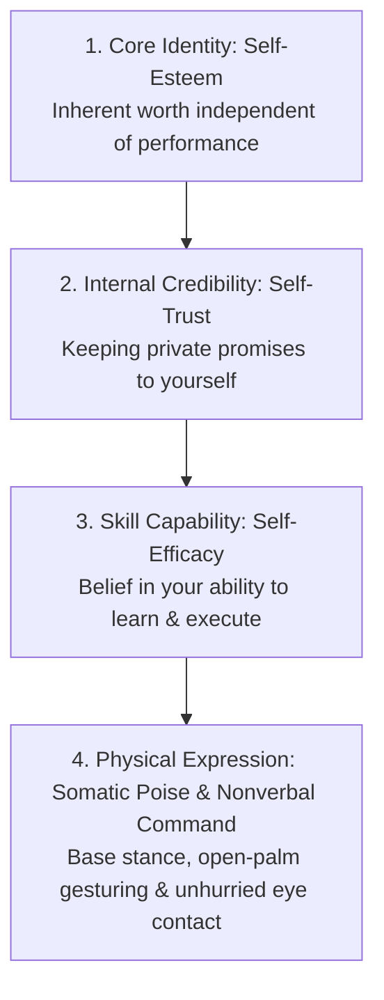
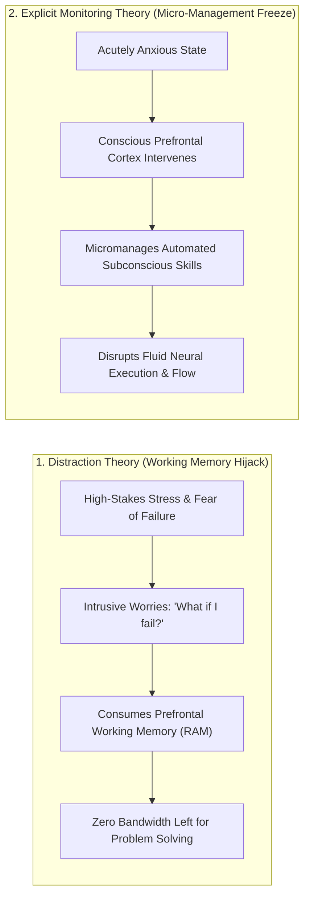
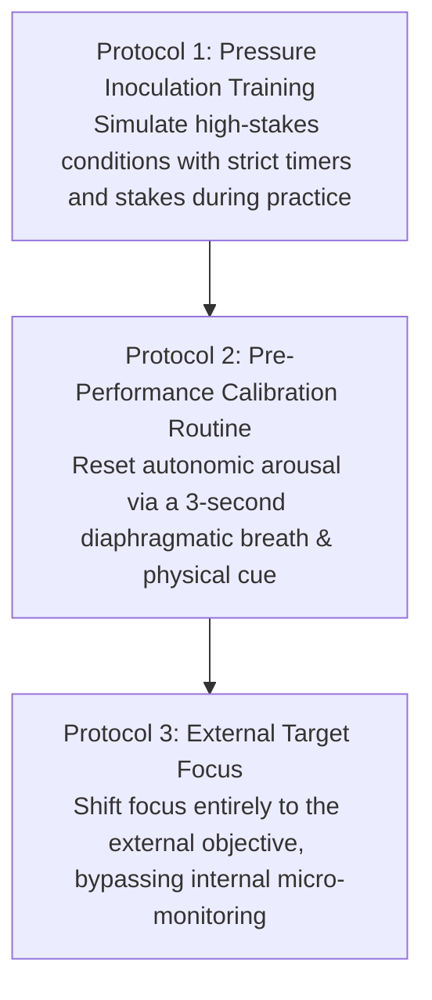
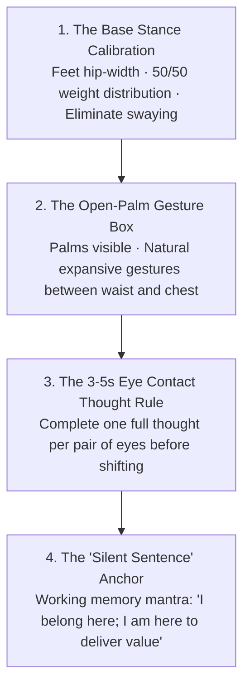
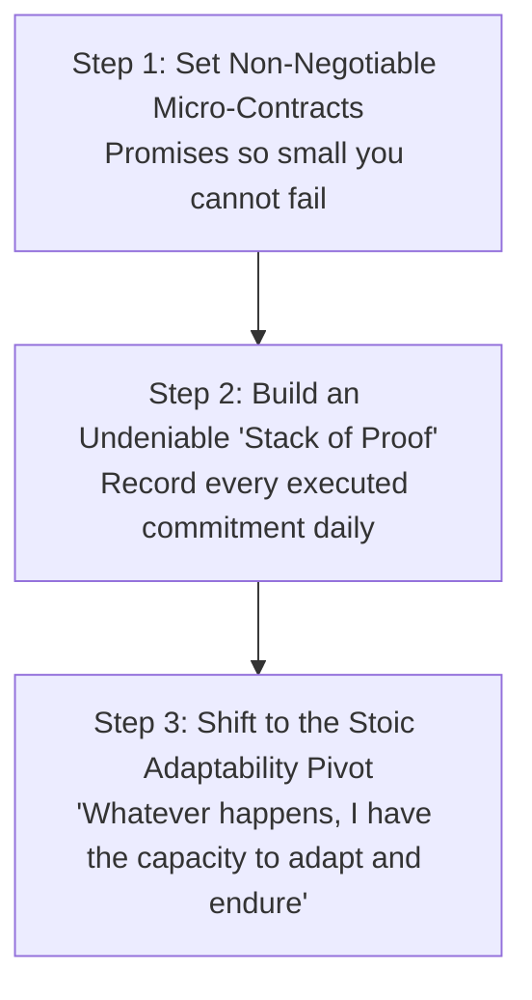
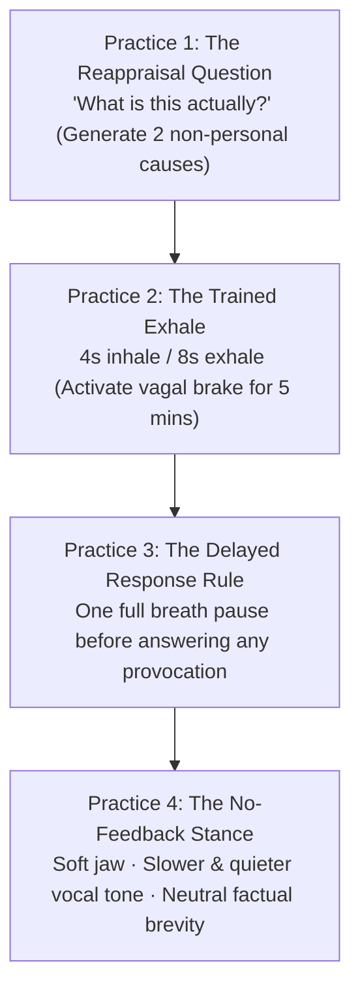

Confidence is one of the most misunderstood concepts in human psychology. Most people view confidence as a personality trait, an emotional state of fearlessness, or a feeling you must summon *before* attempting something difficult.

In cognitive science and empirical performance psychology, confidence is not a feeling; it is the **emergent result of a calibrated feedback loop between competence, self-trust, somatic poise, and evidence**.

True confidence is not the belief that you will never fail, freeze, or look foolish. It is the quiet, unshakeable internal conviction: **"Whatever happens, I have the capacity to handle it."**

---

### The Four Pillars of the Confident Self

1. **Self-Esteem (Inherent Worth)**: The fundamental belief that you possess value as a human being, completely detached from external accolades, status, or temporary setbacks.
2. **Self-Trust (Internal Credibility)**: The reputation you have with yourself. Every time you set an intention and keep it, self-trust compounds; every time you break a private promise, self-trust deteriorates.
3. **Self-Efficacy (Bandura’s Competence Metric)**: Your belief in your capacity to acquire skills, adapt to novel challenges, and master a specific domain through deliberate practice.
4. **Somatic Poise & Nonverbal Command**: The outward physical groundedness and biological poise displayed in real-time environments forged through deliberate nonverbal mechanics.

---

### The Neurobiology of Choking Under Pressure

Why do highly prepared students, athletes, and speakers suddenly freeze, stumble, or blank out during high-stakes moments? Performance psychology identifies two distinct neurological failure modes:

1. **Distraction Theory (Working Memory Hijack)**: When fear of outcome dominates your mind, intrusive self-doubts flood your working memory. Because your prefrontal cortex has limited cognitive bandwidth, these anxiety loops leave no computational space to solve the analytical problem in front of you.
2. **Explicit Monitoring Theory (The Paradox of Over-Analysis)**: Complex skills (speaking fluently, solving familiar math problems, playing an instrument) are stored in automated, subconscious neural circuits. Under extreme pressure, the panicked conscious mind tries to "step in" and manually micromanage every micro-step. This conscious intervention breaks the natural fluidity of the skill, resulting in a complete freeze.

---

### The Three Protocols for Flawless Execution Under Pressure

#### 1. Pressure Inoculation Training (Stress Simulation)
* The human nervous system chokes when it experiences a sudden spike in adrenaline it has never encountered in practice.
* **The Heuristic**: Never practice only in safe, relaxed environments. Inject artificial pressure into your daily drills: introduce a ticking timer, solve questions in public, or create small stakes for errors. This immunizes your nervous system against adrenaline shock.

#### 2. The Pre-Performance Calibrating Routine
* Before stepping into an exam hall, interview, or presentation, execute a fixed 5-second ritual:
  * One deep diaphragmatic inhale through the nose, followed by an extended physiological sigh.
  * Plant your feet firmly on the floor and engage your base stance.
  * This sends an immediate parasympathetic signal to the amygdala, halting cortisol flooding.

#### 3. External Target Focus (Holistic Outcome over Internal Mechanics)
* When you feel yourself starting to over-analyze your internal state (*"My heart is racing; is my voice trembling?"*), immediately redirect 100% of your attention to the **External Target**:
  * In an exam: Focus entirely on the exact text of the question.
  * In a speech: Focus entirely on whether the person in the front row understood your core point.
  * Shifting to an external focus prevents Explicit Monitoring from sabotaging your automated fluency.

---

### Somatic Poise & Stanford Nonverbal Command

When walking into a high-stakes environment, your autonomic nervous system often defaults to defensive micro-movements (shifting weight, pacing, hiding hands). Reprogram this state through **Stanford Somatic Mechanics**:

#### 1. The Base Stance Calibration
Stand with your feet directly under your hips, weight balanced 50/50. Raise both arms overhead to expand your ribcage, then let them fall naturally to your sides. This eliminates nervous swaying and communicates biological stability.

#### 2. The Open-Palm Gesture Matrix
The primitive human brain looks at hands first to verify safety. Keeping your palms open and visible signals biological transparency, honesty, and calm authority. Keep natural gestures between your waist and chest.

#### 3. The 3–5 Second Eye-Contact Thought Rule
Nervous speakers dart their eyes rapidly. Lock eye contact with one person, deliver **one full thought (3 to 5 seconds)**, pause, and then smoothly transition your gaze to another person for the next thought.

#### 4. The "Silent Sentence" Technique
Performance anxiety occurs when working memory is flooded with frantic thoughts (*"Do they like me? What if I stumble?"*). Overwrite this noise by loading a single **Silent Sentence** into your conscious awareness:
> *"I belong in this room. I am here to deliver clarity, not to perform for approval."*

---

### The Protocol for Building Undeniable Confidence

1. **The Micro-Contract Rule**: Never make a promise to yourself that you are not 100% committed to keeping. If you decide to read 5 pages or do 10 pushups, treat that commitment like an iron legal contract.
2. **Build a "Stack of Proof"**: Document your daily wins in a physical notebook. When imposter syndrome arises, do not rely on motivational hype—simply review the undeniable ledger of your executed work.
3. **The Core Stoic Shift**: Stop demanding that external circumstances be easy. Enter every challenge with the quiet posture: *"I do not need this to be easy; I only need to trust that whatever happens, I have the capacity to adapt, learn, and endure."*

---

## 🏛️ Tier 1: The Jargon-Free Reality Bridge (Plain English Hook)
*Target: An intelligent 25-year-old educated graduate entering high-stakes workplace or social environments.*

- **The Core Translation**: True composure is not biting your lip, freezing your face into a blank stare, and pretending you do not care while your heart hammers at 140 BPM. That is **fake calm** (suppression)—and people around you can smell it instantly. Real composure means you do not get hijacked in the first place because you process the situation differently before your body panics (*cognitive reappraisal*). Provocative colleagues, demanding bosses, or manipulative individuals throw bait specifically to watch you flinch, over-explain, or apologize. When you remain genuinely, biologically calm, you deny them the steering wheel. Your quiet presence unnerves them because their standard tactics produce zero traction.
- **Everyday Analogy**: Think of a martial artist facing an aggressive, lunging opponent. If the martial artist clenches every muscle in rigid panic, a simple shove knocks them down. But if the martial artist steps lightly off the attack vector, the attacker’s own momentum carries them stumbling forward into empty space. Genuine composure is emotional aikido: when someone throws an insult or creates artificial urgency, you simply refuse to provide a wall for them to push against.
- **Why This Matters Today**: In corporate meeting rooms, high-stakes negotiations, and modern online discourse, reactive people dominate those who display emotional vulnerability or nervous defensiveness. Unshakeable composure is the ultimate asymmetric power advantage: the person who controls their nervous system controls the room.

---

## 🔬 Tier 2: Modern Cognitive Science & Neurobiology Correlate
*Target: Grounding composure in empirical clinical psychology and autonomic neuroscience.*

- **Cognitive Reappraisal vs. Expressive Suppression (Stanford Emotion Regulation)**: Dr. James Gross's landmark emotion regulation framework establishes that emotional responses unfold sequentially over time:
  $$\text{Situation} \longrightarrow \text{Attention} \longrightarrow \text{Appraisal} \longrightarrow \text{Response}$$
  * **Upstream Reappraisal**: Changing how you interpret a stimulus *before* the amygdala fires. This requires negligible cognitive effort and produces zero autonomic strain.
  * **Downstream Suppression**: Allowing the threat appraisal to ignite sympathetic arousal, then expending heavy prefrontal glucose to manually mask facial expressions and tremors.
- **The Social Cost of Fake Calm (Butler et al., 2003)**: In a clinical experiment, pairs of participants discussed distressing topics while one was instructed to suppress emotional expression. The results were startling: suppression did not fool the partner. Instead, the partner's **arterial blood pressure spiked dramatically**, and feelings of rapport, warmth, and trust collapsed. Subconscious mirror neuron systems detect micro-tensions, lack of vocal prosody, and respiratory stiffness as covert hostility, triggering collective physiological alarm.
- **Neurovisceral Integration & The Vagal Brake (Thayer & Lane)**: Composure is biologically indexed by **Heart Rate Variability (HRV)**. The prefrontal cortex regulates cardiac rhythm via the vagus nerve (the "vagal brake"). When vagal tone is high, the vagal brake slows the sinoatrial node, maintaining mental clarity under evaluative stress. When threat triggers sympathetic activation, releasing the vagal brake causes tachycardia and tunnel vision.

---

## ⚖️ Tier 3: The Skeptic’s Razor & Failure Mode Guardrails
*Target: Inoculating against psychopathic emotional numbness, toxic passivity, and disassociation.*

- **The "Sociopathic Stone" Fallacy**: Real composure is not psychopathic detachment, callous apathy, or cold contempt. Sitting with dead eyes while someone shares genuine grief or asks for urgent operational help is not composure; it is antisocial dysfunction. Composure is physiological self-command in service of constructive action, not an emotional lobotomy.
- **The Dangerous Inaction Trap**: Composure must never be used as an excuse for cowardice. Remaining calm while your boundaries are repeatedly violated, contracts are broken, or an enterprise is burning is failure. True composure gives you the calm clarity to draw lethal boundaries and enforce accountability with surgical precision and zero emotional screaming.
- **Biological Limits of Exhaustion**: You cannot "reappraise" your way through chronic sleep deprivation, clinical burnout, or severe chemical imbalance. When glycogen and neurotransmitters are depleted, prefrontal top-down regulation collapses. Baseline biological restoration (sleep, nutrition, sunlight) is the non-negotiable substrate of psychological composure.

---

## ⚡ Tier 4: The 24-Hour Behavioral Protocol ("The Homework")
*Target: The Four Evidence-Based Practices to Execute Daily.*

1. **Practice 1: The Reappraisal Question (Upstream Cognitive Pivot)**
   - *Action*: When insulted, slighted, or challenged in a meeting, instantly intercept the automatic subconscious inquiry: *"What does this mean about me?"*
   - *Execution*: Replace it with the clinical question: *"What is this actually?"* Force your prefrontal cortex to generate two alternative explanations that have zero to do with your worth (e.g., *"This person is terrified their budget will be cut,"* or *"They are experiencing intense status insecurity"*). This immediately disarms the amygdala threat cascade.
2. **Practice 2: The Trained Exhale (Manually Engaging the Vagal Brake)**
   - *Action*: Spend 5 minutes every morning and 60 seconds before high-stakes confrontations training your parasympathetic brake.
   - *Execution*: Inhale diaphragmatically through your nose for 4 seconds, then exhale slowly through pursed lips for 8 seconds. Prolonging the exhalation increases intrathoracic pressure, signaling baroreceptors to stimulate the vagus nerve and mechanically decelerate your heart rate.
3. **Practice 3: The Delayed Response Rule (Breaking the Urgency Trap)**
   - *Action*: Institute an ironclad interpersonal boundary: never reply immediately when someone speaks with urgency, hostility, or passive-aggression.
   - *Execution*: When the other person finishes speaking, wait exactly **one full, unhurried breath (2 to 3 seconds)** before uttering a single syllable. Maintain soft, neutral eye contact. This brief silence breaks conversational momentum, forces their mirror neurons to register your groundedness, and gives your executive faculties time to select the most strategic response.
4. **Practice 4: The No-Feedback Stance (Denying the Signal)**
   - *Action*: When someone attempts to bait you or escalate drama.
   - *Execution*: Intentionally unclamp your teeth and drop your jaw slightly (relieving masseter muscle tension). As the provoker becomes louder and faster, deliberately make your voice **quieter, lower in pitch, and noticeably slower**. Respond only with brief, objective facts without defensive justification: *"I understand your position. The report will be completed by 4 PM."* They will run out of fuel because there is no friction to burn.

---

### The Core Takeaway to Remember
> Confidence and composure are not feelings you wait for; they are the emergent result of upstream cognitive reappraisal, neurovisceral regulation via the vagal brake, and an unhurried, grounded body. Inoculate yourself against pressure, eliminate fake suppression that spikes social tension, deny the feedback loop provokers steer by, and let your quiet, undeniable presence command the room.
