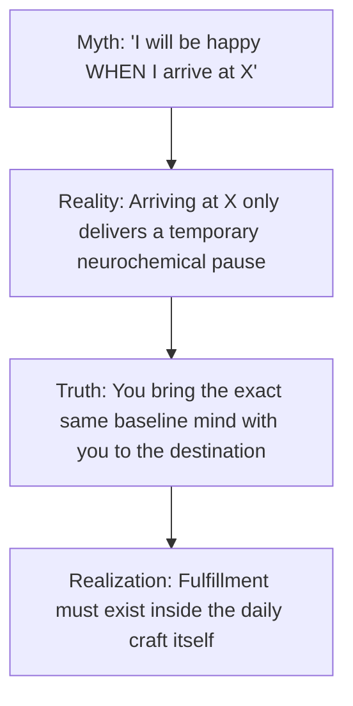
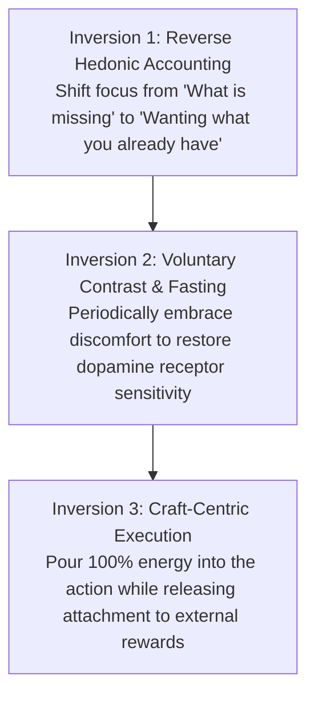

The dominant promise of modern culture is that happiness is an **outcome of future attainment**: *Once I clear this exam, earn this salary, buy this home, or gain this status, I will finally experience lasting peace and fulfillment.*

In empirical psychology and neuroscience, this belief is known as the **Arrival Fallacy**.

Human neurochemistry is not designed for permanent baseline happiness following an achievement. The moment an external goal is reached, the brain's baseline rapidly resets through **Hedonic Adaptation**, returning you to your prior level of emotional unrest and demanding the next hit of dopamine pursuit.

True, durable fulfillment is not created by ceaselessly inflating your external attainments; it is created by **mathematically and philosophically mastering the dynamics of desire**.

---

### The Hedonic Treadmill Mechanics

1. **The Biological Baseline Reset**: Evolutionary biology designed dopamine to motivate survival and resource acquisition, not to foster permanent contentment. If an achievement made an organism permanently content, it would cease seeking food or defending itself.
2. **The Habituation Trap**: Within weeks of reaching any major life milestone, your brain normalizes the new reality. What once felt like a miraculous luxury becomes your taken-for-granted minimum standard.

---

### The Satisfaction Equation

To understand why high achievers frequently suffer from acute emptiness, examine the mathematical model of satisfaction:

$$\text{Satisfaction} = \frac{\text{What You Have}}{\text{What You Want}}$$

* **The Consumer Treadmill**: Society teaches you to focus 100% of your energy on expanding the **numerator** (*What You Have*). However, as the numerator grows, unexamined social comparison and lifestyle inflation cause the **denominator** (*What You Want*) to expand at double the pace, resulting in a net decrease in satisfaction.
* **The Asymmetric Lever**: The greatest leverage in human happiness is not earning 10x more; it is learning to **rigorously manage, shrink, and discipline the denominator**.

---

### The Anatomy of the Arrival Fallacy

The **Arrival Fallacy** is the cognitive illusion that reaching a destination will deliver permanent bliss.

* **The Mind Stays the Same**: When you achieve a long-sought goal, you do not transform into a new human being. You are the exact same person, with the same internal patterns, now standing in a slightly different environment.
* **The Transience of Results**: An exam result or job offer is an event that lasts a single second. The process of studying, building, and living is what you experience for 16 hours every day. If the process brings misery, the outcome cannot redeem it.

---

### The Three Inversions for Unshakeable Fulfillment

To step off the hedonic treadmill and anchor yourself in deep, sustainable fulfillment:

#### 1. Reverse Hedonic Accounting (Wanting What You Have)
Instead of compiling mental wish-lists of what is absent, practice deliberate cognitive subtraction: imagine what your life would look like if you suddenly lost what you currently take for granted (your health, basic shelter, freedom, cognitive faculties). Gratitude is not sentimentality; it is the deliberate maintenance of high perceptual contrast.

#### 2. Voluntary Discomfort (Resetting Hedonic Sensitivity)
When you surround yourself with constant air conditioning, soft beds, instant food delivery, and digital entertainment, your baseline becomes numb. Periodic physical fasting, cold showers, strenuous workouts, and device-free silence restore your nervous system's sensitivity, making simple daily reality feel extraordinarily rich.

#### 3. Shift from Outcome-Obsession to Craft Stewardship
Perform your work with fierce excellence because the work itself is worthy of your discipline, not because you need applause, status, or validation to validate your worth.

---

### The Core Takeaway to Remember

> Lasting fulfillment is never found at the finish line; it is found in mastering the desire for the finish line. Shrink your wants, embrace the daily craft, and recognize that the peace you are chasing in the future is only accessible in the present moment.
