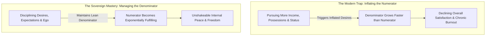
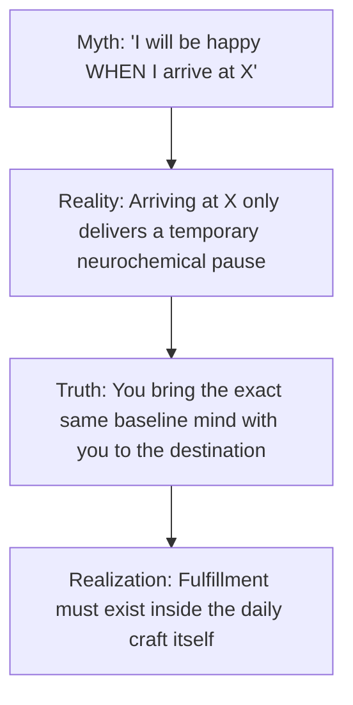
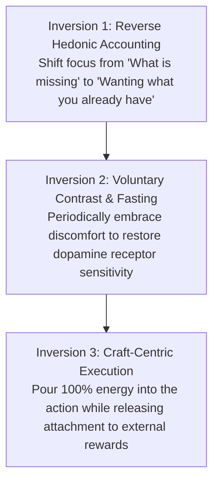
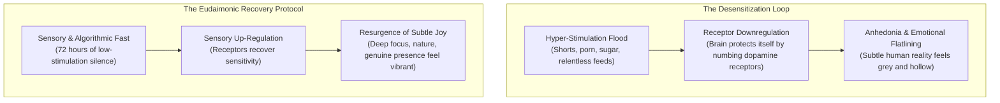
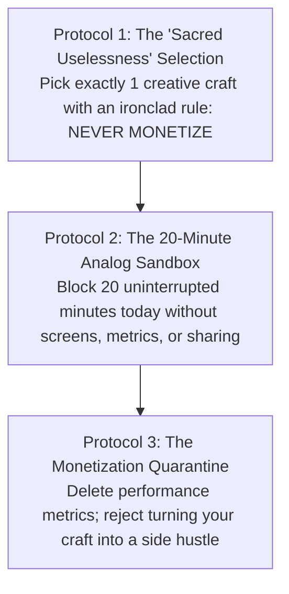
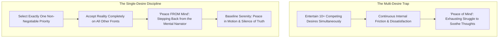

The dominant promise of modern culture is that happiness is an **outcome of future attainment**: *Once I clear this exam, earn this salary, buy this home, or gain this status, I will finally experience lasting peace and fulfillment.*

In empirical psychology and neuroscience, this belief is known as the **Arrival Fallacy**.

Human neurochemistry is not designed for permanent baseline happiness following an achievement. The moment an external goal is reached, the brain's baseline rapidly resets through **Hedonic Adaptation**, returning you to your prior level of emotional unrest and demanding the next hit of dopamine pursuit.

True, durable fulfillment is not created by ceaselessly inflating your external attainments; it is created by **mathematically and philosophically mastering the dynamics of desire**.

---

### The Hedonic Treadmill Mechanics

1. **The Biological Baseline Reset**: Evolutionary biology designed dopamine to motivate survival and resource acquisition, not to foster permanent contentment. If an achievement made an organism permanently content, it would cease seeking food or defending itself.
2. **The Habituation Trap**: Within weeks of reaching any major life milestone, your brain normalizes the new reality. What once felt like a miraculous luxury becomes your taken-for-granted minimum standard.

---

### The Satisfaction Equation

To understand why high achievers frequently suffer from acute emptiness, examine the mathematical model of satisfaction:

$$\text{Satisfaction} = \frac{\text{What You Have}}{\text{What You Want}}$$

* **The Consumer Treadmill**: Society teaches you to focus 100% of your energy on expanding the **numerator** (*What You Have*). However, as the numerator grows, unexamined social comparison and lifestyle inflation cause the **denominator** (*What You Want*) to expand at double the pace, resulting in a net decrease in satisfaction.
* **The Asymmetric Lever**: The greatest leverage in human happiness is not earning 10x more; it is learning to **rigorously manage, shrink, and discipline the denominator**.

---

### The Anatomy of the Arrival Fallacy

The **Arrival Fallacy** is the cognitive illusion that reaching a destination will deliver permanent bliss.

* **The Mind Stays the Same**: When you achieve a long-sought goal, you do not transform into a new human being. You are the exact same person, with the same internal patterns, now standing in a slightly different environment.
* **The Transience of Results**: An exam result or job offer is an event that lasts a single second. The process of studying, building, and living is what you experience for 16 hours every day. If the process brings misery, the outcome cannot redeem it.

---

### The Three Inversions for Unshakeable Fulfillment

To step off the hedonic treadmill and anchor yourself in deep, sustainable fulfillment:

#### 1. Reverse Hedonic Accounting (Wanting What You Have)
Instead of compiling mental wish-lists of what is absent, practice deliberate cognitive subtraction: imagine what your life would look like if you suddenly lost what you currently take for granted (your health, basic shelter, freedom, cognitive faculties). Gratitude is not sentimentality; it is the deliberate maintenance of high perceptual contrast.

#### 2. Voluntary Discomfort (Resetting Hedonic Sensitivity)
When you surround yourself with constant air conditioning, soft beds, instant food delivery, and digital entertainment, your baseline becomes numb. Periodic physical fasting, cold showers, strenuous workouts, and device-free silence restore your nervous system's sensitivity, making simple daily reality feel extraordinarily rich.

#### 3. Shift from Outcome-Obsession to Craft Stewardship
Perform your work with fierce excellence because the work itself is worthy of your discipline, not because you need applause, status, or validation to validate your worth.

#### 4. Reversing Emotional Blunting (Anhedonia) & The Eudaimonic Reset
A pervasive symptom of hyper-digitalized existence is feeling **emotionally numb**: an inability to feel joy, excitement, or deep sorrow. Individuals mistake this for clinical deficiency or existential nihilism:

1. **Protective Downregulation**: Emotional blunting is the brain's defense mechanism. When assaulted with unnatural spikes of supernormal stimuli, the synapse pulls receptors inward to prevent neurotoxic burnout. The consequence is that ordinary life feels completely flat.
2. **The Eudaimonic Transition**: Hedonic happiness relies on external spikes (buying things, applause, dopamine hits). Eudaimonic well-being emerges from living in alignment with purpose, virtue, and deep engagement. By executing an intentional low-stimulation reset, the threshold of perception drops, and deep emotional richness returns naturally.

---

## 🏛️ Tier 1: The Jargon-Free Reality Bridge (Plain English Hook)
*Target: An intelligent 25-year-old educated graduate experiencing the existential grind of adult life.*

- **The Core Translation**: Remember when you were 12, and you could spend four unbroken hours building a Lego castle, sketching comic books, or playing an instrument without ever thinking: *"How do I put this on LinkedIn? How do I monetize this into a side hustle?"* You did it simply because the act itself was joyful. In adult life, two catastrophic distortions occur: **Hobby Attrition** (dropping every non-essential interest because work and exhaustion consume all your cognitive bandwidth) and **The Monetization Poisoning of Leisure** (feeling guilty for doing anything that does not generate revenue or career leverage). When you reduce your entire existence to functional utility—work, sleep, chores, doomscrolling—your identity flattens into a two-dimensional economic unit. You lose the very spark that makes life worth living.
- **Everyday Analogy**: Think of your life as an operating system running on a smartphone. Most adults treat hobbies like "bloatware apps" to be uninstalled to save battery for the "real work" (career spreadsheets and emails). Eventually, the phone only has work apps installed. It is efficient, but nobody wants to use it; it has become a grey corporate terminal. A non-monetized hobby is the color graphics processor: without it, the machine runs, but life has zero resolution.
- **Why This Matters Today**: In the creator economy and gig economy, hustle culture demands that every passionate pursuit be converted into an audience, a portfolio, or a subscription. This destroys intrinsic play. Protecting 1 to 2 completely useless, unmonetized creative pursuits is the ultimate act of psychological resistance against the hedonic treadmill.

---

## 🔬 Tier 2: Modern Cognitive Science & Behavioral Economics Correlate
*Target: Grounding the hedonic treadmill and adult play in empirical neuroscience and psychology.*

- **The Overjustification Effect & Intrinsic Motivation (Deci & Ryan, Self-Determination Theory)**: Behavioral economics and psychology prove that introducing extrinsic rewards (money, social media metrics, status) to an activity previously driven by intrinsic curiosity permanently erodes intrinsic motivation. When you begin monetizing a craft, the brain reclassifies it from *play* (autonomic restoration, low cortisol, high dopamine exploration) to *labor* (evaluative anxiety, external scrutiny, goal-directed pressure).
- **Default Mode Network (DMN) & Open-Loop Recovery**: Engaging in an immersive, non-instrumental hobby (gardening, woodworking, playing guitar, model painting) shifts neural recruitment away from the task-positive central executive network (CEN) into transient alpha-wave states. This biological state of "autotelic flow" (Csikszentmihalyi) restores depleted prefrontal neurotransmitter reserves far more effectively than passive screen consumption (Netflix, scrolling).
- **The Finite Bandwidth of Adulthood**: Working memory and executive attention are finite metabolic resources. Research in cognitive load theory demonstrates that adults cannot realistically sustain more than 2 to 3 high-engagement expressive channels alongside full-time vocational responsibilities. Attempting to maintain 10 disparate hobbies guarantees superficial failure; intentionally selecting and fiercely protecting 1 or 2 deep practices ensures long-term psychological equilibrium.

---

## ⚖️ Tier 3: The Skeptic’s Razor & Failure Mode Guardrails
*Target: Inoculating against romantic self-indulgence, practical escapism, and financial neglect.*

- **The Peter Pan Escapism Trap**: Hobbies are restorative sanctuaries, not substitutes for building economic sovereignty. Spending 30 hours a week painting miniatures while your rent is overdue and your professional skills atrophy is not "reclaiming play"; it is childish escapism. True self-sovereignty requires securing your baseline material responsibilities first, so your hobbies remain pure, unburdened play rather than a desperate flight from reality.
- **The Gear-Acquisition Syndrome (GAS) Fallacy**: The consumer hedonic treadmill frequently colonizes hobbies before you even practice them. Beginners spend \$2,000 on high-end cameras, guitar pedals, or cycling gear under the illusion that buying the equipment equals practicing the craft. This is retail dopamine masquerading as mastery. Keep your toolset minimal; let your skill outgrow your gear.
- **The Perfectionism Freeze**: Because adults are accustomed to competence in their day jobs, they feel acute humiliation when they are clumsy beginners at a new hobby (drawing poorly, playing wrong chords). Expecting immediate mastery ruins play. A hobby is the one arena where you have complete permission to be mediocre and thoroughly enjoy it.

---

## ⚡ Tier 4: The 24-Hour Behavioral Protocol ("The Homework")
*Target: Three concrete, measurable practices to reclaim non-instrumental play within 24 hours.*

1. **Protocol 1: The "Sacred Uselessness" Selection (10 Minutes Tonight)**
   - *Action*: Identify the single activity you loved between ages 8 and 16 (sketching, playing chess, coding text games, playing an instrument, gardening, building models).
   - *Execution*: Select exactly one practice. Sign an ironclad mental covenant: *"I will never seek to monetize this, build an audience around this, or post it for external validation. This belongs exclusively to my soul."*
2. **Protocol 2: The 20-Minute Analog Sandbox (Daily Micro-Session)**
   - *Action*: Carve out 20 minutes before bedtime or during lunch.
   - *Execution*: Turn off your phone and Wi-Fi. Engage directly with physical, analog tools (pencils, instruments, books, soil). Do not measure output, word counts, or speed. Immerse yourself completely in the sensory friction of the craft for 20 minutes and stop without reviewing your work.
3. **Protocol 3: The Monetization Quarantine Audit (Immediate Boundary)**
   - *Action*: Whenever someone praises your hobby and says, *"You're so good at this, you should sell these / start a YouTube channel / turn this into a business!"*
   - *Execution*: Practice the definitive polite refusal: *"Thank you, but I love this too much to turn it into work. Some things are meant to be lived, not sold."*

---

### The Naval Ravikant Happiness Axioms: Peace From Mind & The Desire Contract

In his seminal discourse on happiness, Naval Ravikant reframes contentment not as an external trophy or genetic accident, but as a **highly trainable cognitive skill**:

1. **Desire Is a Contract to Be Unhappy**: A desire is a psychological agreement you sign: *"I agree to be discontented until I get X."* The error most ambitious people make is maintaining thirty simultaneous contracts at once (promotions, fitness metrics, social status, romantic outcomes, material luxuries). Entertaining thirty contracts guarantees 29 active sources of suffering at any moment. **Keep only one active desire at a time**, and surrender the rest to reality.
2. **Happiness Is Peace in Motion; Peace Is Happiness at Rest**: Society confuses happiness with excitement or euphoric dopamine rushes. High-arousal excitement is expensive to maintain and crashes into emotional exhaustion. True happiness is nothing more than your biological baseline when you eliminate the friction of wanting things to be different than they are. When sitting quietly, that state is peace; when moving through work and life, that state manifests as effortless joy.
3. **Peace *From* Mind (Not Peace *Of* Mind)**: Most psychological approaches attempt to give people "peace of mind"—teaching them how to dispute irrational thoughts, argue with anxieties, and produce calming positive thoughts. Naval points out that this is fighting fire with gasoline. The ultimate liberation is **peace from mind**: recognizing that you are the conscious space in which thoughts appear, not the thoughts themselves. When you stop taking the narrator inside your head seriously, its power dissolves.
4. **The Silence of Truth**: The closer you get to objective truth, the quieter your mind becomes. Internal chatter, anxiety, and obsessive debates are symptoms of friction between your delusions and reality. When you see reality clearly as it actually is, there is nothing left to argue about, and deep silence naturally ensues.
5. **The Modern Struggle: Fighting Weaponized Addiction**: Happiness without basic material comfort is playing life on hard mode; financial solvency eliminates survival panic. But once material comfort is achieved, the primary enemy of happiness is **weaponized addiction**. Modern civilization employs thousands of engineers to weaponize sugar, social feeds, outrage, video games, and porn. Breaking these addictions and reclaiming your attention baseline is seen as antisocial, but it is the non-negotiable prerequisite for mental peace.

---

### The Core Takeaway to Remember

> Lasting fulfillment is never found at the finish line; it is found in mastering the desire for the finish line. Shrink your wants, embrace the daily craft, protect your right to unmonetized play, and recognize that the peace you are chasing in the future is only accessible in the present moment.
