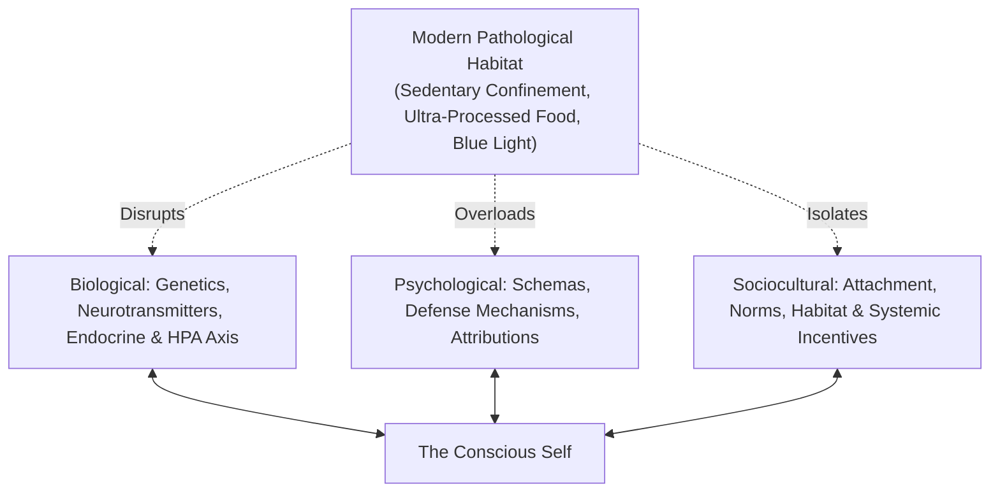
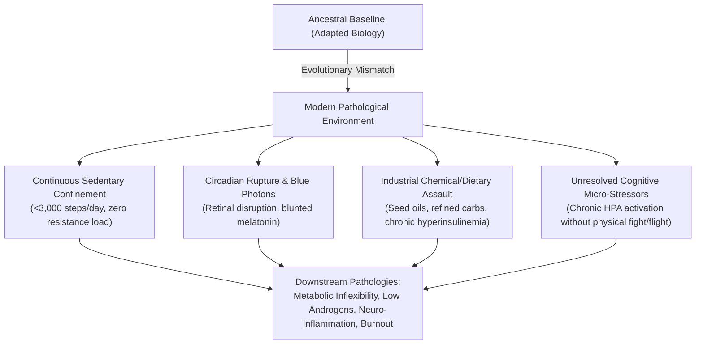
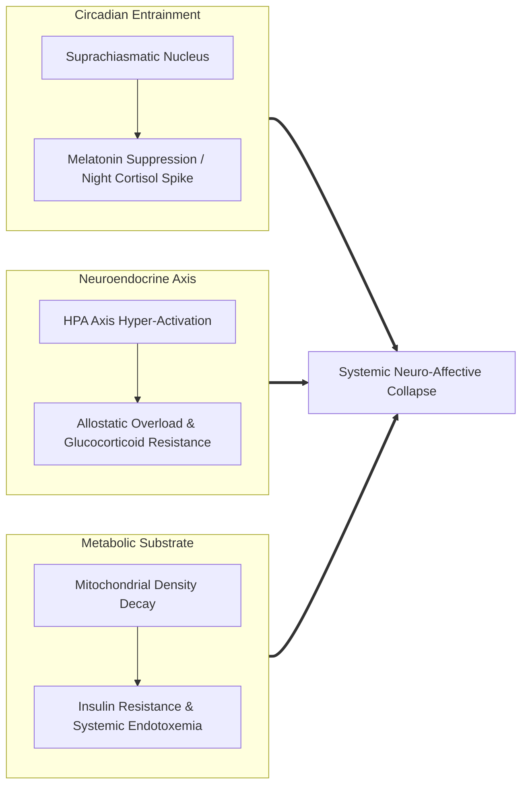
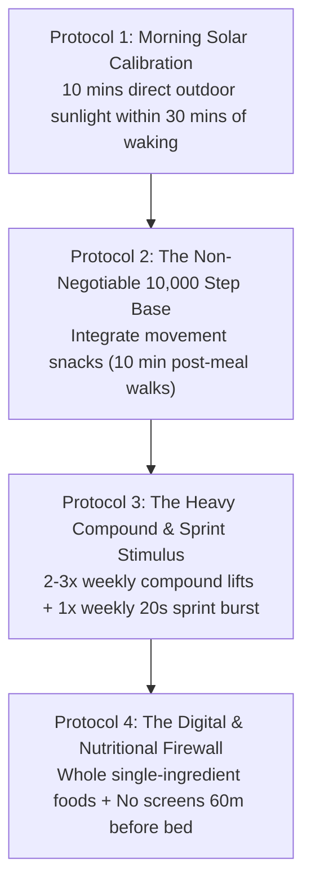

The human mind is an embodied, socially embedded, and biologically anchored prediction engine:

---

### The Foundational Psychological & Biological Engines

#### 1. Neural Circuitry & Executive Control
The prefrontal cortex (PFC) acts as the biological seat of impulse regulation and long-term planning, in constant tension with the amygdala (salience and fear conditioning) and the nucleus accumbens (reward expectation). When physical health and sleep decline, top-down prefrontal executive function degrades first, surrendering control to limbic reactivity.

#### 2. Cognitive Schemas & Biases
* **Fundamental Attribution Error (FAE)**: We attribute others' failures to character defects, while attributing our own failures to external circumstances.
* **Cognitive Dissonance (Festinger)**: Psychological discomfort arising when behavior clashes with self-image. Humans naturally alter their rationalizations rather than change behavior.

#### 3. Attachment Architecture (Bowlby & Ainsworth)
Early relational interactions form internalized cognitive models:
* *Secure*: High trust, comfortable with vulnerability and autonomy.
* *Anxious-Preoccupied*: Hyper-vigilance to abandonment, compulsive seeking of reassurance.
* *Dismissive-Avoidant*: Compulsive self-reliance, suppressing emotional needs under stress.

#### 4. The Big Five OCEAN Model
The gold-standard empirical model of personality variation: Openness, Conscientiousness, Extraversion, Agreeableness, and Neuroticism.

---

### The Clinical Diagnosis: Modern Life as an Evolutionary Mismatch

As emergency medicine physician Dr. Seth Capehart MD emphasizes, millions of adults in their 30s and 40s present with a uniform constellation of symptoms: chronic mid-day brain fog, unexplainable fatigue, declining testosterone/endocrine markers, visceral fat accumulation, and persistent low-grade anxiety. 

The conventional medical apparatus routinely labels this "normal aging" or hands out pharmaceuticals to artificially suppress peripheral symptoms (statins for cholesterol, SSRIs for anhedonia, stimulants for fatigue). In reality, this is **systemic biological failure driven by the modern habitat**.

---

## 🏛️ Tier 1: The Jargon-Free Reality Bridge (Plain English Hook)
*Target: An intelligent 25-year-old graduate struggling with low energy, brain fog, and chronic overwhelm.*

- **The Zoo Animal Reality**: Imagine capturing a wild silverback gorilla or an apex wolf, locking it inside a 10x10 carpeted concrete room, feeding it exclusively sugary breakfast cereals and microwave pastries, forcing it to sit under flickering fluorescent bulbs for 12 hours a day, and limiting its movement to walking 40 paces to the bathroom. After two years, when the wolf becomes lethargic, depressed, obese, and anxious, no veterinarian would conclude: *"This wolf has a genetic defect. Let's prescribe it an anti-anxiety pill."* Every rational person would recognize immediately that **the wolf is trapped in an environment hostile to its nature**. You are that wolf. You built a civilized zoo cage called the modern 9-to-5 life, filled it with convenience, and now wonder why your biology feels broken.
- **The Modern Default is Sickness**: Modern society is not designed for human flourishing; it is designed for institutional productivity and commercial consumption. Every default option—sitting for 10 hours, ordering hyper-palatable industrial food through an app, scrolling short-form video in bed under blue screens—is an engineered trap. If you live on modern autopilot, the automatic destination is fatigue, metabolic dysfunction, and emotional exhaustion.
- **Why This Matters Today**: Reclaiming your energy, drive, and mental sharpness is not about finding a magic productivity hack or a new nootropic. It is about realizing that **you must intentionally opt out of modern default living** to survive with your biology intact.

---

## 🔬 Tier 2: Modern Cognitive Science & Neurobiology Correlate
*Target: Grounding the evolutionary mismatch in clinical endocrinology, circadian physiology, and metabolic neuroscience.*

- **Evolutionary Mismatch Theory (Daniel Lieberman, Harvard)**: Natural selection adapted human physiology over 2 million years to an environment requiring persistent low-to-moderate physical locomotion, acute bursts of survival resistance, natural sunlight cycles, and nutrient-dense, single-ingredient sustenance. The industrial and digital revolution introduced an unprecedented divergence between our ancestral genome and our daily ecological reality.
- **Circadian Rupture & Melanopsin Desensitization**: Intrinsically photosensitive retinal ganglion cells (ipRGCs) contain the photopigment **melanopsin**, which projects directly to the brain's master clock: the **suprachiasmatic nucleus (SCN)**. 
  - Morning sunlight exposure (>10,000 lux) sets the circadian clock, triggering a healthy cortisol peak that stimulates executive alertness and sets a 14-hour timer for nighttime melatonin secretion.
  - Indoor lighting (typically <500 lux) delivers insufficient lux to properly set the clock in the morning, while evening blue-light exposure (450–480 nm wavelengths from monitors and smartphones) halts pineal melatonin release by up to 85%, fragmenting REM and deep slow-wave sleep.
- **The Chronic Allostatic Load & Glucocorticoid Resistance**: Hans Selye's General Adaptation Syndrome (GAS) showed that chronic unremitting stress leads to the exhaustion phase. In ancestral environments, stress was acute and physical (e.g., escaping a predator), resolved through vigorous physical exertion that cleared catecholamines and cortisol. In modern knowledge work, stressors are psychological, abstract, and perpetual (inboxes, mortgages, Slack notifications). Without physical exertion to metabolize stress hormones, cortisol remains chronically elevated, inducing **glucocorticoid receptor desensitization**, systemic neuro-inflammation, and suppressed thyroid/gonadal axes.
- **Metabolic Inflexibility & Muscle as an Endocrine Organ**: Skeletal muscle is the body's primary glucose sink and a potent endocrine organ that secretes anti-inflammatory **myokines** (such as IL-6 during contraction, which suppresses systemic TNF-alpha). Sedentary desk confinement leads to rapid mitochondrial down-regulation, loss of muscle insulin sensitivity, and metabolic inflexibility—the inability of cells to efficiently alternate between oxidizing carbohydrates and fats.

---

## ⚖️ Tier 3: The Skeptic’s Razor & Failure Mode Guardrails
*Target: Inoculating against medical nihilism, extremist pseudo-science, and commercial biohacking traps.*

- **The Danger of Medical Nihilism**: Rejecting modern lifestyle defaults does **not** mean rejecting modern medical science. Emergency surgery, antibiotics, diagnostic imaging, and acute trauma care are triumphs of civilization that have saved hundreds of millions of lives. Conflating a critique of lifestyle-induced chronic disease with broad anti-medicine conspiracy theories is a dangerous failure mode. Use modern medicine for acute diagnostics and trauma; use lifestyle sovereignty for chronic vitality.
- **The $5,000 Biohacking Gadget Trap**: Many beginners fall into the commercial trap of purchasing expensive red-light panels, wearable trackers, cold-plunge tubs, and dozens of exotic supplements while neglecting the non-negotiables: walking 10,000 steps, lifting heavy barbells, sleeping 8 hours in a dark room, and eliminating ultra-processed junk food. No gadget or supplement can compensate for a sedentary, sleep-deprived foundation.
- **The Extremist Purism Fallacy**: You do not need to move into a cave, hunt wild game with a spear, or abandon your digital career. The goal is not ancestral LARPing (live-action role-playing); it is **deliberate lifestyle inoculation**. You leverage digital technology to create intellectual leverage while building an unyielding physical firewall around your biology.

---

## ⚡ Tier 4: The 24-Hour Behavioral Protocol ("The Homework")
*Target: Dr. Seth Capehart's 4-Part Biological Sovereignty Architecture.*

1. **Protocol 1: Morning Solar Calibration (Reset the SCN Master Clock)**
   - *Action*: Within 30 to 45 minutes of waking, step outside without sunglasses for **10 to 15 minutes** (even on cloudy days).
   - *Mechanic*: Solar photons enter the retina, activating melanopsin-expressing ipRGCs, terminating nighttime melatonin, triggering an adaptive cortisol pulse, and synchronizing peripheral clocks across your liver, heart, and skeletal muscle.
2. **Protocol 2: The Non-Negotiable 10,000 Step Locomotion Baseline**
   - *Action*: Never allow a day to pass where you register fewer than 8,000–10,000 steps.
   - *Execution*: Break this into non-disruptive chunks: a 15-minute walk before work, taking all phone calls while pacing, and a **10-minute brisk walk immediately following lunch and dinner**. Post-prandial walking activates muscular GLUT-4 transporters independent of insulin, slashing post-meal glucose spikes by up to 50%.
3. **Protocol 3: The Heavy Compound & Sprint Stimulus**
   - *Action*: Train heavy resistance 2–3 times per week, and perform one short sprint session weekly.
   - *Execution*: Focus exclusively on multi-joint compound movements: Squat, Deadlift, Overhead Press, and Pull-up (3–5 working sets in the 5–8 rep range). Once per week, perform **four to six 20-second all-out sprints** on an Airdyne bike, uphill slope, or rowing machine. This acute anaerobic strain depletes glycogen, triggers mitochondrial biogenesis (PGC-1alpha), and stimulates human growth hormone and testosterone release.
4. **Protocol 4: The Digital & Nutritional Perimeter**
   - *Action*: Eliminate default modern consumption habits.
   - *Execution*:
     - *Nutrition*: Shop only the perimeter of the grocery store (unprocessed meats, fish, eggs, whole tubers, vegetables, fruits). Eliminate ultra-processed industrial seed oils and refined liquid sugars.
     - *Digital Curfew*: 60 minutes before bed, power down all laptops and smartphones or place them outside the bedroom. Sleep in a pitch-black, cool (65–68°F / 18–20°C) environment to allow deep slow-wave glymphatic clearance of neurotoxic metabolic waste from the brain.

---

### The Core Takeaway to Remember
> You are not lazy, broken, or genetically cursed. You are an adapted hunter-gatherer biological organism confined within a toxic, hyper-convenient modern zoo. When you stop medicating the symptoms and intentionally opt out of default modern habits through solar entrainment, daily locomotion, heavy resistance loading, and whole-food nutrition, your natural energy, mental clarity, and sovereign drive return automatically.
