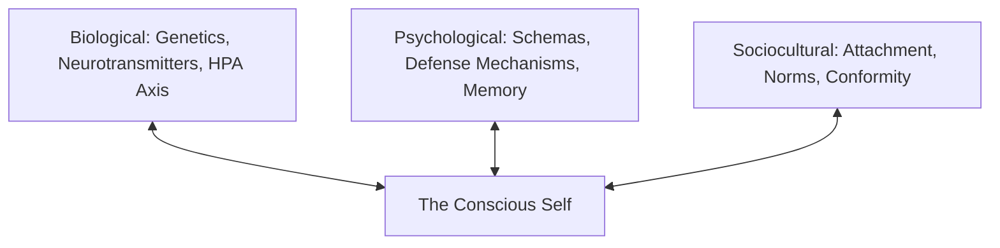

The human mind is an embodied, socially embedded prediction engine:

---

### The Foundational Psychological Engines

#### 1. Neural Circuitry & Executive Control
The prefrontal cortex (PFC) acts as the biological seat of impulse regulation and long-term planning, in constant tension with the amygdala (salience and fear conditioning) and the nucleus accumbens (reward expectation).

#### 2. Cognitive Schemas & Biases
* **Fundamental Attribution Error (FAE)**: We attribute others' failures to character defects, while attributing our own failures to external circumstances.
* **Cognitive Dissonance (Festinger)**: Psychological discomfort arising when behavior clashes with self-image. Humans naturally alter their rationalizations rather than change behavior.

#### 3. Attachment Architecture (Bowlby & Ainsworth)
Early relational interactions form internalized cognitive models:
* *Secure*: High trust, comfortable with vulnerability and autonomy.
* *Anxious-Preoccupied*: Hyper-vigilance to abandonment, compulsive seeking of reassurance.
* *Dismissive-Avoidant*: Compulsive self-reliance, suppressing emotional needs under stress.

#### 4. The Big Five OCEAN Model
The gold-standard empirical model of personality variation: Openness, Conscientiousness, Extraversion, Agreeableness, and Neuroticism.
