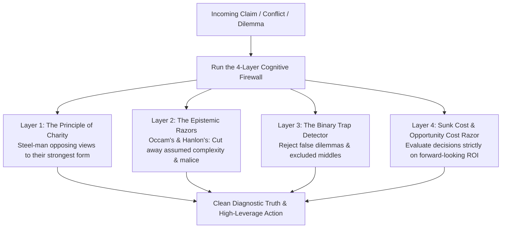
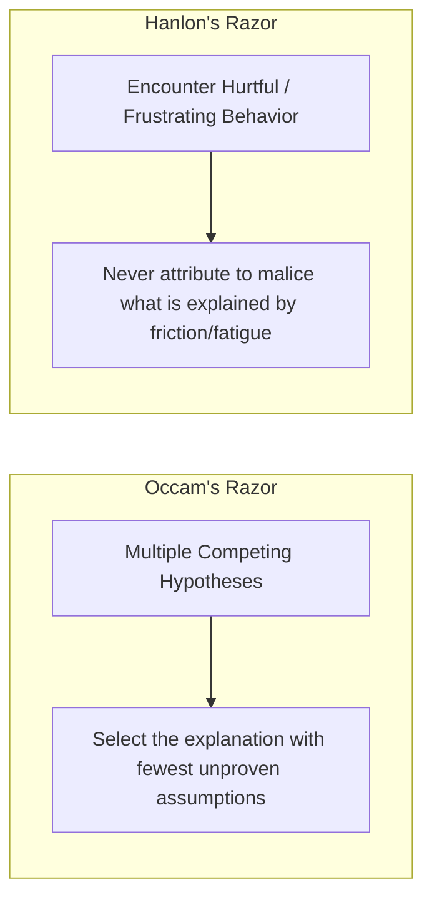
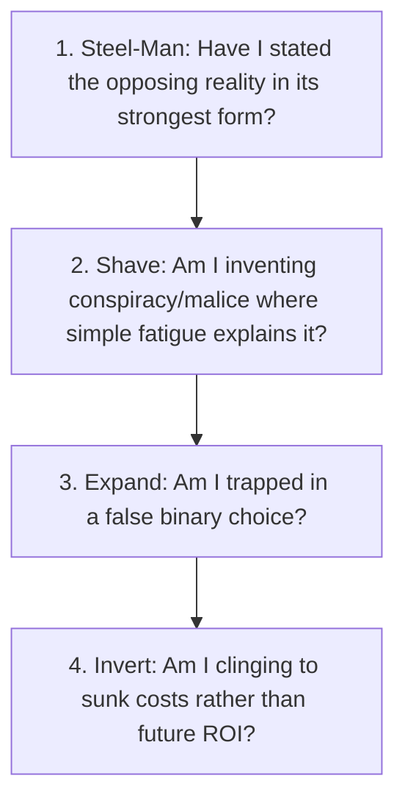

Clear thinking is not an innate gift; it is an active defense system.

The human brain is naturally vulnerable to emotional reactivity, logical shortcuts, cognitive biases, and manipulative rhetoric. In the absence of an explicit intellectual toolkit, we routinely fight straw men, assume malice in others, throw good energy after bad investments, and force nuanced situations into rigid binaries.

By installing the **Cognitive Firewall**—a suite of philosophical razors, formal fallacies, and the Principle of Charity—you insulate your mind against bad reasoning, dramatically sharpen your problem-solving, and make high-stakes decisions with mathematical composure.

---

### The Cognitive Firewall Architecture

---

### The Four Layers of the Cognitive Firewall

---

#### 1. The Principle of Charity & Steel-Manning
* **The Classical Fallacy**: *The Straw-Man Fallacy*—distorting, exaggerating, or simplifying an opponent's argument so it is easy to defeat.
* **The Intellectual Law**: The **Principle of Charity** requires that you interpret an opposing argument or contrary evidence in its **strongest, most rational, and most compelling form** before attempting to critique it.
* **Why It Matters**: Attacking a weak caricature of an idea makes you feel intellectually superior while leaving you practically ignorant. When you "steel-man" opposing viewpoints, you either discover a profound truth you were blind to, or your own position becomes indestructible because it has survived the ultimate test.

---

#### 2. The Epistemic Razors: Cutting Through Illusion
A "philosophical razor" is a mental tool that allows you to shave off unnecessary explanations or improbable hypotheses.

* **Occam’s Razor**: When presented with competing explanations for an event, select the one that makes the fewest assumptions. Complexity is often a disguise for confusion.
* **Hanlon’s Razor**: *"Never attribute to malice that which is adequately explained by ignorance, carelessness, or fatigue."* When someone ignores your message, makes a mistake, or cuts you off in traffic, assume they are overwhelmed or distracted rather than scheming against you. This single heuristic destroys 90% of interpersonal stress.

---

#### 3. The False Dilemma (Fallacy of the Excluded Middle)
* **The Distortion**: Forcing reality into an artificial "either/or" choice when a rich spectrum of alternatives exists.
  * *"Either I clear this exam in my first attempt, or my entire youth is wasted."*
  * *"Either I work 16 hours a day without sleep, or I am undisciplined."*
* **The Firewall Protocol**: Whenever you hear yourself thinking in extremes, ask: **"What is the Third Path?"** Almost every sustainable victory in career and craft lies in the deliberate, high-leverage middle ground.

---

#### 4. The Sunk Cost Fallacy & The Opportunity Cost Razor
* **The Psychological Trap**: Continuing a failing strategy, a dead-end project, or a toxic commitment simply because you have already invested immense time, money, or emotional pride into it.
* **The Economic Law**: Past costs are **sunk and unrecoverable**. They have zero relevance to the future.
* **The Forward-Looking Test**:
  * Ask: *"If I woke up today with zero previous history in this project, would I invest my next 100 hours into it right now?"*
  * If the honest answer is **No**, abandon the sunk cost immediately. Your most precious non-renewable asset is **future opportunity cost**.

---

### The 4-Step Decision Checklist

---

### The Core Takeaway to Remember
> Clear thinking is not the absence of emotion; it is the discipline of razor-sharp logic. Steel-man the ideas you disagree with, cut away assumed malice, reject false binaries, and never sacrifice your future on the altar of sunk costs. Let the cognitive firewall guard your clarity.
