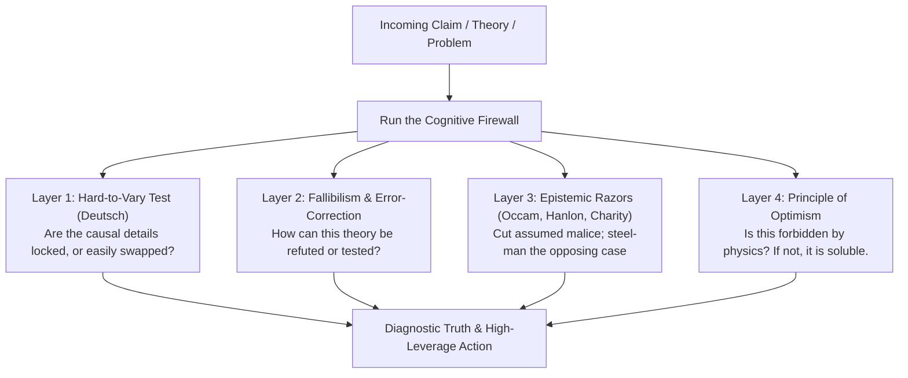
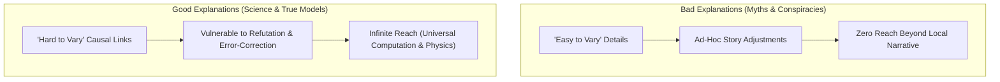
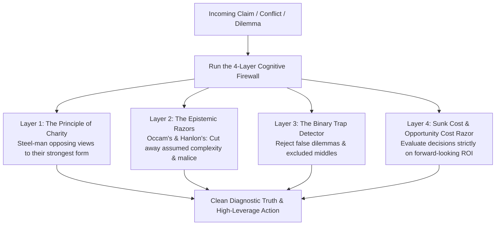
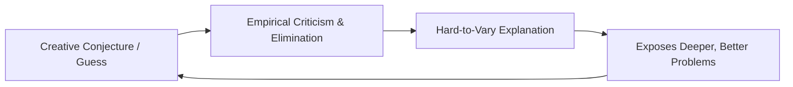
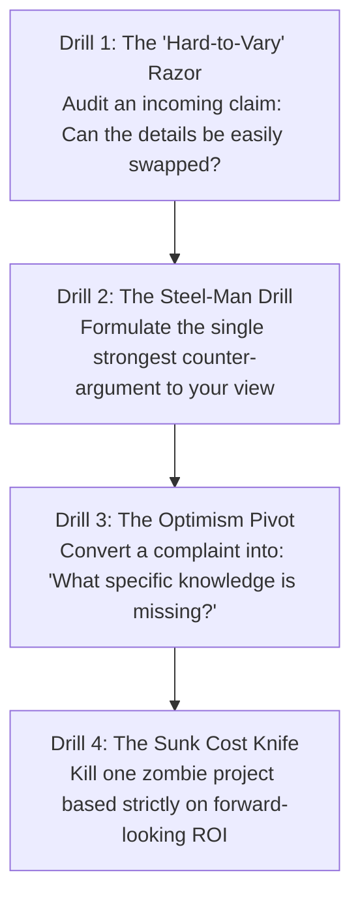

Clear thinking is not an innate gift; it is an active defense system.

The human brain is naturally vulnerable to emotional reactivity, logical shortcuts, cognitive biases, and manipulative rhetoric. In the absence of an explicit intellectual toolkit, we routinely fight straw men, assume malice in others, throw good energy after bad investments, and force nuanced situations into rigid binaries.

By installing the **Cognitive Firewall**—a suite of philosophical razors, formal fallacies, the Principle of Charity, and David Deutsch's criterion of **Hard-to-Vary Explanations**—you insulate your mind against bad reasoning, dramatically sharpen your problem-solving, and make high-stakes decisions with mathematical composure.

---

### The Beginning of Infinity: David Deutsch's Epistemic Revolution

In his masterwork *The Beginning of Infinity* (explored across 8 deep episodes by Naval Ravikant), physicist David Deutsch provides the deepest upgrade to human thinking since Karl Popper:

#### 1. The "Hard-to-Vary" Test: The Ultimate Epistemic Filter
* **The Persephone Myth (Easy to Vary)**: The ancient Greeks explained winter by claiming the goddess Persephone was kidnapped to the underworld for 6 months, causing the earth to freeze in mourning. If Persephone ate a pomegranate, an apple, or was banished for 4 months instead of 6, the myth still worked effortlessly. It was **easy to vary**.
* **The Axial Tilt of Earth (Hard to Vary)**: Modern physics explains winter via the Earth's 23.5-degree axial tilt relative to its orbital plane. If you alter the angle, the orbits, or the thermodynamics, the theory collapses and fails to match planetary observations. Every piece is tightly constrained by reality.
* **The Cognitive Filter**: When someone presents a business strategy, medical diagnosis, or political narrative, ask: *“If I alter the supporting details, does the claim still hold together just as easily?”* If yes, you are listening to an ad-hoc myth.

#### 2. Fallibilism: Giving Up on Infallible Justification
All traditional philosophy sought "justified true belief"—a holy book, a trusted authority, or an infallible sensory observation. Deutsch proves that **no truth can ever be finally justified**. We are all fallible. Progress does not come from proving things 100% right; progress comes from **creative conjectures subjected to ruthless criticism and empirical testing** to weed out errors.

#### 3. The Principle of Optimism
> *"All evils are due to lack of knowledge."*

If a problem does not violate the fundamental laws of physics (thermodynamics, quantum mechanics, relativity), it is **100% soluble given the requisite knowledge**. Famine, disease, space exploration, and economic poverty are not curses of the cosmos; they are problems of missing knowledge.

---

### The Four Layers of the Cognitive Firewall

---

### The 4-Archetype Systems Taxonomy (Cynefin Alignment)

To think clearly, classify the nature of the system you are addressing:

1. **Clear Systems**: Cause and effect are predictable and universally repeatable. Use standard checklists.
2. **Complicated Systems**: Cause and effect exist but require expert domain analysis (e.g. legal contracts, tax structuring). Hire top specialists.
3. **Complex Systems**: Non-linear feedback loops where cause and effect can only be understood in hindsight (e.g. startup growth, market shifts). Deploy safe-to-fail probes.
4. **Chaotic Systems**: Cause and effect are severed (crises, crashes). Act immediately to stabilize first, then diagnose.

---

## 🏛️ Tier 1: The Jargon-Free Reality Bridge (Plain English Hook)
*Target: An intelligent 25-year-old graduate trying to filter internet arguments, media panic, and bad business advice.*

- **The Conspiracy Theory Detective**: Have you ever argued with someone who believes in a massive global conspiracy? Notice how every piece of counter-evidence you present is twisted into proof of the conspiracy: *"Aha! The fact that the mainstream media reported against it just proves how deep the coverup goes!"* That is an **easy-to-vary explanation**. It is intellectually worthless because no fact could ever prove it wrong. A real explanation has locked, specific gears: if you pull one gear out, the whole clock stops ticking.
- **The Engine of Optimism**: Most people view the world through pessimistic goggles: *"The economy is doomed, resources are running out, civilizational collapse is coming."* Deutsch’s lens is radical: *Everything around you—from the smartphone in your pocket to modern chemotherapy—was once considered an impossible miracle.* Human beings are not passive passengers on a dying planet; we are **universal creators of explanatory knowledge**. Problems will never stop happening, but every single problem can be solved if we do not destroy our capacity to criticize, experiment, and learn.

---

## 🔬 Tier 2: Modern Cognitive Science & Epistemological Architecture Correlate
*Target: Grounding epistemology in Karl Popper, David Deutsch, and information theory.*

- **The Evolution of Knowledge (Darwinian vs Memetic Epistemology)**: Biological evolution creates knowledge encoded in DNA through random mutation and natural selection. Humans create explanatory knowledge in our minds via **creative conjecture and conscious empirical criticism**. This allows human knowledge to evolve billions of times faster than biological wetware.
- **The Fallacy of Induction**: You cannot build true theories simply by collecting thousands of positive observations (as Francis Bacon thought). Observing 1,000,000 white swans can never prove that all swans are white; observing a single black swan refutes the theory. Real science does not verify; it **falsifies**.
- **Constructor Theory**: Deutsch and Chiara Marletto's frontier physical framework transforms physics by focusing not on what happens, but on **which transformations are possible, which are impossible, and why**. A constructor is an entity that can cause a transformation repeatedly without undergoing permanent net change (e.g., a catalyst, a heat engine, or an automated manufacturing plant).

---

## ⚖️ Tier 3: The Skeptic’s Razor & Failure Mode Guardrails
*Target: Inoculating against scientific dogmatism, blind technotopianism, and epistemic arrogance.*

- **The Fallacy of "The Science Is Settled"**: Science is never settled. Anyone who declares that a theory is beyond criticism or debate has abandoned science and adopted religion. Scientific consensus is useful for action, but the history of science is a graveyard of "infallible" consensus overturned by a superior explanation.
- **The Trap of Blind Technotopianism**: The Principle of Optimism is not passive faith that *"technology will automatically save us."* Bad ideas, totalitarian censorship, anti-rational memes, and war can destroy civilizations. Optimism requires fierce protection of **error-correcting institutions** (free speech, peer review, democratic rotation of power).
- **The "Smartest Person in the Room" Blindspot**: High-IQ individuals are exceptionally skilled at rationalizing bad ideas because they can invent sophisticated arguments to defend their pre-existing biases. True epistemic maturity is not how well you can defend your idea; it is **how eagerly you look for evidence that proves you wrong**.

---

## ⚡ Tier 4: The 24-Hour Behavioral Protocol ("The Homework")
*Target: The 4 Daily Epistemic Drills to Fortify the Cognitive Firewall.*

1. **Drill 1: The Hard-to-Vary Audit**
   - *Action*: Today, when reading an article, pitch, or diagnostic opinion.
   - *Execution*: Ask: *"What specific causal mechanism does this rely on? If I changed the villain, the tool, or the timeline, would the argument remain intact?"* If it can be altered without friction, reject it as a low-quality narrative.
2. **Drill 2: The Steel-Man Challenge**
   - *Action*: Pick one belief you hold passionately (political, technical, or financial).
   - *Execution*: Spend 5 minutes writing the **absolute strongest argument against your own position**. If you cannot articulate the opposing view better than your opponents can, you do not understand your own position.
3. **Drill 3: The Optimism Pivot**
   - *Action*: The next time you face a frustrating failure or operational bottleneck at work.
   - *Execution*: Stop complaining and forbid the phrase *"Why is this happening?"* Replace it with the Deutsch inquiry: *"What exact piece of knowledge or missing system are we lacking that makes this a problem?"* Focus 100% of your cognition on acquiring that knowledge.
4. **Drill 4: The Sunk Cost Knife**
   - *Action*: Audit your current commitments.
   - *Execution*: Identify one project, subscription, or investment you are continuing purely because you have already invested time or money into it. Acknowledge that the past capital is gone forever, and cut it today based strictly on future return on energy.

---

### The Core Takeaway to Remember
> Clear thinking is the ultimate superpower. Reject easy-to-vary myths, anchor yourself in fallibilism, and never seek final certainty. Remember the golden invariant of the universe: problems are inevitable, but problems are soluble. With hard-to-vary explanations, creative conjecture, and relentless error-correction, the horizon of what you can build is infinite.
