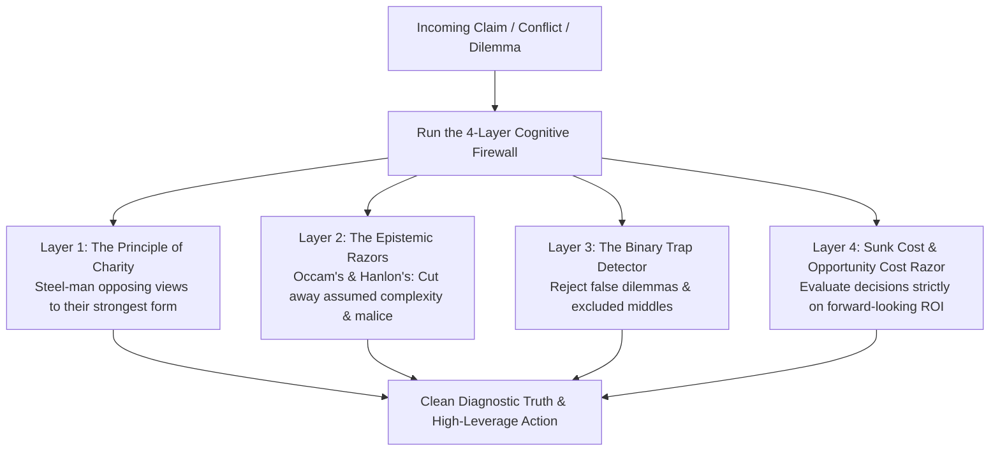
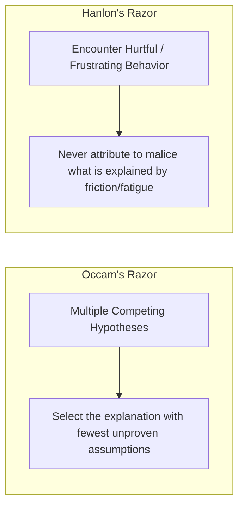
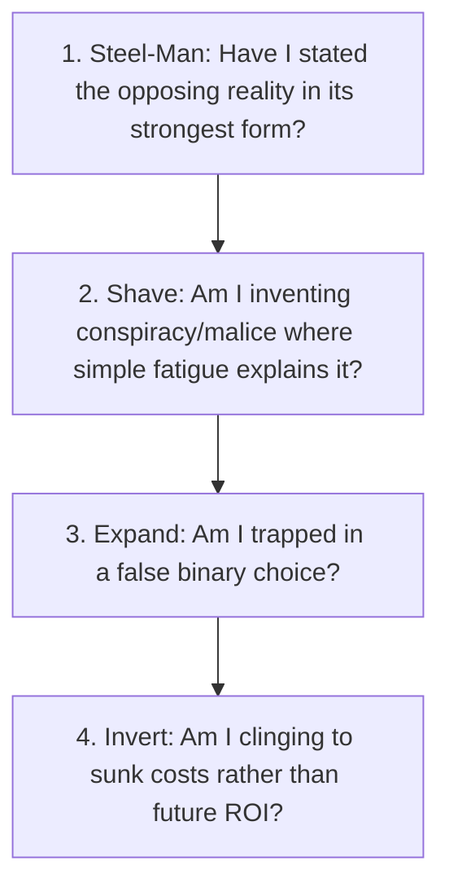
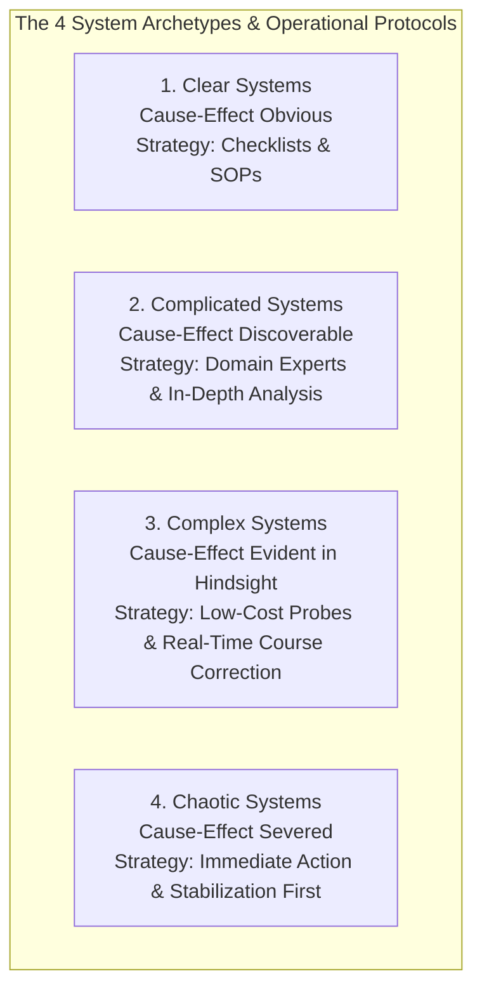
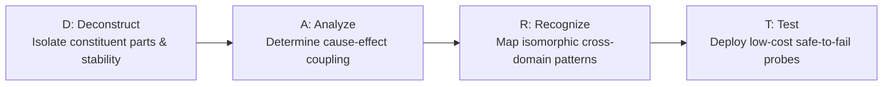
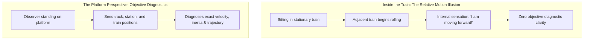

Clear thinking is not an innate gift; it is an active defense system.

The human brain is naturally vulnerable to emotional reactivity, logical shortcuts, cognitive biases, and manipulative rhetoric. In the absence of an explicit intellectual toolkit, we routinely fight straw men, assume malice in others, throw good energy after bad investments, and force nuanced situations into rigid binaries.

By installing the **Cognitive Firewall**—a suite of philosophical razors, formal fallacies, and the Principle of Charity—you insulate your mind against bad reasoning, dramatically sharpen your problem-solving, and make high-stakes decisions with mathematical composure.

---

### The Cognitive Firewall Architecture

---

### The Four Layers of the Cognitive Firewall

---

#### 1. The Principle of Charity & Steel-Manning
* **The Classical Fallacy**: *The Straw-Man Fallacy*—distorting, exaggerating, or simplifying an opponent's argument so it is easy to defeat.
* **The Intellectual Law**: The **Principle of Charity** requires that you interpret an opposing argument or contrary evidence in its **strongest, most rational, and most compelling form** before attempting to critique it.
* **Why It Matters**: Attacking a weak caricature of an idea makes you feel intellectually superior while leaving you practically ignorant. When you "steel-man" opposing viewpoints, you either discover a profound truth you were blind to, or your own position becomes indestructible because it has survived the ultimate test.

---

#### 2. The Epistemic Razors: Cutting Through Illusion
A "philosophical razor" is a mental tool that allows you to shave off unnecessary explanations or improbable hypotheses.

* **Occam’s Razor**: When presented with competing explanations for an event, select the one that makes the fewest assumptions. Complexity is often a disguise for confusion.
* **Hanlon’s Razor**: *"Never attribute to malice that which is adequately explained by ignorance, carelessness, or fatigue."* When someone ignores your message, makes a mistake, or cuts you off in traffic, assume they are overwhelmed or distracted rather than scheming against you. This single heuristic destroys 90% of interpersonal stress.

---

#### 3. The False Dilemma (Fallacy of the Excluded Middle)
* **The Distortion**: Forcing reality into an artificial "either/or" choice when a rich spectrum of alternatives exists.
  * *"Either I clear this exam in my first attempt, or my entire youth is wasted."*
  * *"Either I work 16 hours a day without sleep, or I am undisciplined."*
* **The Firewall Protocol**: Whenever you hear yourself thinking in extremes, ask: **"What is the Third Path?"** Almost every sustainable victory in career and craft lies in the deliberate, high-leverage middle ground.

---

#### 4. The Sunk Cost Fallacy & The Opportunity Cost Razor
* **The Psychological Trap**: Continuing a failing strategy, a dead-end project, or a toxic commitment simply because you have already invested immense time, money, or emotional pride into it.
* **The Economic Law**: Past costs are **sunk and unrecoverable**. They have zero relevance to the future.
* **The Forward-Looking Test**:
  * Ask: *"If I woke up today with zero previous history in this project, would I invest my next 100 hours into it right now?"*
  * If the honest answer is **No**, abandon the sunk cost immediately. Your most precious non-renewable asset is **future opportunity cost**.

---

### The 4-Step Decision Checklist

---

### Systems Thinking: Deconstructing Invisible Patterns & The 4 System Archetypes

Clear thinking reaches its institutional pinnacle when an individual transitions from evaluating isolated events to analyzing **underlying system architectures**. As distilled by technology executive **Sandeep Swadia**, brilliant professionals regularly make catastrophic decisions because they apply the wrong cognitive approach to the system they inhabit.

A **System** is an interconnected set of components continuously generating recurring behavioral patterns. Evaluating a system requires interrogating three hidden dimensions: *What are the unobserved parts? How are they coupled? What feedback loops govern them?*

#### 1. The Four System Archetypes (Cynefin Operational Mapping)

1. **Clear Systems (The Domain of Best Practice)**:
   * *Dynamics*: Cause-and-effect relationships are directly observable and predictable. Identical inputs yield identical outcomes every time (e.g., surgical scrubbing protocols, aviation pre-flight checks, bakery recipes).
   * *The Van Halen Brown M&M Heuristic*: In the 1980s, rock band Van Halen embedded a clause in their 400-page production contract requiring a bowl of M&Ms backstage with all brown candies removed. If brown M&Ms were present, David Lee Roth knew the venue had failed to read the technical safety specifications, instantly diagnosing systemic risk.
   * *Protocol*: Do not improvise. Deploy **rigid checklists** to eliminate human omission errors.

2. **Complicated Systems (The Domain of Expert Analysis)**:
   * *Dynamics*: Cause and effect exist, but they are submerged beneath multi-layered variables (e.g., medical triage, mortgage debt structuring, tax optimization, enterprise software architecture). Multiple right answers exist.
   * *Protocol*: Slow down. Hire or consult the **correct specialist**. An expert who knows where failure points hide in plain sight is mandatory.

3. **Complex Systems (The Domain of Emergence & Adaptive Probing)**:
   * *Dynamics*: Cause and effect are coupled in non-linear feedback loops and can **only be understood in hindsight** (e.g., corporate mergers, parenting teenagers, AI enterprise adoption, financial market behavior). What succeeded yesterday may fail tomorrow.
   * *Protocol*: Standard Operating Procedures and expert opinions fail here. The only viable path is **rapid, low-cost probing**: run small, safe-to-fail experiments, remain directionally correct, and adjust in real time.

4. **Chaotic Systems (The Domain of Rapid Triage & Novel Practice)**:
   * *Dynamics*: The relationship between cause and effect is completely severed or turbulent (e.g., the 1982 Tylenol cyanide crisis, acute battlefield ambushes, natural disasters). Information is incomplete, and conditions fluctuate by the minute.
   * *The Paralysis Trap*: Attempting analysis or awaiting consensus in chaos is fatal.
   * *Protocol*: **Act immediately to establish stability and safety**. Pull the contaminated inventory, secure the perimeter, stop the hemorrhage—and only investigate causes once the ground stops moving.

---

### The Cobra Effect: The Peril of Proxy Incentive Traps

Systems become dangerously dysfunctional when humans game metric incentives.
* **The Historical Case**: In colonial Delhi, British authorities attempted to eradicate venomous cobras by offering a cash bounty for every dead snake brought to police stations. Enterprising citizens began breeding cobras in captivity to harvest bounties. When the government terminated the bounty, breeders released thousands of worthless snakes into the streets, resulting in a cobra population far higher than before the policy.
* **The Systemic Law**: *When a proxy reward is attached to an outcome, agents optimize for the proxy and destroy the original objective.* (Aligning with Goodhart’s Law). Always audit what unintended behaviors your reward structures incentivize.

---

### The DART Diagnostic Protocol

When confronting an unfamiliar crisis or strategic problem, run the **DART Framework** to classify the system before committing resources:

1. **D — Deconstruct**: Break the system into subcomponents. Are the parts static or constantly shifting?
2. **A — Analyze**: Interrogate the cause-and-effect relationship. Is it obvious (Clear), discoverable (Complicated), emergent (Complex), or severed (Chaotic)?
3. **R — Recognize**: Identify whether you or others have encountered isomorphic patterns in disparate domains (e.g., seeing biological ecosystem competition in corporate product marketing).
4. **T — Test**: Launch minimal viable probes to gather feedback before committing irreversible capital. (In chaotic systems, skip directly to stabilization).

---

### The Moving Train Illusion & The Platform Perspective

The greatest perceptual distortion in human life occurs when you attempt to evaluate a system while being an active participant inside it.

* **The Illusion**: Sitting inside a stationary train car while an adjacent train begins rolling creates an identical physiological sensation to moving forward. From inside a company, a relationship, or an emotional narrative, your intuition cannot distinguish between genuine advancement and external drift.
* **Stepping Onto the Platform**: True clarity requires stepping onto the metaphorical platform through three objective external instruments:
  1. **Disinterested Mentors**: Outside advisors who possess zero emotional stake in your narrative and can see your carriage from the platform.
  2. **Unflinching Empirical Data**: Quantitative numbers that disregard your subjective self-justifications.
  3. **Longitudinal Time Audits**: Comparing current performance against strict 6-month and 12-month historical benchmarks rather than short-term feelings.

---

### The Core Takeaway to Remember
> Clear thinking is not the absence of emotion; it is the discipline of razor-sharp logic. Steel-man the ideas you disagree with, cut away assumed malice, reject false binaries, and never sacrifice your future on the altar of sunk costs. Let the cognitive firewall guard your clarity.
