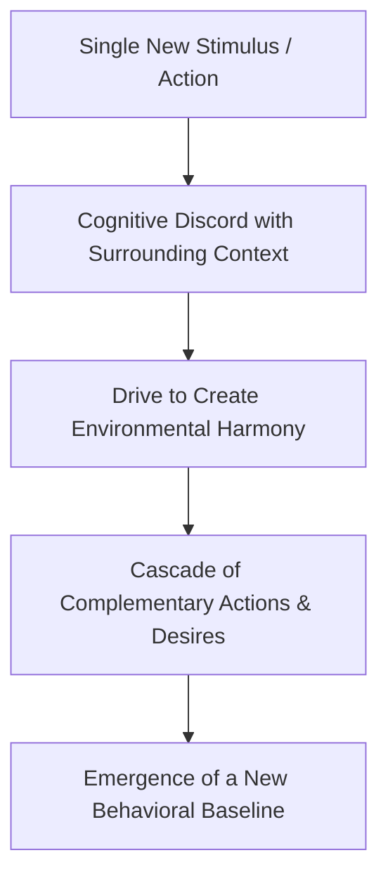
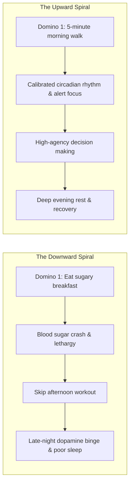
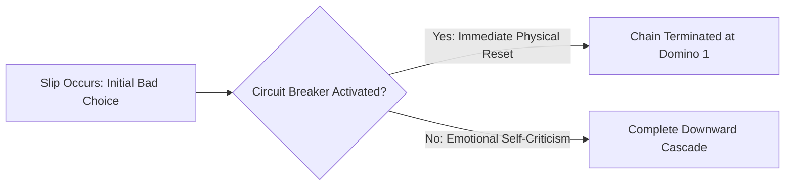

Most people treat their habits as isolated events. You might believe that eating junk food, skipping a workout, mindlessly scrolling social media, and staying up late are four distinct problems requiring four separate battles of willpower. 

In behavioral psychology, human actions rarely occur in isolation. Instead, they operate as **interconnected behavioral cascades**—where a single initial choice triggers an involuntary chain reaction of complementary behaviors. 

This psychological mechanism is known as the **Diderot Effect**.

---

### The Origin of the Spiral: The Scarlet Dressing Gown

In the 18th century, the French philosopher Denis Diderot lived in modest circumstances. Upon receiving an exquisite scarlet dressing gown as a gift, he noticed a sudden psychological discord: the elegance of his new gown made his existing wooden desk, tattered chair, and simple tapestries appear shabby. 

Compelled to match the standard set by the gown, Diderot purchased a new leather chair, replaced his desk with expensive furniture, bought new artwork, and eventually spiraled into heavy debt. He wrote: *"I was the absolute master of my old robe; I have become the slave of the new one."*

---

### The Two Directions of Behavioral Cascades

The Diderot Effect governs both destruction and mastery in daily life:

#### 1. The Downward Cascade (Negative Feedback Loops)
A single compromise at the beginning of the day lowers your internal identity baseline. Once the first domino falls, your brain rationalizes subsequent bad choices to maintain cognitive consistency with your current compromised state (*"I've already ruined my morning, so I might as well skip the gym and order takeout"*).

#### 2. The Upward Cascade (Positive Habit Stacking)
Conversely, one intentional, high-standard anchor action sets a high psychological baseline for the day. Cleaning your desk or completing a brief morning workout creates a standard of excellence that naturally repels low-agency behaviors throughout the afternoon.

---

### How to Master Habit Cascades: Three Core Protocols

To harness the Diderot Effect and prevent destructive domino chains, implement three structural protocols:

#### 1. Identify and Defend the "Lead Domino" (Keystone Trigger)
Never fight habits at the end of the chain. If you struggle with late-night binge-eating or phone addiction in bed, the real battle is not happening at 11:00 PM—it was decided at 7:00 PM when you brought your charger into the bedroom or skipped an evening meal.
* **Audit the Sequence**: Trace every recurring bad habit backward to identify the specific initial trigger (*The Lead Domino*).
* **Concentrate Defense**: Direct 100% of your conscious discipline solely to defending that first trigger. If the first domino never falls, the remaining ten downstream habits are never activated.

#### 2. Install Artificial Circuit Breakers (The "Never Twice" Rule)
When a negative lead domino inevitably falls, the goal is not perfection—it is **chain termination**.

* Establish a strict rule: **A bad choice is an accident; a second consecutive bad choice is the start of a new habit cascade.**
* If you eat poorly or get distracted, execute an immediate physical circuit breaker (e.g., wash your face with cold water, take a 5-minute walk outside, or step away from screens) to reset your nervous system baseline immediately.

#### 3. Identity Anchoring through Environmental Harmony
Your physical environment constantly whispers to you about who you are.
* If your physical workspace is cluttered with snack wrappers, open tabs, and chaotic cables, your environment invites scattered, undisciplined behavior.
* When you curate an environment of absolute cleanliness, minimalist order, and functional tools, your subconscious mind naturally aligns its actions with that elevated standard.

---

### The Core Takeaway to Remember
> You rarely have ten separate habit problems; you usually have one fragile lead domino. Protect your initial daily anchor, install circuit breakers when you stumble, and let positive behavioral cascades elevate your default standard of living.
