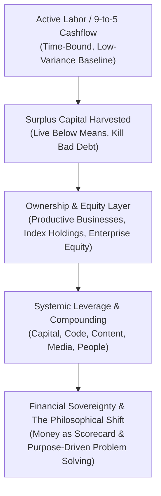
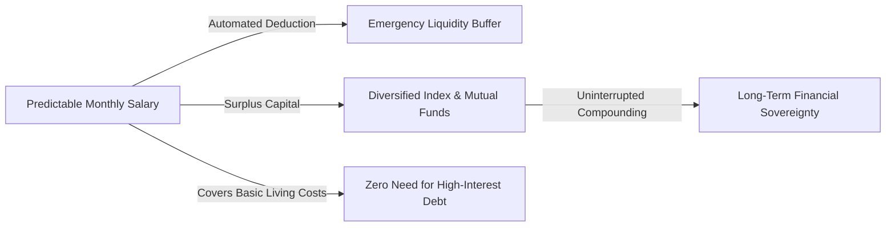
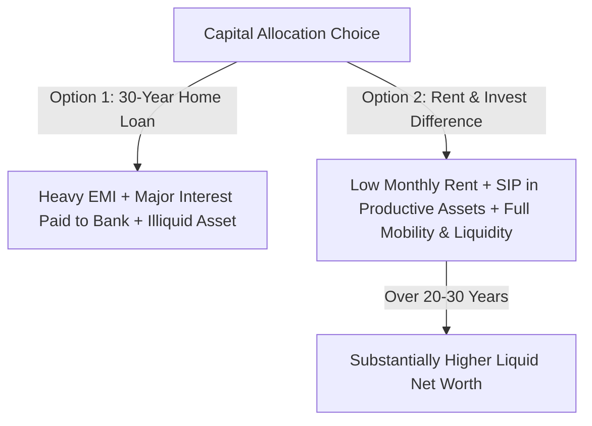
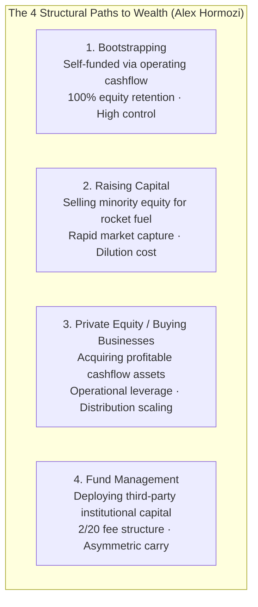
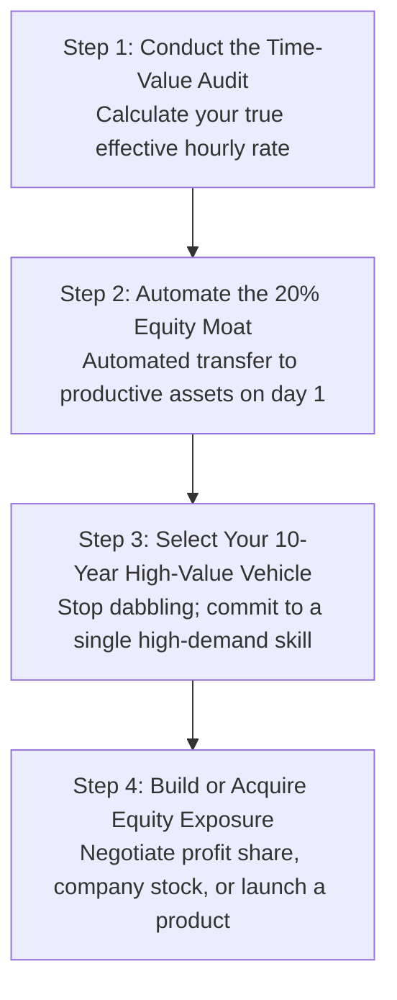

Money is often treated as a game of high-risk gambles or instant windfalls. In reality, true financial autonomy is a discipline of **structural engineering**: turning predictable income into durable assets while eliminating hidden friction, high-interest debt, and emotional decision-making.

---

### The 9-to-5 as a Low-Variance Capital Engine

A widespread modern myth is that a predictable salaried job is an obstacle to wealth. In financial terms, a stable 9-to-5 job functions as a **low-variance, risk-free cash flow engine**. 

* **The Entrepreneurial / Speculative Trap**: High-risk endeavors (such as day trading or premature business ventures without runway) introduce immense emotional volatility and high probability of capital destruction.
* **The Asymmetric Advantage of Stability**: When your living expenses are fully covered by steady income, you possess the ultimate investing superpower: **time without forced selling**. You are never compelled to liquidate investments during market downturns.

---

### The Rent vs. Buy Equation: Breaking Emotional Myths

In traditional culture, buying a home is viewed as the default sign of financial maturity. Mathematically, purchasing real estate with heavy leverage (a 20 to 30-year home loan) is often an expensive emotional choice rather than an optimal investment.

#### 1. The True Cost of a Mortgage (The Interest Multiplier)
When taking a 20-to-30-year home loan, the borrower often ends up paying **2x to 2.5x the actual cost of the property** in pure interest to the bank. 
* During the first 7 to 10 years of a loan, the overwhelming majority of each monthly installment (EMI) goes toward servicing the bank's interest, not paying down your actual principal.
* In addition to EMI, real estate carries ongoing illiquid costs: property taxes, maintenance, society fees, registration charges, and severe depreciation of interior fittings.

#### 2. The Opportunity Cost of Down Payment and EMIs
When renting, your monthly housing cost is generally a small fraction of the EMI required to own the same property. 
* By renting and methodically investing the difference (down payment lump sum + monthly gap between rent and EMI) into diversified, productive equity assets (Index/Mutual Funds), compounding works *for* you rather than *against* you in bank interest.
* **Mobility & Flexibility**: Renting preserves geographic mobility, allowing you to relocate effortlessly for higher-paying career opportunities without the burden of an illiquid physical asset.

---

### The Speculation Trap: Why Trading Destroys Wealth

Over 90% of retail participants who attempt short-term trading (such as intraday equity or derivatives) lose capital over a 3-year horizon. 

Trading fails for three mechanical reasons:
1. **Frictional Drag**: Brokerage fees, transaction taxes, and slippage eat away profits regardless of market direction.
2. **Asymmetric Psychological Pressure**: When real livelihood is on the line, emotional stress triggers irrational panic-selling at bottoms and greedy buying at market tops.
3. **Zero-Sum Mechanics**: Short-term trading is not wealth creation; it is a zero-sum transfer of wealth from emotional retail traders to algorithmic institutional players.

True wealth is created by **holding productive businesses over decades**, allowing corporate earnings, innovation, and economic expansion to compound your net worth passively.

---

## 🏛️ Tier 1: The Jargon-Free Reality Bridge (Plain English Hook)
*Target: An intelligent 25-year-old graduate entering the workforce or starting an entrepreneurial journey.*

- **The Landlord vs. Handyman Reality**: Imagine a handyman who works 14 hours a day fixing drywall, repairing plumbing, and painting ceilings. He earns $100 an hour and feels productive. Meanwhile, the landlord who owns the 50-unit building never touches a wrench; he collects the rent every month, pays the handyman, and watches the property value double over a decade. The handyman is trapped in the **Labor Illusion**—believing that sweating more hours produces wealth. The landlord understands the **Ownership Axiom**: *You get rich off what you own, not what you do.*
- **The Hamster Wheel of High Earners**: Many doctors, corporate lawyers, and consultants earn $300,000 to $500,000 a year, yet remain one paycheck away from panic because their entire lifestyle is funded by active manual billing. The moment they stop sitting in the chair, their revenue hits zero. Real wealth begins only when you decouple your income from the clock.
- **Why This Matters Today**: The digital economy has created infinite leverage through software, media, and scalable business models. If you continue trading linear hours for linear dollars, you are fighting an uphill war against inflation and biological aging. 

---

## 🔬 Tier 2: Modern Cognitive Science & Economic Architecture Correlate
*Target: Grounding enterprise scaling and capital allocation in economic leverage theory and systems psychology.*

- **The Four Forms of Leverage (Naval Ravikant & Hormozi Synthesis)**:
  1. *Labor*: Employing other humans (highest management friction).
  2. *Capital*: Deploying money to earn money (clean, scalable, but requires an existing base).
  3. *Code & Automation*: Software that works while you sleep with zero marginal replication cost.
  4. *Media & Content*: Digital distribution that reaches millions without incremental marginal expense.
- **The Observer vs. Participant Cognitive Shift**: In cognitive systems theory, a participant is immersed within the operational loop (first-order cybernetics), reacting to local stimulus. An observer operates at second-order cybernetics, viewing the business as an input-output state machine. Hormozi's framework demands that entrepreneurs deliberately transition from:
  $$	ext{Doer (Execution)} longrightarrow 	ext{Manager (Delegation)} longrightarrow 	ext{Architect (System Design)} longrightarrow 	ext{Investor (Capital Allocation)}$$
- **The 5-Stage Enterprise Hierarchy**:
  - *Stage 1: The Grand Slam Offer*: Solving a burning problem so completely that saying no feels irrational.
  - *Stage 2: Money Models*: Structuring recurring, high-margin, cashflow-positive unit economics.
  - *Stage 3: Lead Generation*: Establishing predictable, multi-channel inbound and outbound pipelines.
  - *Stage 4: Sales Architecture*: Converting demand systematically through trained talent and frictionless closing mechanisms.
  - *Stage 5: Equity & Valuation Multiple*: Packaging operations so the company commands a high EBITDA valuation multiple independent of the founder.
- **The Psychological Phase Transition ("Questioning the Meaning of Money")**: As an entrepreneur passes $10M–$50M+ in liquid net worth, Maslow's hierarchy of needs collapses into self-actualization. Money ceases to alter personal consumption (a $1,000 steak tastes no better than a $50 steak after a threshold). At this juncture, money shifts from a tool of comfort into a **scorecard of competence** and a vehicle for solving complex civilizational challenges.

---

## ⚖️ Tier 3: The Skeptic’s Razor & Failure Mode Guardrails
*Target: Inoculating against premature entrepreneurship, get-rich-quick delusions, and lifestyle inflation traps.*

- **The Premature Entrepreneurship Trap**: Quitting a stable 9-to-5 job with $1,000 in savings to "start a business" is not bravery; it is financial recklessness. A stable job is your primary angel investor. When you have zero cash runway, you make desperate, short-term client decisions, accept low margins, and live in constant cortisol panic. Build skills, stack an emergency moat, and validate cashflow *before* taking the leap.
- **The "Lifestyle Inflation" Executioner**: Earning $250,000 and spending $240,000 on luxury car leases, penthouse rents, and designer clothes leaves you poorer and more fragile than someone earning $60,000 and investing $20,000. True wealth is the assets you *do not* see—the unspent capital compounding quietly in the background.
- **The Shiny Object Syndrome**: The biggest killer of ambitious builders is jumping from dropshipping to crypto to real estate to agency models every 90 days. Extreme wealth requires a **10-year monomaniacal commitment to a single vehicle**. Mastery compounds exponentially; switching resets your learning curve to zero.

---

## ⚡ Tier 4: The 24-Hour Behavioral Protocol ("The Homework")
*Target: The 4 Concrete Steps to Shift from Labor to Equity.*

1. **Step 1: The Effective Hourly Rate Audit (Kill Minimum-Wage Tasks)**
   - *Action*: Divide your monthly net income by the total hours spent working and commuting. This is your baseline Hourly Rate ($R$).
   - *Execution*: Review your weekly calendar. Any task that can be outsourced, automated, or eliminated for less than $R$ (e.g., house cleaning, repetitive data entry, administrative scheduling) must be systematically delegated. Reinvest those freed hours into high-leverage skill acquisition.
2. **Step 2: The Automated Wealth Tax (Pay Equity First)**
   - *Action*: Set up an automated recurring transfer for the day after your income deposits.
   - *Execution*: Route a minimum of **20% of your gross earnings** into broad-market index funds, productive equity, or your enterprise business account before paying rent, groceries, or discretionary bills. Force your lifestyle to adapt to the remaining 80%.
3. **Step 3: The 10-Year Monomaniacal Vehicle Selection**
   - *Action*: Audit your current commercial direction.
   - *Execution*: Choose **one** clear monetization vehicle from the 4 Paths to Wealth (e.g., Bootstrapping an agency/SaaS, climbing an equity-compensated corporate ladder, or real estate/business investing). Write a contract to yourself: *"I will execute this specific model for 36 months without chasing a single new opportunity."*
4. **Step 4: The Equity Shift (Move from Labor to Asset)**
   - *Action*: Audit how you are currently compensated.
   - *Execution*: If you are an employee, actively position yourself for equity grants, stock options, or profit-sharing agreements tied to revenue generated. If you are a freelancer or consultant, stop charging hourly; transition to value-based pricing, retainer models, or performance-equity deals.

---

### The Core Takeaway to Remember
> Wealth is never built by sweating longer hours at a linear wage. It is engineered by using predictable cashflow as seed capital, mastering one of the 4 paths to wealth for a decade, and relentlessly converting active labor into durable, scalable equity that compounds while you sleep.
