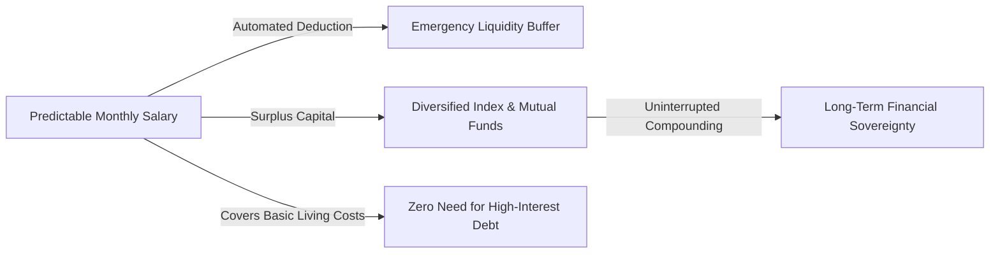
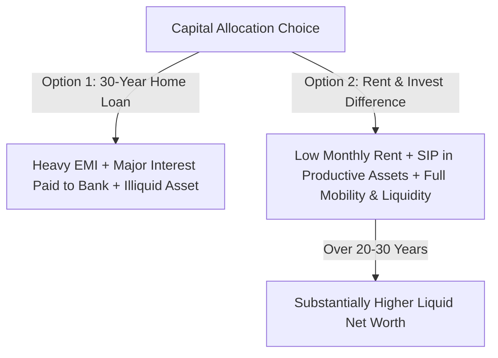

Money is often treated as a game of high-risk gambles or instant windfalls. In reality, true financial autonomy is a discipline of **structural engineering**: turning predictable income into durable assets while eliminating hidden friction, high-interest debt, and emotional decision-making.

---

### The 9-to-5 as a Low-Variance Capital Engine

A widespread modern myth is that a predictable salaried job is an obstacle to wealth. In financial terms, a stable 9-to-5 job functions as a **low-variance, risk-free cash flow engine**. 



* **The Entrepreneurial / Speculative Trap**: High-risk endeavors (such as day trading or premature business ventures without runway) introduce immense emotional volatility and high probability of capital destruction.
* **The Asymmetric Advantage of Stability**: When your living expenses are fully covered by steady income, you possess the ultimate investing superpower: **time without forced selling**. You are never compelled to liquidate investments during market downturns.

---

### The Rent vs. Buy Equation: Breaking Emotional Myths

In traditional culture, buying a home is viewed as the default sign of financial maturity. Mathematically, purchasing real estate with heavy leverage (a 20 to 30-year home loan) is often an expensive emotional choice rather than an optimal investment.



#### 1. The True Cost of a Mortgage (The Interest Multiplier)
When taking a 20-to-30-year home loan, the borrower often ends up paying **2x to 2.5x the actual cost of the property** in pure interest to the bank. 
* During the first 7 to 10 years of a loan, the overwhelming majority of each monthly installment (EMI) goes toward servicing the bank's interest, not paying down your actual principal.
* In addition to EMI, real estate carries ongoing illiquid costs: property taxes, maintenance, society fees, registration charges, and severe depreciation of interior fittings.

#### 2. The Opportunity Cost of Down Payment and EMIs
When renting, your monthly housing cost is generally a small fraction of the EMI required to own the same property. 
* By renting and methodically investing the difference (down payment lump sum + monthly gap between rent and EMI) into diversified, productive equity assets (Index/Mutual Funds), compounding works *for* you rather than *against* you in bank interest.
* **Mobility & Flexibility**: Renting preserves geographic mobility, allowing you to relocate effortlessly for higher-paying career opportunities without the burden of an illiquid physical asset.

---

### The Speculation Trap: Why Trading Destroys Wealth

Over 90% of retail participants who attempt short-term trading (such as intraday equity or derivatives) lose capital over a 3-year horizon. 

Trading fails for three mechanical reasons:
1. **Frictional Drag**: Brokerage fees, transaction taxes, and slippage eat away profits regardless of market direction.
2. **Asymmetric Psychological Pressure**: When real livelihood is on the line, emotional stress triggers irrational panic-selling at bottoms and greedy buying at market tops.
3. **Zero-Sum Mechanics**: Short-term trading is not wealth creation; it is a zero-sum transfer of wealth from emotional retail traders to algorithmic institutional players.

True wealth is created by **holding productive businesses over decades**, allowing corporate earnings, innovation, and economic expansion to compound your net worth passively.

---

### The Structural Blueprint for Financial Independence

Building an unshakeable financial foundation follows a non-negotiable sequence:

```mermaid
graph TD
    S1[Phase 1: Elimination of High-Interest Debt] --> S2[Phase 2: 6-12 Months Emergency Fund in Liquid Instruments]
    S2 --> S3[Phase 3: Automated Monthly SIP in Low-Cost Equities]
    S3 --> S4[Phase 4: Systematic Withdrawal Plan (SWP) for Infinite Passive Income]
```

#### 1. Build an Impenetrable Liquidity Moat
Before allocating any money to the stock market, secure **6 to 12 months of non-negotiable living expenses** in liquid instruments (fixed deposits or liquid funds). This prevents you from ever needing to take high-interest personal loans or sell investments in an emergency.

#### 2. Automate Wealth Accumulation (SIP)
Treat investments as a non-negotiable fixed bill that leaves your account the day after salary arrives. By automating monthly contributions into broad-market index or diversified mutual funds, you remove emotional hesitation and benefit automatically from dollar-cost averaging during market dips.

#### 3. Harvest Passive Income (SWP)
In the distribution phase of life, rather than locking wealth into low-yielding annuity plans or illiquid brick-and-mortar rentals, capital can be harvested through a **Systematic Withdrawal Plan (SWP)**. By withdrawing 4% to 5% annually while the remaining principal stays invested in productive assets, your capital continues to outpace inflation indefinitely.

---

### The Core Takeaway to Remember
> Wealth is not built by chasing volatile windfalls; it is built by using predictable income to steadily purchase productive assets, eliminating the emotional burden of unnecessary debt, and letting time do the heavy lifting.
