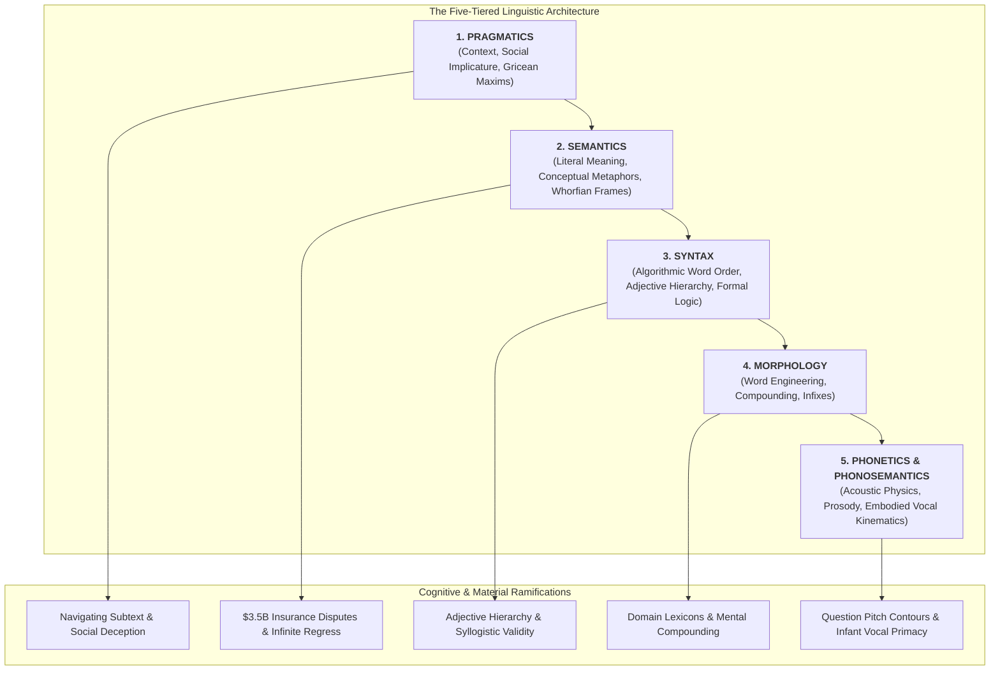
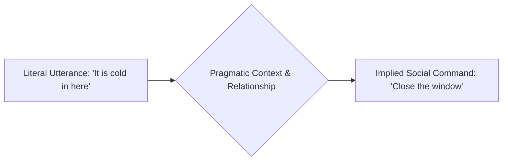
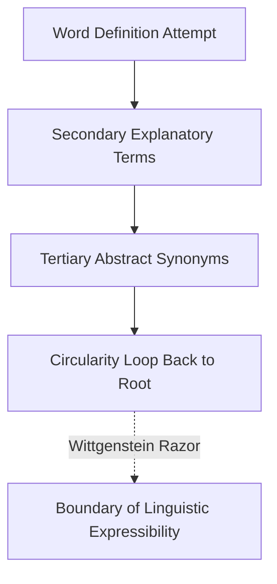
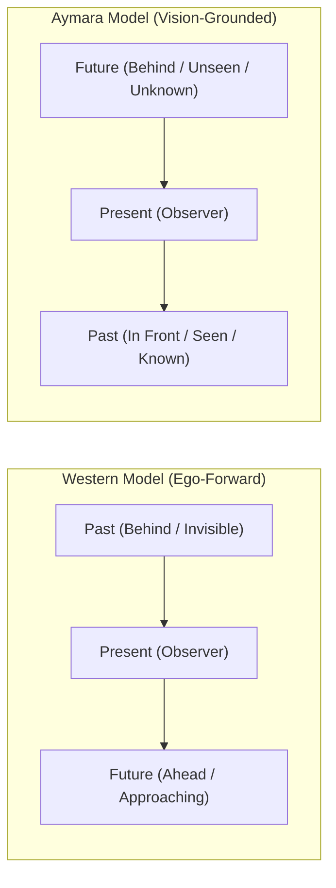
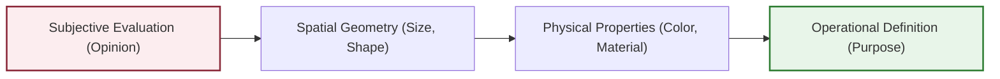
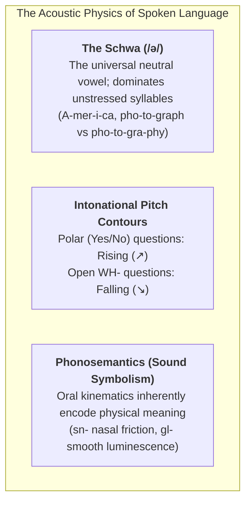

Human beings view language as a tool for transferring thoughts: you take an idea in your head, convert it into words, speak them through your vocal tract, and another person hears those words and reconstructs your idea.

Yet when cognitive scientists, logicians, and linguists examine human speech, they discover that **language is not an arbitrary bag of dictionary definitions. It is an intuitive, five-tiered computational operating system governed by subconscious cognitive algorithms.**

Every human child masters an astronomical web of recursive grammatical rules, acoustic modulations, and social inferences before they are capable of calculating basic arithmetic—without ever receiving a single formal lecture on grammar.

To achieve sovereignty in writing, public address, legal analysis, and interpersonal negotiation, one must understand the **Five-Tiered Linguistic Architecture** that governs how human brains actually encode and decode reality.

---

### Layer 1: Pragmatics (Context, Intent & Implicature)

Pragmatics is the study of how **context shapes meaning**. Words in human interaction rarely communicate only their dictionary definitions. 

Consider a standard workplace exchange:
* *"Do you know what time it is?"*
* **Literal Semantic Meaning**: *"Do you possess the cognitive awareness of the current hour?"*
* **Pragmatic Meaning**: *"You are late. We need to start now."*

If a colleague replies: *"Yes, I do,"* and remains silent, they have answered the semantic question accurately while committing a severe **pragmatic violation**.

In the 1970s, philosopher Paul Grice formulated the **Cooperative Principle** and the **Four Conversational Maxims**:
1. **Maxim of Quantity**: Be as informative as required, and no more.
2. **Maxim of Quality**: Do not state what you believe to be false or lack evidence for.
3. **Maxim of Relation (Relevance)**: Make your contribution relevant to the ongoing context.
4. **Maxim of Manner**: Avoid obscurity and ambiguity; be orderly and brief.

When someone deliberately violates a maxim—such as answering an inquiry about a coworker’s competence by praising their haircut—they generate **Conversational Implicature**. Pragmatic mastery is the ability to read and deploy the unwritten social layer without being deceived by surface phrasing.

---

### Layer 2: Semantics (Meaning, Conceptual Metaphors & The Paradox of Definition)

Semantics governs the literal relationship between linguistic signs and the realities they denote. Yet beneath surface clarity lies profound philosophical instability.

#### 1. The Paradox of Definition & Infinite Regress
If you attempt to establish the objective foundation of any term, you are immediately trapped in circularity:
* What is *reality*? Everything that *exists*.
* What does it mean to *exist*? To have *objective being*.
* What is *being*? That which is *real*, not *imaginary*.
* What is *imaginary*? That which exists only in the *mind*, not in *reality*.

Because natural language possesses no self-evident axioms, every definition relies on secondary words, triggering an infinite regress. This boundary condition led philosopher Ludwig Wittgenstein to his famous conclusion in the *Tractatus Logico-Philosophicus*:

$$\text{“Whereof one cannot speak, thereof one must be silent.”}$$

#### 2. Linguistic Relativity: The Aymara Temporal Inversion
Does language merely describe thought, or does it construct it? The **Sapir-Whorf Hypothesis** argues that the grammatical structure of a tongue actively conditions the perceptual reality of its speakers.

Consider how cultures orient time in space:
- **Western / Indo-European Model**: The **Future is in Front** (*"look forward to next week"*), and the **Past is Behind** (*"leave the past behind you"*).
- **The Aymara Inversion (Andes Indigenous Peoples)**: The **Past is in Front** (*nayra*), and the **Future is Behind** (*qhipa*).

The Aymara rationale is rigorously grounded in visual empiricism: **the past has already happened; therefore, it is known and can be 'seen' by the mind's eye (placed in front of the observer). The future has not happened; therefore, it is unknown, dark, and unseen (located behind one's back).**

#### 3. Multi-Billion-Dollar Semantic Ambiguity
Natural language cannot provide absolute mathematical clarity, producing massive geopolitical and economic collisions:
* **The Bill Clinton 1998 Grand Jury Deposition**: When questioned about an affidavit stating there was no sexual relationship, Clinton responded: *"It depends on what the meaning of the word 'is' is."* Beyond legal evasion, the verb *to be* conflates temporary present states (*"it is 4:00 PM"*), eternal ontological conditions (*"the sky is blue"*), and prospective scheduled events (*"the hearing is tomorrow"*).
* **The \$3.5 Billion World Trade Center Insurance Trial**: Following September 11, 2001, leaseholder Larry Silverstein and insurer Swiss Re engaged in historic litigation centered on the single word **"occurrence"**. Silverstein argued that two distinct airplanes colliding with two distinct towers constituted *two separate occurrences* (entitling two \$3.5B payouts). The insurers argued that a single coordinated al-Qaeda plot constituted *one occurrence*. In the absence of an objective linguistic definition, the courts ultimately split the verdict, costing insurers billions.

---

### Layer 3: Syntax (The Algorithmic Grammar of Mind)

Syntax governs the structural sequencing of words. Far from being an arbitrary cultural convention, human syntax executes rigid, subconscious computational rules.

#### 1. The Royal Order of Adjectives
In the English language, adjectives must precede a noun in this exact, immutable hierarchy:

$$\text{Opinion} \to \text{Size} \to \text{Age} \to \text{Shape} \to \text{Color} \to \text{Origin} \to \text{Material} \to \text{Purpose}$$

| Sequence | Category | Canonical Example | Cognitive Function |
| :---: | :--- | :--- | :--- |
| **1** | **Opinion** | Beautiful, ugly, exquisite | Establishes the speaker's subjective/evaluative filter |
| **2** | **Size** | Huge, tiny, miniature | Establishes physical bounding box |
| **3** | **Age** | Ancient, antique, young | Chronological coordinate |
| **4** | **Shape** | Round, square, oval | Geometric topology |
| **5** | **Color** | Black, green, crimson | Surface optical reflectance |
| **6** | **Origin** | Canadian, Italian, Martian | Geographic/cultural genesis |
| **7** | **Material** | Plastic, leather, wooden | Physical chemical substrate |
| **8** | **Purpose** | Racing, hunting, sleeping | Operational utility |

You can intuitively construct:
> *"My one beautiful big old round black Canadian plastic racing poodle."*

If you violate this sequence—*"My racing plastic Canadian black round old big beautiful one poodle"*—the sentence transforms into an incomprehensible lexical soup. 

**The Cognitive Reason**: The human brain demands that descriptions proceed from the **most subjective/evaluative information toward the most objective/material properties**. Knowing the speaker's emotional stance upfront (*"beautiful"*) primes the mental canvas, allowing subsequent physical parameters to resolve without working memory overload.

#### 2. Formal Syllogisms & Aristotelian Validity
Syntax also governs deductive logic. Aristotle established that an argument's **formal validity** is completely independent of its constituent terms:

$$\begin{aligned}
\text{Premise 1:} & \quad \text{All men are mortal.} \\
\text{Premise 2:} & \quad \text{Socrates is a man.} \\
\text{Conclusion:} & \quad \therefore \text{Socrates is mortal.}
\end{aligned}$$

Crucially, **syntactic validity does not guarantee truth**, and true conclusions can emerge from invalid syntax:

$$\begin{aligned}
\text{Invalid Syllogism (Fallacy of Undistributed Middle):} \\
\text{All cats are mammals.} \\
\text{All dogs are mammals.} \\
\therefore \text{All cats are dogs.} \quad \text{[LOGICALLY INVALID]}
\end{aligned}$$

Replacing terms can yield a true statement via broken logic:
> *"All poodles are mammals. All dogs are mammals. Therefore, all poodles are dogs."* (The conclusion is factually true, but the deductive syntax is entirely fraudulent).

#### 3. Russell's Theory of Definite Descriptions
Philosopher Bertrand Russell resolved syntactical paradoxes like *"The present King of France is bald"* by translating natural language into formal logical syntax:

$$\exists x \, [K(x) \land \forall y (K(y) \to y = x) \land B(x)]$$

This reveals that natural sentences conceal hidden existential claims. Because no such entity $x$ exists, the proposition is false rather than meaningless.

---

### Layer 4: Morphology (The Architecture of Word Construction)

Morphology analyzes the internal construction of words from **morphemes** (the smallest units of meaning). 

#### 1. Compounding & Semantic Drift
* A *green house* (Noun + Adjective: a residential dwelling painted green)
* A *greenhouse* (Compound Noun: a specialized glass structure for horticulture)

Over historical time, compound words fuse into single lexical units. In high-performance domains, understanding compounding enables thinkers to coin precise mental models that collapse paragraphs of explanation into a single memorable term.

#### 2. The Rhythmic Rules of Infixes
While formal schooling ignores **infinitival infixes**, native speakers insert modifiers directly inside root words (*abso-bloody-lutely*). Yet even colloquial vulgarity obeys strict morphological metrical stress:
- Permitted: *abso-freaking-lutely* (inserted directly before the primary stressed syllable `lute`).
- Forbidden: *ab-freaking-solutely* (violates the metrical stress footprint of English).

---

### Layer 5: Phonetics & Phonosemantics (The Acoustic Physics of Speech)

The bedrock substrate of spoken language is **phonetics**: the physical sound waves produced by aerodynamic energy passing across vocal folds and modulated by oral resonators.

#### 1. The Universal Schwa (/ə/) & Vowel Reduction
English spelling drastically misrepresents acoustic reality. The most common vowel sound in spoken English is **the Schwa (/ə/)**—a completely neutral, unarticulated mid-central vowel. 

Whenever a syllable is unstressed, its vowel collapses into a schwa:
* **Am**er**i**ca $\to$ /əˈmɛrɪkə/ (both the first and last vowels are schwas).
* Compare: **pho**tograph (/ˈfoʊtəˌɡræf/) versus pho**to**graphy (/fəˈtɒɡrəfi/). When the stress shifts to the second syllable, the previously articulated `o` collapses into a schwa.

Non-native speakers frequently sound foreign not because their vocabulary is deficient, but because they meticulously articulate full vowels on unstressed syllables where native biology defaults to the relaxed schwa.

#### 2. Prosodic Intonation Contours
Native speakers execute subconscious pitch modulation depending on the logical category of inquiry:
* **Polar (Yes/No) Questions $\to$ Rising Pitch ($\nearrow$)**: *"Is it raining?"*, *"Is your dog friendly?"*
* **Information-Seeking (WH-) Questions $\to$ Falling Pitch ($\searrow$)**: *"What time is it?"*, *"What is two plus two?"*

Executing a rising pitch on a WH- question (*"What time is it? ↗"*) sounds unnatural or patronizing, proving that prosodic acoustics are bound to deep syntactic circuits.

#### 3. Phonosemantics: Embodied Consonants & The 'Mama/Papa' Invariant
Does the sound of a word have an inherent connection to its meaning? Conventional linguistics long insisted that the link between signifier and signified is purely arbitrary (Saussure). 

Yet **Phonosemantics (Sound Symbolism)** demonstrates that human mouth mechanics inherently encode physical reality:
* **The `sn-` Cluster (Nasal Constriction)**: Producing /sn/ forces the tongue against the palate, partially blocking oral airflow and forcing air through the nasal passages. Consequently, words denoting nasal anatomy or olfactory actions cluster under `sn-`: *sniff, snort, sneeze, snore, snout, snarl*.
* **The `gl-` Cluster (Smooth Luminescence)**: The frictionless liquid transition from velar /g/ to lateral /l/ generates words denoting unhindered smoothness (*glass, glide, gloss, glaze*) and optical radiation (*glow, gleam, glitter, glisten*).
* **The Global Invariant of 'Mama' and 'Papa'**: Across genetically unrelated language families worldwide, words for *mother* universally utilize the bilabial nasal consonant /m/ (*Mama, Mère, Mutter, Madar, Mata*). Anthropological linguistics reveals that /m/ is the easiest consonant for an infant to produce while nursing, requiring only opening and closing the lips while vocalizing the neutral vowel /a/. The slightly more strenuous bilabial plosives /b/ and /p/ became the universal designation for fathers (*Baba, Papa, Père, Pater, Pita*).

Infant oral anatomy provides a stronger foundation for objective semantic meaning than centuries of abstract epistemology.

---

### Synthesis: The Sovereign Communicator's Operating Manual

Mastery of human communication requires synchronizing all five layers simultaneously:

| Layer | Diagnostic Question | Sovereign Tactical Execution |
| :--- | :--- | :--- |
| **Pragmatics** | What unstated social power dynamic or implicature is active? | Manage the Gricean maxims; address the underlying emotional intent, not just the surface question. |
| **Semantics** | Are core terms grounded, or are we trapped in circular definitions? | Expose semantic drift; define critical terms operationally to prevent \$3.5B ambiguity traps. |
| **Syntax** | Does the sequence of attributes minimize cognitive friction? | Respect the Royal Order of Adjectives (subjective $\to$ objective); verify formal deductive validity. |
| **Morphology** | Are terms engineered for maximum conceptual density? | Compound high-leverage nouns; ensure rhythmic stress alignment for newly coined terminology. |
| **Phonetics** | Does vocal acoustics broadcast calm authority? | Deploy falling intonation for commanding clarity; utilize the natural schwa to avoid stilted cadence. |
