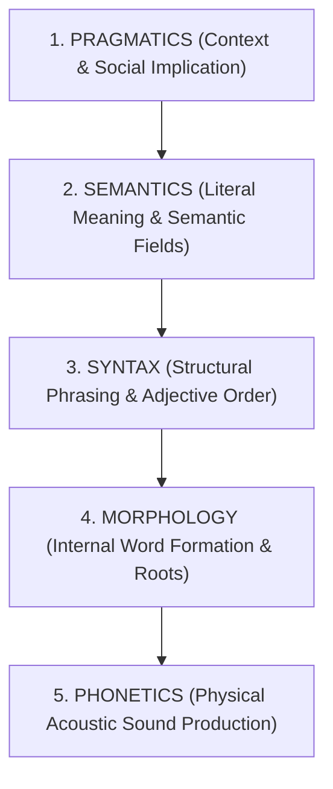
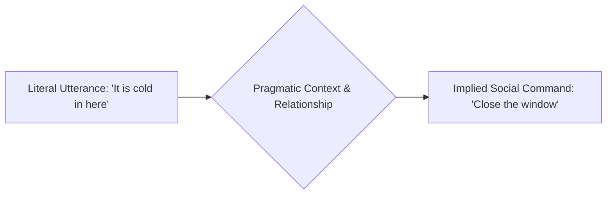

Human beings view language as a tool for transferring thoughts: you take an idea in your head, convert it into words, speak them through your vocal tract, and another person hears those words and reconstructs your idea.

Yet when cognitive scientists and linguists examine human speech, they discover that **language is not an arbitrary bag of dictionary definitions. It is an intuitive, multi-tiered computational operating system.** 

Every human child masters an astronomical web of recursive grammatical rules, acoustic modulations, and social inferences before they are capable of calculating basic arithmetic—without ever receiving a single formal lecture on grammar.

To achieve sovereignty in writing, public address, and interpersonal dialogue, you must understand the **Five-Tiered Linguistic Architecture** that governs how human brains actually encode and decode reality.

---

### The Five-Tiered Linguistic Stack

Linguistics organizes human communication across five distinct, nested strata. A failure or mastery at any single layer cascades through the entire message:

---

### Layer 1: Pragmatics (Context, Intent & Implicature)

Pragmatics is the study of how **context shapes meaning**. Words in human interaction rarely communicate only their dictionary definitions. 

Consider a standard workplace exchange:
* *"Do you know what time it is?"*
* Literal Semantic meaning: *"Do you possess the cognitive awareness of the current hour?"*
* Pragmatic meaning: *"You are late. We need to start now."*

If a colleague replies: *"Yes, I do,"* and remains silent, they have answered the semantic question accurately while committing a severe **pragmatic violation**.

In the 1970s, philosopher Paul Grice formulated the **Cooperative Principle** and the **Four Conversational Maxims**:
1. **Maxim of Quantity**: Be as informative as required, and no more.
2. **Maxim of Quality**: Do not state what you believe to be false or lack evidence for.
3. **Maxim of Relation (Relevance)**: Make your contribution relevant to the ongoing context.
4. **Maxim of Manner**: Avoid obscurity and ambiguity; be orderly and brief.

When someone deliberately violates a maxim—such as answering an inquiry about a coworker’s competence by praising their haircut—they generate **Conversational Implicature**. Pragmatic mastery is the ability to read and deploy the unwritten social layer without being deceived by surface phrasing.

---

### Layer 2: Semantics (Literal Meaning & Concept Framing)

Semantics governs the literal relationship between linguistic signs and the realities they denote. 

Within semantics, words are not isolated islands; they exist within **Semantic Networks** and **Conceptual Domains**. When you deploy a word like *"budget"*, you evoke a cognitive frame of restriction and scarcity. When you replace it with *"resource allocation"*, the conceptual frame shifts to strategic empowerment.

Semantics also demonstrates how small linguistic additions fundamentally transform mental objects:
* *Dog* (Generic domestic mammal)
* *Cartoon dog* (Fictional illustration)
* *Giant red cartoon dog* (Clifford—an entirely distinct psychological archetype)

---

### Layer 3: Syntax (The Mathematical Order of Thought)

Syntax governs how words assemble into valid phrases and sentences. Most humans assume word order is flexible as long as the meaning is clear. In reality, the human brain executes **rigid, non-negotiable algorithms**.

Consider the **Royal Order of Adjectives**. In the English language, adjectives must precede a noun in this precise, unalterable hierarchy:

$$\text{Opinion} \to \text{Size} \to \text{Age} \to \text{Shape} \to \text{Color} \to \text{Origin} \to \text{Material} \to \text{Purpose}$$

| Order | Adjective Class | Correct Sequence | Violation (Jarring) |
| :---: | :--- | :--- | :--- |
| 1 | **Opinion** | Lovely, ugly, magnificent | — |
| 2 | **Size** | Huge, tiny, miniature | — |
| 3 | **Age** | Ancient, young, antique | — |
| 4 | **Shape** | Square, spherical, oval | — |
| 5 | **Color** | Red, obsidian, emerald | — |
| 6 | **Origin** | Chinese, French, Martian | — |
| 7 | **Material** | Wooden, metallic, silk | — |
| 8 | **Purpose** | Hunting, racing, sleeping | — |

You can effortlessly say:
> *"A lovely huge ancient square green Italian leather traveling bag."*

If you re-order the attributes—*"An Italian lovely square traveling green ancient leather huge bag"*—every native listener instantly recoils, recognizing that the sentence is broken, even though 100% of the constituent semantic information remains identical. 

Syntax proves that **human thought requires structural scaffolding to be decoded without cognitive friction**.

---

### Layer 4: Morphology (How Words Are Engineered)

Morphology analyzes the internal construction of words from **morphemes** (the smallest units of meaning). 

While schools teach prefixes (*un-*, *re-*) and suffixes (*-tion*, *-ly*), natural speech frequently utilizes **infinitival infixes**—inserting modifiers directly inside a root word (e.g., *abso-bloody-lutely*). Crucially, even infixes are governed by strict phonological rhythm: you can insert an infix before a primary stressed syllable (*abso-freaking-lutely*), but never after an unstressed syllable (*ab-freaking-solutely*).

Morphology also governs **compounding**:
* A *green house* (Noun + Adjective: a dwelling painted green)
* A *greenhouse* (Compound Noun: a glass structure for horticulture)

Over time, compound words fuse into single lexical units. In technical and high-performance domains, understanding compounding allows you to invent precise mental models that collapse paragraphs of explanation into a single memorable term.

---

### Layer 5: Phonetics (The Acoustic Physics of Speech)

The foundational substrate of spoken language is **phonetics**: the physical sound waves produced by air passing from the lungs across the vocal folds, shaped by the tongue, teeth, and lips.

Because human writing systems are imperfect transcriptions of sound, spelling often conceals acoustic reality. In English:
* *GH* makes an /f/ sound in *enough*
* *O* makes an /ɪ/ sound in *women*
* *TI* makes an /ʃ/ sound in *nation*

Linguists developed the **International Phonetic Alphabet (IPA)** to map the exact acoustic coordinates of every human sound. In vocal sovereignty, understanding phonetics teaches you how to lower resonance from the nasal cavity into the chest, regulate vowel duration, and eliminate glottal friction to project effortless authority.

---

### Sovereign Application: Why This Matters for Thinkers and Leaders

When you speak or write without understanding linguistic architecture, you leave your impact to chance:
1. **At the Pragmatic Layer**: You misread subtext, answer rhetorical questions literally, and fail to manage social tension.
2. **At the Syntactic Layer**: You violate natural cognitive ordering, forcing the listener’s brain to expend working memory untangling your phrasing instead of absorbing your insight.
3. **At the Morphological & Semantic Layer**: You dilute your message with imprecise vocabulary, failing to build memorable compound models.

Mastery of communication is not born from theatrical charisma. It is forged by aligning your message with the **deep computational architecture of the human mind**.
