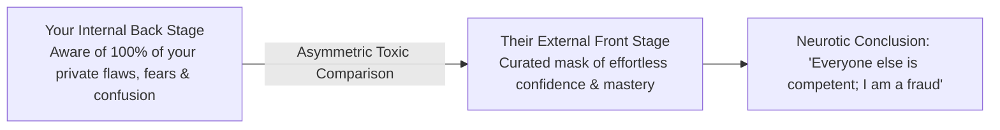
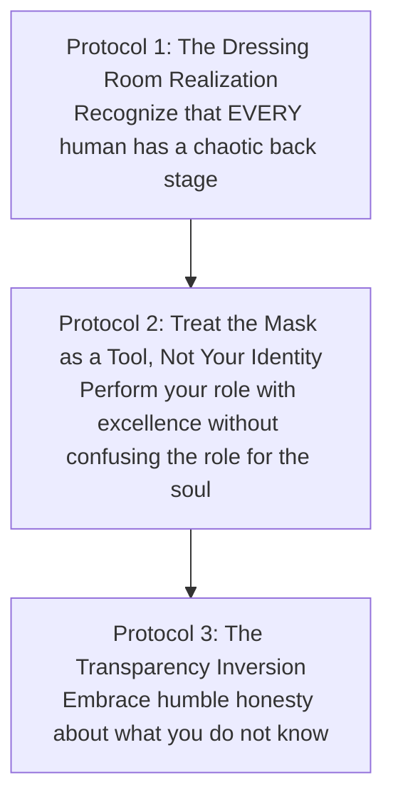

Almost every ambitious person suffers from a recurring psychological infection: **Imposter Syndrome**—the persistent fear that they are an unqualified fraud about to be exposed by their peers.

In 1959, sociologist Erving Goffman published a revolutionary framework in *The Presentation of Self in Everyday Life* known as the **Dramaturgical Model of Social Interaction**. 

Goffman revealed that human social life is structurally identical to a theatrical stage production. When you understand the profound difference between the **Front Stage** and the **Back Stage**, imposter syndrome and social intimidation dissolve completely.

---

### The Dramaturgical Division: Front Stage vs. Back Stage

```mermaid
graph TD
    subgraph The Front Stage (The Public Performance)
        F1[Polished Appearance & Rehearsed Composure]
        F2[Mask of Total Competence & Confidence]
        F3[Carefully Filtered for Social Audience]
    end

    subgraph The Back Stage (The Private Reality)
        B1[Messy Doubts, Exhaustion & Confusion]
        B2[Rehearsing, Stumbling & Adjusting Props]
        B3[Raw Biological & Emotional Humanity]
    end

    F1 & F2 & F3 -.->|What the World Sees| OBS[The Public Spectator]
    B1 & B2 & B3 -.->|What Only the Individual Sees| SLF[Internal Consciousness]
```

* **The Front Stage**: The physical and behavioral setting where an individual performs a curated social role (an employee in a meeting, a student during a viva, a speaker on a podium, or a creator posting on social media). On the front stage, props are arranged, mistakes are hidden, and confidence is broadcast.
* **The Back Stage**: The private dressing room where the performer steps out of character. Here, every human being experiences self-doubt, fatigue, messy emotional drafts, digestive discomfort, and hesitation.

---

### The Anatomy of the Imposter Fallacy



* **The Asymmetric Information Trap**: You have 24/7 insider access to your own Back Stage—you know every insecurity, every unread chapter, and every moment of fear. But you only ever see the polished Front Stage performance of other people.
* **The Inevitable Distortion**: When you compare your raw, unedited interior with someone else's highlight reel or professional persona, you will *always* feel like an imposter.

---

### The Three Protocols for Demystifying the Stage



1. **The Dressing Room Realization**: The CEO, the exam topper, the decorated professor, and the industry titan all have messy, confused, doubting Back Stages. They are not demigods; they are actors doing their best under the spotlight.
2. **Role Distance**: Never confuse your social costume with your true essence. Wear the uniform of your profession or role with total discipline and care, but retain the quiet awareness of the unattached observer.
3. **The Transparency Inversion**: Paradoxically, the fastest way to kill imposter syndrome is to openly admit what you don't know: *"I don't have that answer yet, but I will research the exact mechanics and report back by 4:00 PM."* The moment you stop pretending to be omniscient, you can never be "exposed."

---

### The Core Takeaway to Remember
> You feel like an imposter only because you are comparing your chaotic, unedited backstage with everyone else's rehearsed front-stage performance. Strip away the theatrical props: every human is figuring it out in real time. Deliver your performance with focus, shed the mask when the curtain falls, and walk with quiet peace.
