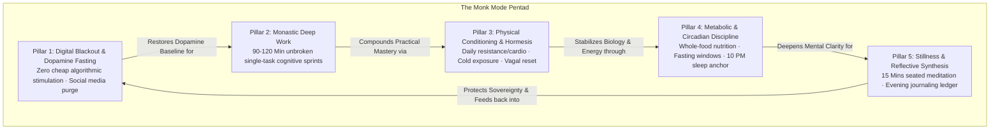
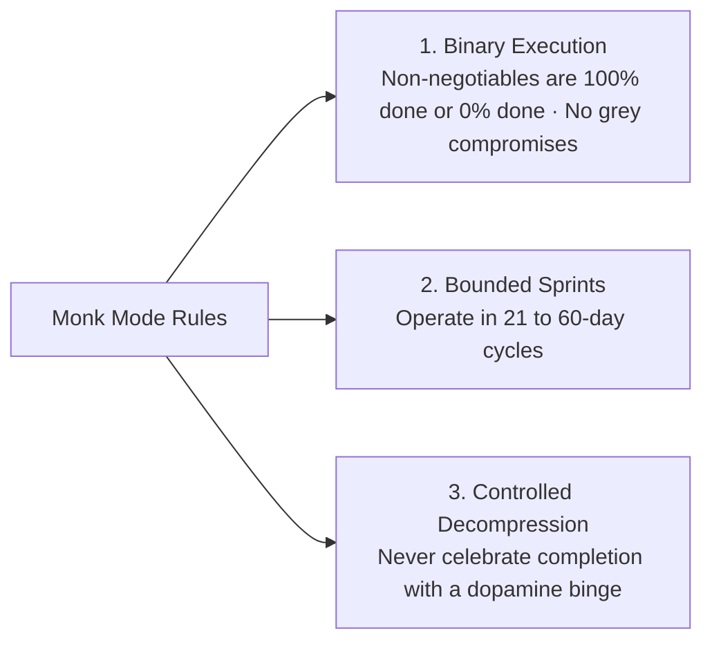
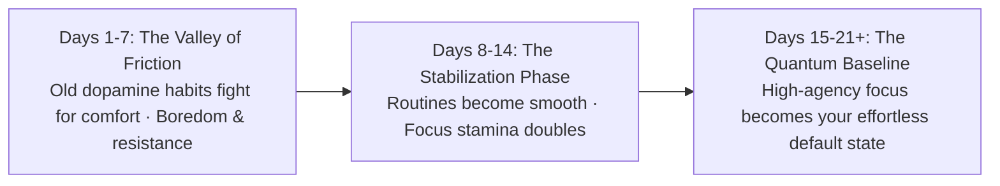

Most human lives are not governed by conscious choice; they are governed by **subconscious inertia, algorithmic conditioning, and default drift**.

When you wake up and immediately react to notifications, drift through workday obligations, consume hyper-stimulating entertainment in the evening, and sleep without reflection, your brain operates inside the **Autopilot Trap** (excessive dominance of the Default Mode Network).

To break free from reactive drift, you do not need chaotic, emotional motivation. You need **Monk Mode: a deterministic, high-agency operating system** that systematically recalibrates your dopamine sensitivity, executive focus, physical baseline, and skill trajectory.

---

### The Monk Mode Architecture: The 5 Non-Negotiable Pillars

---

### Pillar 1: Digital Blackout & Dopamine Fasting (Signal Calibration)
* **The Problem**: Constant micro-stimulation desensitizes striatal dopamine receptors, making deep study feel painfully boring.
* **The Non-Negotiable**: Enforce a total blackout on algorithmic short-form video, video games, and frivolous group chats throughout the Monk Mode sprint. High-dopamine inputs are quarantined or eliminated entirely.
* **The Yield**: Baseline dopamine sensitivity recovers, restoring intrinsic fascination with difficult books, complex problems, and quiet crafts.

---

### Pillar 2: Monastic Deep Work (Cognitive Capital)
* **The Problem**: Shallow work (checking emails, jumping across tabs, superficial reading) gives the illusion of productivity while building zero career leverage.
* **The Protocol**: Complete at least one **90 to 120-minute unbroken cognitive block** every morning before the world begins demanding your attention.
* **The Rule**: A single tab open, phone isolated in another room, and zero communication tools running.

---

### Pillar 3: Physical Conditioning & Hormesis (The Biological Anchor)
* **The Problem**: A sedentary body traps chronic cortisol in tissues and depresses prefrontal blood circulation.
* **The Practice**: 30 to 45 minutes of daily resistance training, high-intensity intervals, or brisk outdoor movement combined with cold showers.
* **The Mechanism**: Physical exertion spikes Brain-Derived Neurotrophic Factor (BDNF) and endocannabinoids, eliminating mental restlessness and anchoring emotional stability.

---

### Pillar 4: Metabolic & Circadian Discipline (Clean Cellular Fuel)
* **The Problem**: Heavy processed carbohydrates, late-night meals, and erratic sleep cycles induce systemic brain inflammation and afternoon crashes.
* **The Standard**:
  1. Eat nutrient-dense whole foods with zero refined sugars.
  2. Maintain a consistent 8-hour sleep window anchored at 10:00 PM.
  3. Hydrate immediately upon waking with 500ml of mineralized water.

---

### Pillar 5: Daily Stillness & Reflective Synthesis (Wisdom Ledger)
* **The Problem**: Without reflection, mistakes are repeated daily and mental loops remain unclosed.
* **The Practice**:
  * **Morning Stillness**: 10 to 15 minutes of seated mindfulness/breath observation to expand the gap between stimulus and response.
  * **Evening Ledger**: 5 minutes before bed recording:
    1. *Where did I execute with high agency today?*
    2. *Where did I experience resistance or leaks?*
    3. *What is my single non-negotiable lead priority for tomorrow?*

---

### The Three Operational Rules of Monk Mode

1. **Binary Execution (Zero Negotiation)**: Non-negotiables have no middle ground. An action is either executed or not. This eliminates the energy-draining mental debate (*"Should I study today or rest?"*).
2. **Bounded Sprint Horizon**: Monk Mode is not a perpetual ascetic sentence; it is a **21 to 60-day high-intensity sprint** designed to create a quantum leap in skill, rank, or health.
3. **Controlled Decompression (The Rebound Defense)**: The biggest trap of Monk Mode is bingeing on dopamine the day after completion. Transition smoothly into a sustainable high-standard baseline.

---

### The 21-Day Neuroplastic Transformation Curve

* **The Friction Hurdle**: During the first 7 days, your subconscious will generate dozens of excuses to break the protocol.
* **The Breakthrough**: By day 21, previous dopamine pathways atrophy, prefrontal control becomes second nature, and monastic focus feels calm, natural, and deeply empowering.

---

### The Core Takeaway to Remember
> Monk Mode is not about punishment; it is about reclaiming your sovereignty. Eliminate cheap stimulation, guard your morning deep work, train your physical body, fuel your biology, and close every day with honest reflection. When you master your daily non-negotiables, mental rebirth is the inevitable result.
