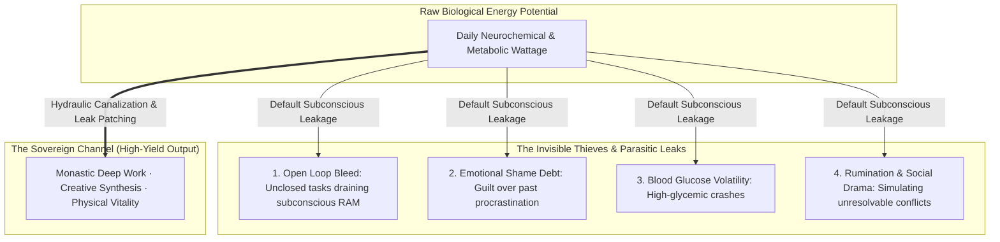
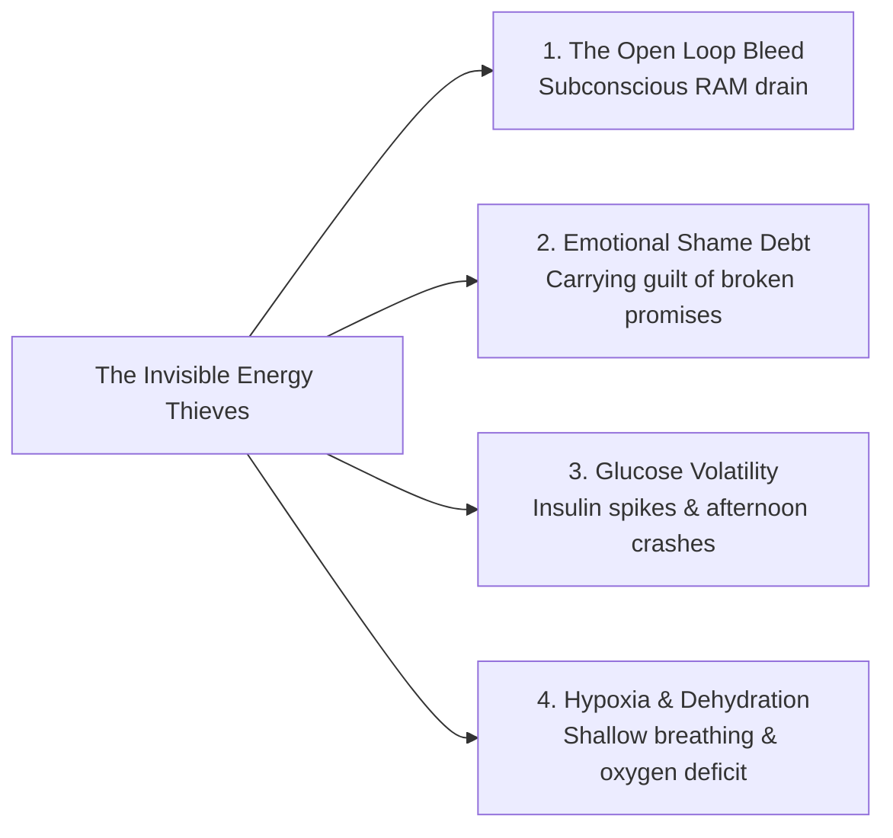
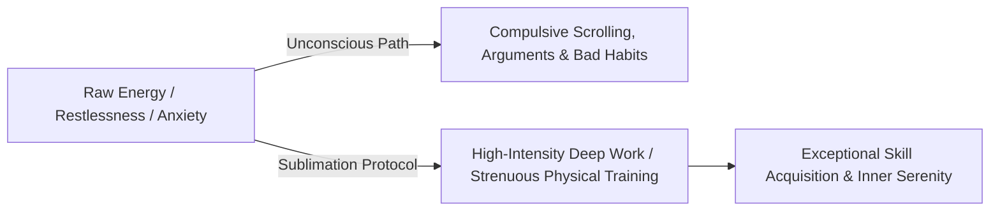
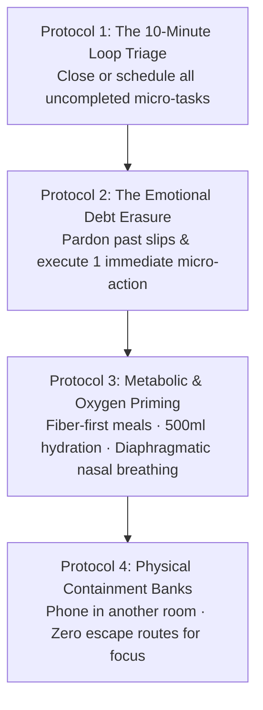

When people struggle with chronic distraction, afternoon lethargy, or lack of discipline, they almost universally diagnose themselves with an **energy deficit**: *"I just don't have enough drive, energy, or stamina to do what needs to be done."*

In cognitive neurobiology and psychodynamics, this diagnosis is fundamentally false. **The human nervous system is rarely depleted of energy; it is suffering from an energy direction failure and invisible micro-thefts.**

Consider what happens when an "undisciplined" individual is given a hyper-stimulating video game, an intense online debate, or an engaging movie: they can effortlessly expend massive amounts of cognitive focus, strategic calculation, and emotional energy for six continuous hours without a single trace of fatigue. The biological power plant is functioning at maximum capacity, but the current is being drained by **parasitic energy sinkholes and subconscious leaks**.

---

### The Conservation Law of Psychic Energy

Just as the First Law of Thermodynamics states that energy cannot be created or destroyed—only transformed from one form to another—the human mind operates under a **hydraulic energy model**:

* **The River Principle**: Your mental energy is like a rushing mountain river. You cannot stop the river by building a fragile wall of brute willpower—the water pressure will simply build up, breach the dam, and cause an explosive relapse into distraction.
* **Canalization over Suppression**: You do not suppress psychic energy; you **dig new irrigation canals** and patch the invisible leaks so that the natural current has nowhere to flow except through meaningful, high-leverage craft.

---

### The Four Invisible Thieves Stealing Your Energy

1. **The Open Loop Bleed (Subconscious RAM Drain)**:
   * Every unfinished task, unreplied email, delayed chore, or postponed decision does not vanish when ignored. It continues to run as a **background process in working memory** (the Zeigarnik effect), silently consuming up to 30% of your prefrontal processing power.
2. **Emotional Shame Debt (The Guilt Tax)**:
   * When you procrastinate and spend 3 hours beating yourself up with internal self-criticism, you expend more metabolic energy on *self-loathing* than the actual work would have taken. Guilt is the heaviest emotional tax on biological vitality.
3. **The Blood Glucose Rollercoaster (Metabolic Theft)**:
   * Consuming high-sugar snacks, refined carbs, or heavy processed meals spikes blood glucose, triggering massive insulin surges followed by reactive hypoglycemia. The brain interprets this sudden glucose drop as an emergency, inducing severe brain fog, sleepiness, and panic cravings.
4. **Chronic Sub-Clinical Hypoxia & Micro-Dehydration**:
   * Sitting hunched over a desk induces shallow, rapid chest breathing and mild dehydration. A 2% drop in cellular hydration and chronic shallow breathing reduces cerebral blood oxygenation by 15% to 20%, mimicking clinical exhaustion.

---

### The Principle of Sublimation: Channeling Raw Drive

In analytical psychology, **Sublimation** is the mature psychological defense mechanism whereby primal, raw biological drives (restlessness, anxiety, anger, sexual energy, obsessive focus) are transmuted into socially productive, intellectually demanding activities.

* When you feel intensely restless, agitated, or anxious, do not attempt to force yourself into passive stillness.
* **Convert the state kinetically**: Channel that high-arousal energy into a demanding physical workout, a timed problem-solving sprint, or a structured architectural brainstorm. Restlessness is simply unexpressed power looking for a conduit.

---

### The Protocols for Total Energy Sovereignty

#### 1. The 10-Minute Loop Triage (RAM Cleanup)
* Sit with a blank sheet of paper and write down every single uncompleted task or half-made decision bouncing around in your head.
* Apply a 2-minute rule: either execute it immediately, delegate it, schedule an exact calendar time for it, or delete it permanently. Once working memory knows the task is safely externalized, the subconscious background process terminates.

#### 2. Emotional Debt Erasure (Forgive the Past)
* Recognize that guilt does not produce discipline; guilt produces dopamine seeking.
* Mentally forgive yesterday's procrastination with complete finality. Wipe the psychological ledger clean and deposit proof into your identity bank through a single 5-minute work sprint right now.

#### 3. Metabolic & Respiratory Priming
* Prioritize whole foods, fiber, and clean protein before complex study blocks to maintain a smooth, flat glucose curve.
* Every 60 minutes, take 5 slow, deep physiological sighs (double inhale through the nose, long extended exhale through the mouth) to instantly re-oxygenate neural tissues and reset vagal tone.

#### 4. Build Physical Containment Banks
* A river stays powerful only when constrained between two narrow, rigid riverbanks.
* Lock the phone in another room, close all unrelated tabs, and clear the physical desk. When energy has zero escape routes, it naturally pours into the craft directly in front of you.

---

### The Core Takeaway to Remember
> You are not lazy, broken, or lacking in energy. You are an energetic powerhouse being quietly drained by open loops, emotional guilt, metabolic crashes, and unmanaged plumbing. Patch the invisible leaks, clear your subconscious RAM, build unbreakable environmental riverbanks, and direct your full wattage into deep, transformative craft.
