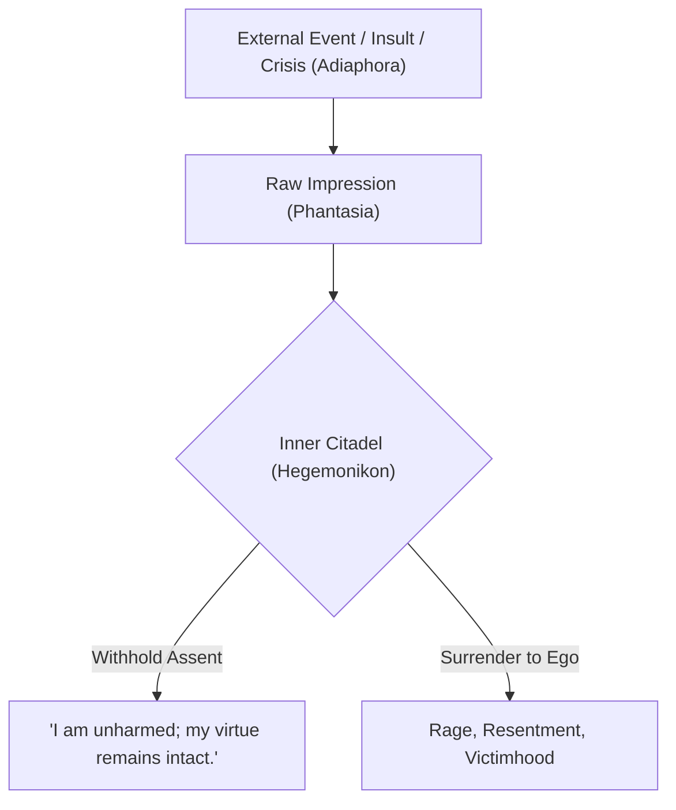
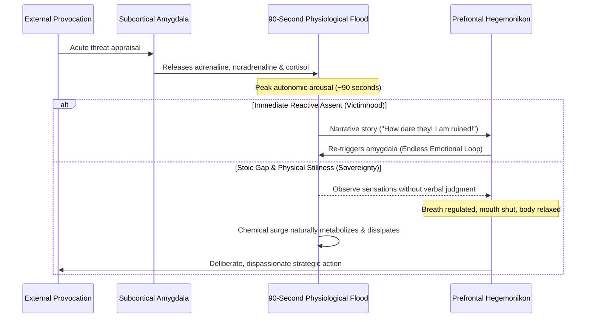

The supreme paradox of Marcus Aurelius was that the man who commanded the Roman legions and owned the Mediterranean world wrote his private notes not to instruct others, but to **discipline himself**.

---

### The Four Pillars of Aurelian Sovereignty

#### 1. "No One is Coming to Save You" (Radical Self-Rescue)
Marcus understood that dependency on outside saviors breeds helplessness. You entered the world alone, you govern your mind alone, and you leave alone. The solution to internal turmoil is not a change of scenery, but an audit of internal beliefs.

#### 2. The Morning Defense Protocol
Every morning, prepare for inevitable social friction:
> *"The people I deal with today will be meddling, ungrateful, arrogant, dishonest, jealous, and surly... but none of them can hurt me, for no one can implicate me in ugliness."*

#### 3. Do Not Be "Caesarified"
Power is a dangerous narcotic. Marcus constantly commanded himself to remain simple, unpretentious, and accessible—treating authority as public stewardship rather than personal glory.

#### 4. The Obstacle IS The Way
Like a roaring fire that consumes everything thrown into it to burn brighter, a sovereign mind converts slander, delays, sickness, and betrayal into the raw fuel of virtue and wisdom.

#### 5. The Neurobiology of Withholding Assent: The 90-Second Response Gap
Modern neurobiology (Dr. Jill Bolte Taylor) and Franklian existential psychology validate the ancient Stoic discipline of *withholding assent*. When provoked by disrespect, criticism, or abrupt crisis:

1. **The Biochemical Half-Life**: The physical sensation of an emotional trigger—flushed skin, elevated heart rate, tight throat—takes approximately **90 seconds** to flush through the bloodstream. 
2. **The Feeding of the Fire**: If you remain physically still, regulate your exhalation, and refuse to spin a story of insult or victimhood, the surge vanishes. Emotional outrage lasting hours or days is never caused by the event; it is manually re-manufactured by internal narrative loops.
3. **The Viktor Frankl Axiom**: *"Between stimulus and response there is a space. In that space is our power to choose our response. In our response lies our growth and our freedom."* By honoring the 90-second buffer, the Inner Citadel remains unbreached.
