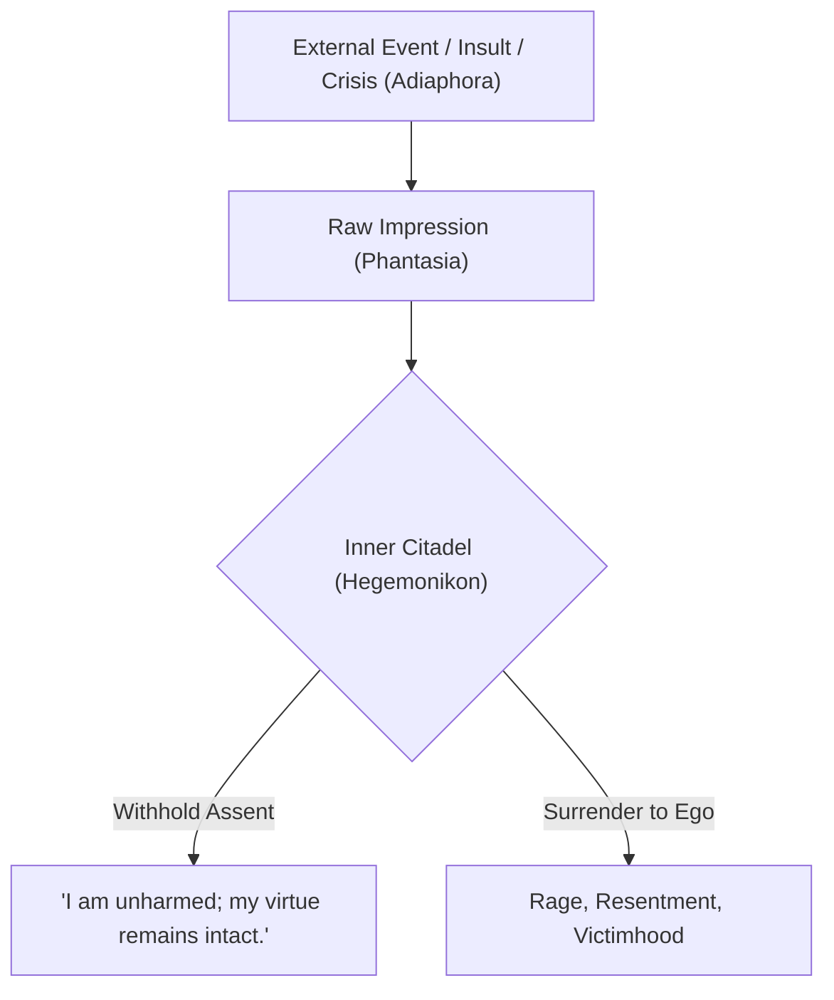
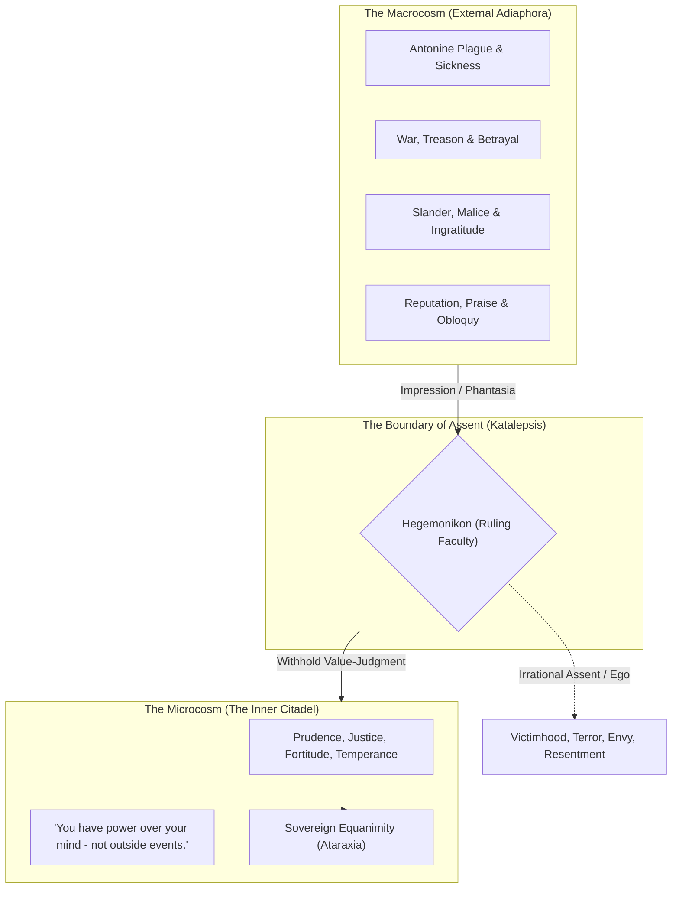
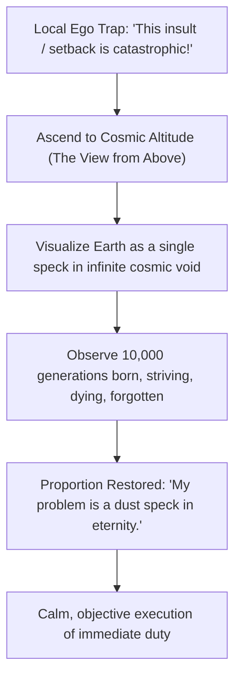
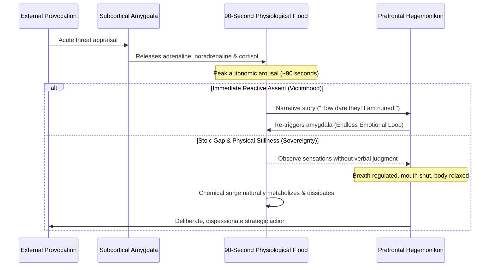

The supreme paradox of Marcus Aurelius was that the man who commanded the Roman legions and owned the Mediterranean world wrote his private notes not to instruct others, but to **discipline himself**.

---

### The Architecture of Aurelian Sovereignty

Marcus Aurelius's *Meditations* (*Ta Eis Heauton* — literally *"To Himself"*) reveals that freedom and sovereignty are not external privileges bestowed by empire, wealth, or fortune, but an uncompromising, solitary internal discipline. The Emperor reigned during the Antonine Plague, catastrophic Germanic frontier wars, internal treason by Avidius Cassius, and personal bereavement (losing eight of his children). Yet his operational philosophy maintained that external events cannot touch the soul without our consent.

---

### Core Tenets & Mental Models

#### 1. Radical Self-Rescue & Solitude: "No One is Coming to Save You"
Marcus understood that dependency on outside saviors, divine interventions, or social applause breeds psychological helplessness. You entered the world alone, you govern your ruling center alone, and you leave alone. 
- **The Delusion of Geographies**: Men seek retreats in the countryside, by the seashore, or in the mountains. Marcus dismissed this as amateurish: *"Nowhere can man find a quieter or more untroubled retreat than in his own soul."*
- **Self-Accountability**: If you are miserable, disorganized, or reactive, no mentor, regime change, or external circumstance will rescue you. The audit must be directed 100% inward.

#### 2. The Morning Pre-Mortem of Human Friction
Every morning at dawn, Marcus fortified his cognitive borders against interpersonal friction:
> *"When you wake up in the morning, tell yourself: The people I deal with today will be meddling, ungrateful, arrogant, dishonest, jealous, and surly. They are like this because they cannot distinguish good from evil. But I have seen the beauty of good, and the ugliness of evil, and have recognized that the wrongdoer has a nature related to my own... None of them can hurt me. No one can implicate me in ugliness. Nor can I feel angry at my relative, or hate him. We were made to work together like feet, hands, and the rows of the upper and lower teeth."*

By pre-visualizing malice and stupidity as natural phenomena (as predictable as thorns on a briar), the sovereign mind removes surprise, neutralizing reactive indignation.

#### 3. Immunity to "Caesarification"
Absolute power is a toxic narcotic that rots character from within. Marcus constantly warned himself against becoming dyed with imperial purple:
- *"Take care not to be transformed into a Caesar, not to be dipped in the purple dye; for that produces stain."*
- Authority must be treated strictly as selfless civic stewardship rather than personal elevation. True sovereignty lies in simplicity, austerity, kindness, and devotion to duty, entirely decoupled from pomp and imperial flatterers.

#### 4. The View from Above (*Sympatheia* & Cosmic Spatial Decentering)
When gripped by acute stress, panic, or social comparison, Marcus practiced spatial elevation:
- **Orbital Perspective**: Mentally ascend to the stratosphere and look down upon the entire Mediterranean basin. Observe the millions of human beings: weddings, funerals, feasts, litigation, plowing of fields, armies clashing, and political intrigues.
- **The Point of a Needle**: The entire earth is merely a point in boundless infinite space. Rome is a fraction of that point, and an individual critic or rival is an imperceptible speck upon that fraction.
- **Dissolution of Ego & Status Anxiety**: Viewed from cosmic altitude, human titles, petty slights, board meetings, and social rivalries lose their terrifying gravity and reveal their comical, fleeting absurdity.

#### 5. Memento Mori & The River of Time (Temporal Dissolution)
Death is not a future tragedy waiting to arrive; it is occurring right now as every passing second dies behind us.
- **The River of Oblivion**: Time is an unceasing, violent torrent. No sooner has a thing entered sight than it has been swept away, and another sweeps past in turn.
- **The Equality of Dust**: Alexander the Great and his mule driver both died, and both were reduced to the exact same elements. The praise of future generations is as empty as the praise of those who came before.
- **The Operational Razor**: *"Think of yourself as dead. You have lived your life. Now, take what's left and live it properly."* Constant remembrance of mortality instantly vaporizes procrastination, vanity, grievance-holding, and fear. If this hour were your final hour on earth, would you waste it scrolling mindlessly or defending your pride against a fool?

#### 6. The Dichotomy of Control & The Boundary of Assent (*Epictetian-Aurelian Hegemonikon*)
Stoic mastery divides the entire universe into two categories:
1. **Things within our power (*Ta Eph' hemin*)**: Our judgments, intentions, desires, aversions, and moral character.
2. **Things outside our power (*Ta Ouk Eph' hemin*)**: The body, wealth, reputation, health, the weather, the opinions of other people, and death.

Harm does not exist in the external event itself; it exists entirely in the judgment we paste onto the event.
> *"Remove the judgment, and you have removed the thought 'I am hurt.' Remove the thought 'I am hurt,' and the hurt itself is gone."*

#### 7. Providential Logos vs. Random Atoms (Cosmic Equanimity)
Marcus engaged deeply with Epicurean atomism versus Stoic providence:
- *"Either a universe governed by intelligent design (Logos), or a chaotic dance of colliding atoms."*
- **The Stoic Invariant**: Even if the cosmos is nothing more than blind, purposeless matter bouncing through a void, your obligation to maintain personal integrity, virtue, justice, and rational self-command remains 100% unaltered. Chaos in the universe does not grant you permission to be chaotic in your own soul.

#### 8. Cosmopolitan Duty & Collective Symbiosis
Stoicism is not cold, narcissistic detachment. Marcus repeatedly insisted that human beings exist for one another:
- *"Men exist for the sake of one another. Teach them then or bear with them."*
- We are limbs of a single cosmic organism. To work against another human being, to harbor bitter malice, or to withhold civic contribution is to act like a severed hand refusing to serve the body.

---

### Modern Neuroscience Bridge: The 90-Second Response Gap

Modern neurobiology (Dr. Jill Bolte Taylor) and Franklian existential psychology validate the ancient Stoic discipline of *withholding assent*. When provoked by disrespect, criticism, or abrupt crisis:

1. **The Biochemical Half-Life**: The physical sensation of an emotional trigger—flushed skin, elevated heart rate, tight throat—takes approximately **90 seconds** to flush through the bloodstream. 
2. **The Feeding of the Fire**: If you remain physically still, regulate your exhalation, and refuse to spin a story of insult or victimhood, the surge vanishes. Emotional outrage lasting hours or days is never caused by the event; it is manually re-manufactured by internal narrative loops.
3. **The Viktor Frankl Axiom**: *"Between stimulus and response there is a space. In that space is our power to choose our response. In our response lies our growth and our freedom."* By honoring the 90-second buffer, the Inner Citadel remains unbreached.

---

### The Sovereign Operating Checklist

| Trigger / Crisis | Default Reactive Pattern | Aurelian Sovereign Protocol |
| :--- | :--- | :--- |
| **Direct Disrespect / Slander** | Immediate counter-attack, defensiveness, simmering outrage | Check: *Did this damage my justice, temperance, or integrity?* If not, the speaker has harmed only themselves. |
| **Severe Setback / Catastrophe** | Despair, blaming fate, feeling singled out | *The Obstacle IS the Way*: Convert the impediment into the raw material of patience, creativity, and endurance. |
| **Ego / Flattery / Promotion** | Smugness, inflated self-importance, fear of losing status | *Avoid Caesarification*: Remember your mortal fragility. Status is fleeting vapor; only duty and virtue endure. |
| **Interpersonal Friction & Ingratitude** | Bitterness, social exhaustion, cynicism | *Morning Pre-Mortem*: They are acting according to their nature. You were built to cooperate like teeth in a jaw. |
| **Anxiety About Future Uncertainty** | Mental spirals, insomnia, catastrophizing | *The View from Above & Present Focus*: Confine your focus to the immediate hour. Meet tomorrow with the exact same reason you use today. |
