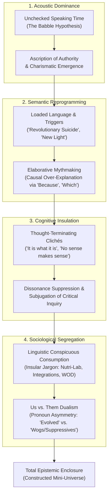
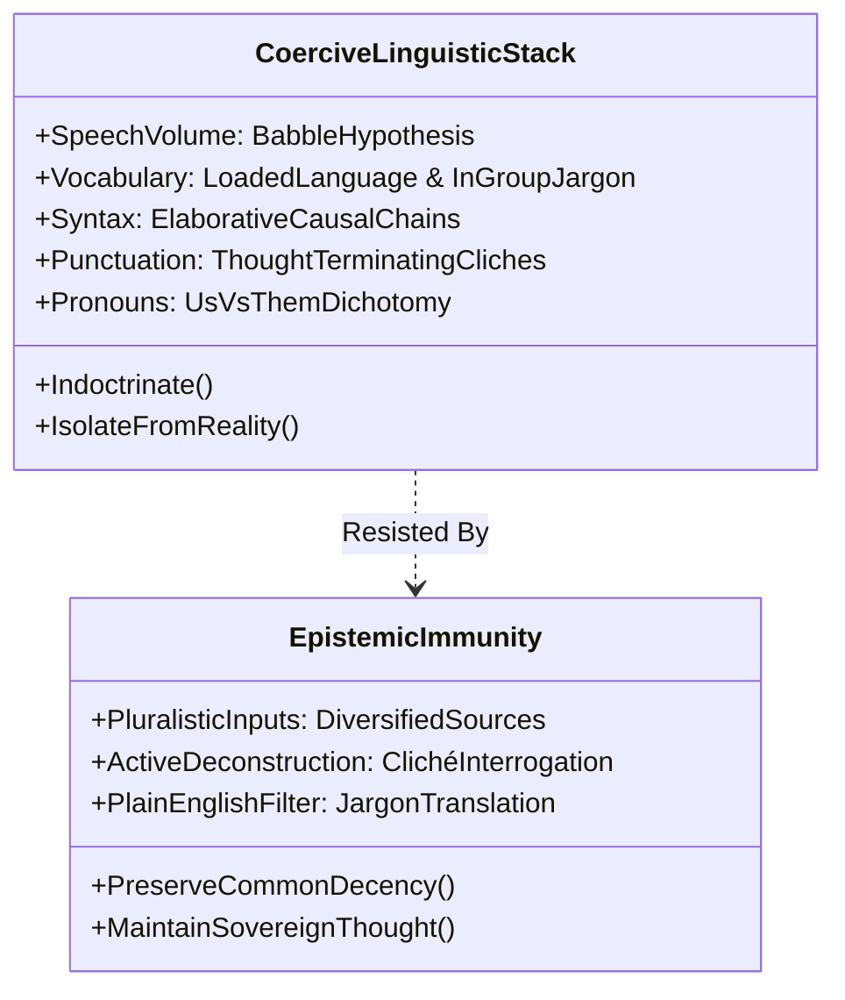

The common perception of authoritarian indoctrination and cultic capture imagines physical captivity, violent threats, or theatrical brainwashing. Yet forensic linguistic analysis reveals a far more insidious truth: **coercive movements do not break the human will by brute force; they imperceptibly rewrite the operational software of the mind through language.**

French phenomenologist Maurice Merleau-Ponty observed that **language is our element as water is the element of fish**. Human beings do not navigate bare physical reality; we inhabit a conceptual cosmos constructed from the words, definitions, and semantic categories we absorb. Alter the grammar, redefine the nouns, and constrict the syntax, and you fundamentally transmute the human experience of what is real, moral, and sane.

---

### The Four Pillars of Linguistic Coercion

#### 1. The Babble Hypothesis: Dominance via Quantity
For decades, social scientists debated whether leadership emergence was driven by intellectual competence, emotional intelligence, or sheer vocal dominance. In 2020, researchers conducted the most rigorous test of the **Babble Hypothesis** to date. Diverse cohorts were tasked with solving high-stakes cooperative strategy games. Total speaking time, semantic substance, and psychological profiles were measured.

The outcome was definitive: **total speaking time had the single highest correlation with who was nominated as group leader**—eclipsing analytical intelligence, domain proficiency, agreeableness, and even general extraversion.

Humans use vocal volume and conversational airtime as an unconscious heuristic: *“If everyone is listening to this person speak without interruption, they must possess the authority to lead.”* Cult figures—from Jim Jones orating for uninterrupted days at Jonestown to Heaven’s Gate’s Marshall Applewhite—exploit this cognitive shortcut by drowning their flock in verbal torrents, monopolizing attentional bandwidth until critical reflection atrophies.

#### 2. Loaded Language: Engineering Pavlovian Triggers
Linguist Amanda Montell (*Cultish*) demonstrates that destructive groups weaponize **Loaded Language**—words engineered with immense emotional freight designed to bypass rational evaluation. 

Over time, through endless ritual repetition, leaders calibrate these terms into **linguistic buttons**:
- **Jim Jones (Peoples Temple)**: Appropriated the Black Panther political idiom *"Revolutionary Suicide"* to reframe mass poisoning with cyanide-laced Flavorade not as death or defeat, but as supreme anti-authoritarian martyrdom.
- **Charles Manson**: Repurposed The Beatles' innocent lyric *"Helter Skelter"* into an apocalyptic, sacred prophecy of impending racial war.
- **David Koresh (Branch Davidians)**: Coined *"New Light"* to sanctify arbitrary doctrinal shifts and personal sexual exploitation as direct divine revelations.

When a follower hears the loaded phrase, conditioned emotional reflexes instantly override logical scrutiny.

#### 3. Thought-Terminating Clichés: Semantic Stop Signs
Originally classified by psychiatrist Robert Jay Lifton in *Thought Reform and the Psychology of Totalism*, a **thought-terminating cliché** is a folk saying or platitude deployed to terminate uncomfortable inquiry and halt cognitive dissonance in its tracks.

These clichés operate as a psychological two-way street:
1. **For the Authority**: It shuts down dangerous questions without requiring an empirical or logical answer.
2. **For the Follower**: It provides cognitive relief, giving the believer explicit permission to stop grappling with troubling contradictions.

| Coercive Context | Thought-Terminating Cliché | Underlying Subtext & Cognitive Effect |
| :--- | :--- | :--- |
| **Manson Family** | *"No sense makes sense."* | Abort all rational analysis; accept incoherence as profundity. |
| **Heaven's Gate** | *"Lacking the gift of recognition."* | Siphon the burden of proof onto the skeptic; brand critical doubt as spiritual blindness. |
| **FLDS (Warren Jeffs)** | *"Keep sweet."* | Criminalize authentic dissent; mandate performative domestic submission. |
| **Multi-Level Marketing (Amway)** | *"Stinkin' thinkin'."* | Pathologize economic skepticism as personal moral and financial failure. |
| **QAnon & Online Conspiracies** | *"Trust the plan."* | Neutralize disconfirming empirical evidence; demand blind faith in invisible schemes. |
| **Corporate Bureaucracy** | *"It is what it is."* | Dismiss systemic malfunction; induce learned helplessness. |

#### 4. Jargon as Linguistic Conspicuous Consumption
While complex technical fields require specialized nomenclature to communicate precision, destructive groups repurpose jargon for a sociological objective: **erecting an insular boundary between the elect and the profane**.

A 2020 study by researchers from Columbia University and the University of Southern California (USC) examined the psychological motives behind unnecessary jargon. Analyzing academic writings and business pitches, they found that **individuals and institutions suffering from low status or feelings of inferiority used significantly higher volumes of convoluted jargon**. Students primed to feel outclassed in venture pitches immediately masked their insecurity in impenetrable terminology.

In cults, this phenomenon operates as **Linguistic Conspicuous Consumption**:
- **Heaven's Gate**: Banned mundane domestic words; the kitchen became the *"Nutri-Lab"*, the laundry became the *"Fiber-Lab"*, the physical body was a *"vehicle"*, and the commune was the *"classroom"*.
- **NXIVM**: Keith Raniere instituted *"integrations"* to fix psychological flaws labeled *"disintegrations"*, dressing sex trafficking in therapeutic techno-babble.
- **Scientology**: Compiled a literal 300-page proprietary dictionary, branding outsiders with the dehumanizing label *"wogs"*, while identifying critical family members as *"suppressive persons"* (SPs).

Learning the secret dialect provides initiates an intoxicating rush of elite belonging—a linguistic clubhouse that simultaneously alienates them from uninitiated family and friends.

---

### The Contemporary Seepage: Cultish Rhetoric in Daily Life

The mechanics of cultic speech are no longer confined to isolated communes. Propelled by hyper-capitalist incentives, algorithmic amplification, and the decline of traditional community anchors (unions, civic clubs, churches), cultish language has permeated contemporary culture:

1. **Corporate Dogma & Principles**: Mantras like Amazon’s *"Dive Deep"* or *"Think Big"* frequently morph from operational guidelines into thought-terminating instruments that silence debate over workplace burnout.
2. **Fitness Tribalism**: Subcultures (CrossFit, SoulCycle) cultivate fanatic fidelity through closed terminology (*"box"*, *"WOD"*, *"tapbacks"*), converting physical exertion into identity signaling.
3. **Political Tribalism**: Public discourse replaces complex policy debate with binary loaded labels—individuals are branded either *"patriots"* or *"traitors"*, eliminating nuanced civic dialogue.
4. **Algorithmic Guru Culture**: Digital wellness influencers (e.g., Teal Swan, Bentinho Massaro) broadcast to millions from smartphones, inventing viral micro-jargon (*"polywork"*, *"micro-cheating"*, *"dopamine detox"*, *"75 cozy"*) to capture digital territory and confer status upon followers who adopt the code.

---

### Incremental Epistemic Drift: The Mechanics of the Scam

In her account of losing $50,000 in cash to an elaborate phone scam, financial journalist Charlotte Cowles observed that the psychological coercion mirrored interrogation tactics and cult indoctrination:

> *"They do it incrementally, in a series of small steps that take you farther and farther from what you know to be true. It's not about breaking the will—they were altering my sense of reality."*

Coercion is not a sudden cliff; it is an imperceptible slope. By nudging an individual through a chain of minor, agreeable linguistic concessions, the manipulator gradually decouples the mark from standard reference frames until handing over life savings—or taking a loyalty oath—feels like the only logical conclusion inside the manufactured mini-universe.

---

### The Sovereignty Protocol: Epistemic Defense Against Coercion

To inoculate oneself against linguistic subjugation, apply three structural razors:

1. **The Translation Test (Jargon Stripping)**:
   Whenever an organization, guru, or leader deploys high-minded or impenetrable terminology (*"integrations"*, *"synergistic alignment"*, *"karmic realignment"*), translate the claim into concrete, third-grade plain English. If the concept evaporates once stripped of its technical ornamentation, it is linguistic conspicuous consumption.

2. **The Cliché Interrogation**:
   When confronted with a semantic conversation-stopper (*"It is what it is"*, *"Trust the process"*, *"Everything happens for a reason"*), refuse the stop sign. Ask: *"What specific causal mechanism does that phrase replace? What uncomfortable fact does this saying allow us to ignore?"*

3. **Radical Linguistic Pluralism (The Merleau-Ponty Invariant)**:
   Because language forms the water in which human consciousness swims, never permit a single entity, institution, partner, or ideology to supply your linguistic ecosystem. Immerse your intellect across conflicting traditions, opposing viewpoints, and diverse communities. When your semantic diet is polyphonic, no single master can build a linguistic prison around your mind.
