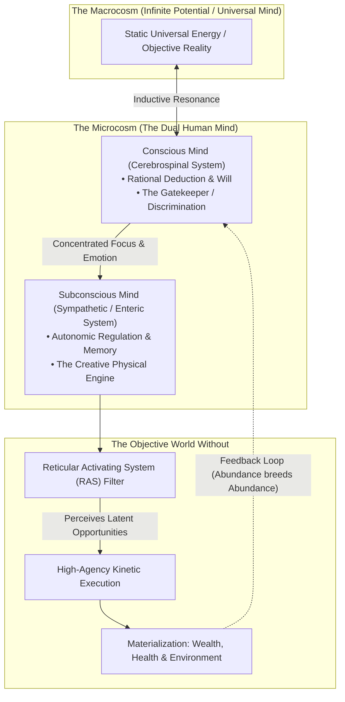
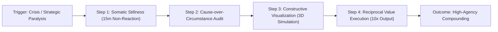

### The Historical Crucible & Foundational Thesis

Written in 1912 and distributed as a 24-week correspondence course in 1916 by St. Louis railroad executive and industrialist **Charles F. Haanel**, *The Master Key System* stands as the foundational intellectual architecture of 20th-century success literature. It served as the direct precursor and ideological blueprint for Napoleon Hill's *Think and Grow Rich*, Claude Bristol's *The Magic of Believing*, and the modern cognitive-behavioral science of self-efficacy.

Haanel rejected both the **passive mystic** (who prays or daydreams without causal mechanics or disciplined action) and the **blind materialist** (who exhausts himself in friction-filled manual labor while operating under a self-defeating internal program).

> **The Central Proposition**:  
> *"The world without is a reflection of the world within. What appears without is what has been found within. In the world within may be found infinite Wisdom, infinite Power, infinite Supply of all that is necessary, waiting for unfoldment, development and expression."*



---

### The Dual Nervous System & Anatomical Psychology

Haanel grounded his psychology directly in the physical wiring of the human body:

1. **The Cerebrospinal System (The Conscious Mind)**:
   * **Anatomical Seat**: The brain, spinal cord, and cranial nerves.
   * **Function**: Organ of volition, analytical reasoning, 5-sensory input, and logical discrimination.
   * **Role**: Acts as the **Cognitive Gatekeeper**. Its primary duty is to protect the subconscious from receiving parasitic, fear-based, or poverty-conditioned suggestions from the external environment.

2. **The Sympathetic Nervous System (The Subconscious Mind)**:
   * **Anatomical Seat**: Centered in the ganglionic plexus, particularly the **Solar Plexus** (the "abdominal brain" or what modern medicine terms the *Enteric Nervous System*).
   * **Function**: Regulates autonomic vitality—heart rate, respiration, digestion, endocrine balance, cellular regeneration, and procedural memory.
   * **Operational Law**: The subconscious does **not reason inductively or deductively**. It accepts every clear premise presented by the conscious mind as absolute truth and relentlessly mobilizes physiological and psychological drives toward its objective realization.

---

### The 24-Part Progressive Master Key Curriculum

The original 1916 course was delivered as 24 sequential lessons, each paired with an uncompromising, daily mental laboratory drill.

```
[Module 1: Somatic Control & Thought Stillness (Parts 1-4)]
                          │
                          ▼
[Module 2: Mental Architecture & Visualization (Parts 5-8)]
                          │
                          ▼
[Module 3: Inductive Logic & Epistemic Razors (Parts 9-12)]
                          │
                          ▼
[Module 4: Engineering of Desire & Intuition (Parts 13-16)]
                          │
                          ▼
[Module 5: Mental Economy & Reciprocal Value (Parts 17-20)]
                          │
                          ▼
[Module 6: The Summit: Polarity, Health & Mastery (Parts 21-24)]
```

#### Module 1: Somatic Control & Thought Stillness (Parts 1–4)
* **Part 1 — The World Within**: Harmony in the mind generates harmony in the body and environment. Contact with the creative source within precedes external success.
  * *The Drill*: Sit erect in a chair in absolute solitude. Keep the physical body completely motionless for 15 to 30 minutes. Inhibit every involuntary scratch, twitch, or shift.
* **Part 2 — The Subconscious Engine**: Over 90% of mental operations occur below conscious awareness. He who directs the subconscious directs his destiny.
  * *The Drill*: Return to physical stillness. Suppress and quiet all stray, erratic, and intrusive thoughts; hold the mind in calm, receptive equilibrium without drifting into sleep.
* **Part 3 — The Solar Plexus & The Abdominal Brain**: The solar plexus is the central power station of physical vitality and personal magnetism. Fear contracts it; conscious confidence expands it.
  * *The Drill*: Achieve complete neuromuscular relaxation. Consciously release tension from the jaw, neck, shoulders, abdomen, and extremities until all somatic strain dissolves.
* **Part 4 — The Law of Growth**: What you focus on expands; what you starve of attention atrophies. Fear is inverted faith—a mental blueprint of disaster.
  * *The Drill*: Maintain stillness and relaxation. Inhibit thoughts of lack, resentment, and sickness. Affirm with conviction: *"I am whole, perfect, strong, powerful, loving, harmonious, and happy."*

#### Module 2: Mental Architecture & Visualization (Parts 5–8)
* **Part 5 — The Creative Workshop**: Every building, empire, and technological artifact was created twice: first in mental imagination, second in physical matter.
  * *The Drill*: Dwell on the creative potency of thought. Visualize your mind as an architect’s drafting table, sketching the blueprint of your future with structural exactness.
* **Part 6 — Concentration & The Focused Beam**: Dispersed thought accomplishes nothing; concentrated thought cuts through resistance like a diamond stylus.
  * *The Drill*: Take a photograph of a familiar person. Study it intently for 3 minutes. Close your eyes and reconstruct their features in your mind in three-dimensional detail. Open your eyes to verify and repeat until crystal clear.
* **Part 7 — The Three-Dimensional Mental Matrix**: Visualization is not vague daydreaming; it is precise spatial and tactile simulation.
  * *The Drill*: Take a small physical object (a walnut, a flower, a key). Examine its weight, texture, ridges, and scent. Close your eyes and reproduce the object in mental space, rotating it and inspecting every facet.
* **Part 8 — The Law of Harmony**: You cannot attract what you internally contradict. Entertaining envy while desiring wealth is a fatal mathematical impossibility.
  * *The Drill*: Mentally construct a vast landscape of natural beauty (a pristine alpine lake, a towering pine forest). Anchor yourself within the scene: feel the cool breeze, hear the water, smell the pine needles.

#### Module 3: Inductive Logic & Epistemic Razors (Parts 9–12)
* **Part 9 — The Affirmation of Truth**: Affirmations are not superstitious spells; they are legal notices served to the subconscious mind.
  * *The Drill*: Undertake a **7-Day Mental Hygiene Fast**. Eliminate every complaining, cynical, or self-pitying word from your speech. Whenever a negative thought enters, immediately substitute its positive antithesis.
* **Part 10 — The Law of Causation**: "Luck" is the refuge of the unscientific mind. Every event is linked by an unbreakable causal chain to an antecedent thought or deed.
  * *The Drill*: Select an acute failure or recurring roadblock in your life. Trace it back without defensiveness to its root cause in your past beliefs, avoidances, or choices. Accept 100% causal ownership.
* **Part 11 — Inductive Reasoning & The Scientific Method**: Human progress accelerates when dogma is abandoned for observation, hypothesis, and empirical verification. Apply the same scientific discipline to your thoughts.
  * *The Drill*: Observe an external condition without emotional judgment. Deduce the fundamental principles governing its behavior.
* **Part 12 — The Power of Unified Concentration**: Genius is simply sustained, unbroken attention applied to a singular problem until the solution surrenders.
  * *The Drill*: Concentrate upon the unity of all life and knowledge. Perceive that your individual intellect is connected to the sum total of human wisdom.

#### Module 4: Engineering of Desire & Intuition (Parts 13–16)
* **Part 13 — Dreams Coupled with Execution**: The visionary without practical execution is an idle parasite; the laborer without vision is a pack animal. Mastery unites exalted dreams with meticulous execution.
  * *The Drill*: Visualize your definitive chief aim in your career or craft. See yourself executing complex operations with effortless competence.
* **Part 14 — Mental Economics & Destructive Friction**: Destructive emotions (spite, jealousy, fear) burn through cognitive glucose and deteriorate neural health.
  * *The Drill*: Practice interpersonal cognitive transmutation. Identify someone you resent, and intentionally project thoughts of goodwill, wisdom, and success toward them until internal bitterness dissolves.
* **Part 15 — The Law of Insight & Intuition**: Intuition is not supernatural whispering; it is the subconscious mind processing millions of environmental patterns that conscious working memory cannot hold.
  * *The Drill*: Pose a complex strategic question to your subconscious mind right before sleep or deep meditation. Cease conscious strain, release the problem entirely, and record the insight that emerges upon waking.
* **Part 16 — The True Nature of Wealth**: Currency is merely an exchange medium. Real wealth is the internalized capacity to solve problems, organize capital, and create value for civilization.
  * *The Drill*: Focus on expanding your service footprint: How can your skills create 10x more utility for your field or community?

#### Module 5: Mental Economy & Reciprocal Value (Parts 17–20)
* **Part 17 — Concentration via Symbolization**: Symbols act as anchors for the subconscious. A vivid mental archetype bypasses verbose conscious analysis.
  * *The Drill*: Condense your primary ambition into a clean, singular visual symbol that instantly triggers the emotional state of completed accomplishment.
* **Part 18 — The Law of Reciprocity & Compensation**: The universe maintains an incorruptible ledger. You can never extract sustainable wealth without delivering equivalent value.
  * *The Drill*: Audit your daily output: Are you giving the world your best craftsmanship, or are you looking for unearned shortcuts?
* **Part 19 — Conservation of Mental Energy**: Idle gossip, endless political arguments, and shallow entertainment bleed the cognitive energy required for profound creative work.
  * *The Drill*: Enforce total cognitive frugality. Hold your mental energy in reserve for demanding, high-leverage intellectual problems.
* **Part 20 — The Spirit of Generosity**: Hoarding out of terror of lack contracts the mind into a scarcity bottleneck. Abundance flows through open hands.
  * *The Drill*: Cultivate profound gratitude for current blessings, anchoring a visceral sensation of fullness and self-sufficiency.

#### Module 6: The Summit: Polarity, Health & Mastery (Parts 21–24)
* **Part 21 — The Law of Polarity**: Every crisis conceals an equal or greater opportunity. Light and darkness, heat and cold, failure and triumph are degrees of the same scale.
  * *The Drill*: Analyze your greatest current personal crisis and locate the exact strategic advantage or character evolution embedded within it.
* **Part 22 — Cellular Health & Neurobiology of Vitality**: The physical body replaces millions of cells daily. If flooded with chronic anxiety and cortisol, pathology emerges. Saturated with vitality and purpose, repair accelerates.
  * *The Drill*: Direct conscious intention through the somatic pathways of the body, affirming cellular vitality, strength, and immunity.
* **Part 23 — Emerson's Law of Compensation**: Every sacrifice yields an equivalent gain; every deceit punishes the deceiver. You cannot be cheated by anyone except yourself.
  * *The Drill*: Realign your entire life with radical integrity: eliminate all misalignment between your private thoughts, spoken words, and public deeds.
* **Part 24 — The Master Key (Unity of Consciousness)**: There is an underlying unity behind all physical laws, chemical reactions, and mental phenomena. When your actions harmonize with truth, constructive evolution, and service, all natural laws fight on your side.
  * *The Drill*: Enter deep silence. Realize your unity with the creative fabric of the universe. Rise from meditation and execute your mission with absolute certainty.

---

### Neuroscientific Translation Matrix (1916 Metaphysics $\to$ 2026 Science)

To strip away Victorian esoteric terminology and validate the framework within modern neuroscience and cognitive psychology:

| Victorian Metaphysical Term (1916) | Modern Neurobiological Reality (2026) | Biological & Cognitive Mechanism |
| :--- | :--- | :--- |
| **"The Solar Plexus / Abdominal Brain"** | **Enteric Nervous System (ENS) & Vagus Nerve** | The gut contains over 500 million neurons and produces 90% of circulating serotonin. Visceral intuitive signals ("gut instincts") are real vagal nerve signals transmitting threat and safety appraisals to the brainstem. |
| **"The Law of Attraction"** | **Reticular Activating System (RAS) & Selective Attention** | The human brain receives 11 million bits of sensory data per second, but can consciously process only ~50 bits. The RAS filters sensory input based on emotionally charged priorities, flagging opportunities that were previously filtered out as irrelevant noise. |
| **"Mental Image Materialization"** | **Predictive Processing & Motor Cortex Simulation** | Functional neuroimaging demonstrates that vivid visualization activates the exact same prefrontal, premotor, and sensory neural networks as physical execution, lowering the activation energy required to execute complex real-world actions. |
| **"Somatic Stillness Drill"** | **Dorsolateral Prefrontal Cortex (DLPFC) Inhibitory Control** | Resisting the urge to scratch, shift, or fidget trains the DLPFC to suppress subcortical motor impulses, directly building executive emotional regulation and impulse resistance. |
| **"Thoughts as Vibration"** | **Neural Oscillatory Coherence** | Sustained concentration shifts neural activity from desynchronized, high-frequency stress waves (High-Beta) to synchronized Alpha/Theta coherence, facilitating rapid synthesis, problem-solving, and neuroplastic consolidation. |

---

### Critical Audit: Epistemic Razors & Pseudoscience Warnings

> [!CAUTION]
> ### The 3 Fatal Pitfalls of Unchecked "New Thought" Philosophy
> 1. **The Armchair Solipsism Fallacy ("The Secret Trap")**:  
>    Thought alone does not warp physical gravity, bend light, or deposit money into accounts. Visualizing a business without doing customer discovery, cold outreach, balance sheet management, and product iteration results in financial ruin. **Thought prepares the perceptual and behavioral machinery for action; it does not replace action.**
> 2. **The Victim-Blaming Fallacy**:  
>    Haanel occasionally asserts that all disease, poverty, and accidents are the direct result of negative individual thoughts. This is empirically false and ignores genetic predispositions, infectious pathogens, geopolitical catastrophe, and stochastic macro-economic shocks.
> 3. **The Pseudoscience of "Etheric Telepathy"**:  
>    19th-century physics attempted to explain mental influence using the "luminiferous ether." In reality, interpersonal influence is mediated through **micro-expressions, vocal tone, pupil dilation, postural dominance, and behavioural consistency**—not invisible telepathic radio waves.

---

### The Master Key Operational Playbook



1. **The 15-Minute Somatic Stillness Razor**: Before attempting to solve an overwhelming problem, sit completely motionless for 15 minutes. Inhibit fidgeting. Settle autonomic arousal. Re-establish DLPFC executive dominance over the amygdala.
2. **The Cause-over-Circumstance Rule**: When confronted by an adverse circumstance, ban all complaints for 48 hours. Locate the internal causal belief or past behavioral omission that permitted the circumstance to occur.
3. **The 7-Day Mental Hygiene Fast**: Cease all gossip, cynicism, and negative self-talk. If you break the fast, reset the clock to Day 1. This systematically prunes negative neural pathways.
4. **The Sensory Simulation Protocol**: When visualizing, engage all five senses: feel the weight of tools, the cadence of your voice, the visual details of completed work.
5. **The Value-First Axiom**: Never pursue capital directly. Pursue the radical expansion of competence, service, and leverage. Capital is the inevitable shadow cast by indispensable value.
