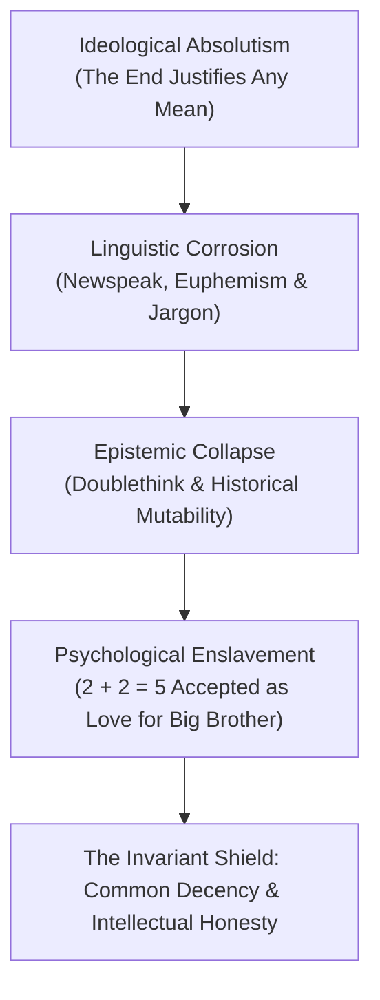

George Orwell’s enduring genius was not predictive prophecy, but forensic psychological diagnosis: **Totalitarianism does not begin with labor camps; it begins with the erosion of objective truth.**

---

### The Anatomy of Orwell's Thought

#### 1. The Death of Objective Truth
In Catalonia during the Spanish Civil War, Orwell witnessed newspapers reporting battles that never took place and lying about men who died fighting bravely. This revealed the terrifying reality of modern propaganda: **the past is not recorded; it is constantly fabricated.**

#### 2. Newspeak & The Narrowing of Thought
The ultimate goal of Newspeak was to make rebellious thoughts (*thoughtcrime*) impossible because there would be no vocabulary left to express them:
> *"The revolution will be complete when the language is perfect."*

#### 3. Doublethink: Controlled Psychosis
Doublethink requires the intellect to knowingly deploy deception, and instantly erase the memory of having lied. It is the voluntary surrender of the logical faculty to power.

#### 4. The Antidote: Common Decency
Against intellectual grandstanding and totalitarian fanaticism, Orwell championed the instinctive honesty, generosity, and straightforwardness of ordinary people. True virtue is concrete, tangible, and refuses to bend facts for ideological loyalty.
