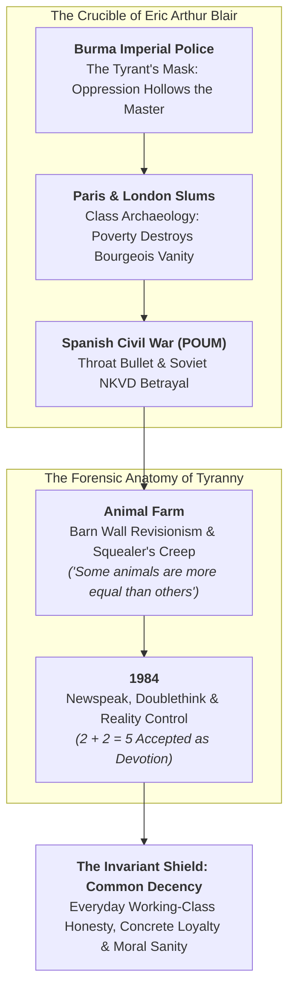
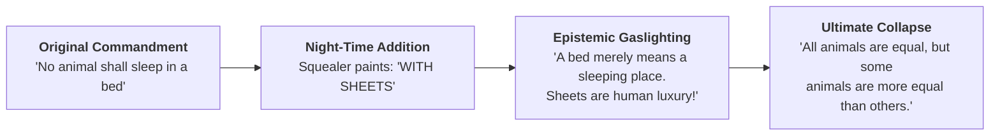

George Orwell’s enduring genius was not predictive prophecy, but forensic psychological diagnosis: **Totalitarianism does not begin with labor camps; it begins with the quiet erosion of objective truth.**

Unlike ivory-tower theoreticians who drafted utopian manifestos from comfortable armchairs, Eric Arthur Blair lived the horror he warned against. He operated the levers of colonial violence, scrubbed filthy dishes in subterranean Parisian kitchens, caught a fascist sniper’s bullet through his vocal cords, and was hunted through the streets of Barcelona by Soviet secret police.

His literary masterpieces—*Animal Farm* and *1984*—were not abstract allegories; they were the scar tissue of a man who watched human ideals systematically cannibalized by power.

---

### The Biographical Crucible: How Eric Blair Became Orwell

Orwell's piercing insight into power dynamics stemmed from four definitive trials:

#### 1. The Imperial Police in Burma: The Tyrant's Hollow Mask
Born to an Anglo-Indian colonial family and educated at Eton, Blair bypassed university to join the British Imperial Police in Burma. For five years, he was an armed agent of imperial subjection, overseeing hangings, manhunts, and prison camps. 

This crucible produced a shattering revelation documented in his essay *Shooting an Elephant*: **when the white man turns tyrant, it is his own freedom that he destroys**. To maintain empire, the oppressor is forced to wear a rigid, inhuman mask of invulnerability. He shoots the working elephant not out of necessity, but because a crowd of two thousand natives is watching, and an imperial master cannot endure appearing foolish. He resigned in disgust, vowing never to participate in systemic dominion again.

#### 2. The Slums of Paris and London: Class Archaeology
Guilt-ridden over his role in imperial violence, Blair deliberately renounced his bourgeois heritage. He immersed himself in the subterranean underworld of European poverty, working sixteen-hour shifts as a dishwasher (*plongeur*) in Parisian hotel basements and tramping through squalid London doss houses. 

Documented in *Down and Out in Paris and London*, this period cured him of ideological condescension. He discovered that the working poor were neither noble primitives nor dangerous degenerates; they were ordinary human beings crushed by arbitrary economic friction. It was here that his lifelong anchor in **Common Decency** took root.

#### 3. The Spanish Civil War & The Soviet Knife in the Back
In 1936, Blair traveled to Spain to fight against General Franco’s fascist uprising, enlisting in the anti-Stalinist Marxist militia (POUM). On the front lines of Aragon, a fascist sniper shot him directly through the throat. The bullet severed his neck clean through, missing the carotid artery by millimeters, temporarily paralyzing his voice and permanently altering his speech.

While recovering in Barcelona, Orwell witnessed a horror far more corrupting than fascist bullets: **Stalinist agents, armed and directed by the Soviet NKVD, turned on their own socialist comrades.** Newspapers printed outrageous fabrications accusing heroic POUM fighters of being fascist spies. Comrades who had bled in the trenches were abducted in the dead of night and executed. Orwell and his wife barely escaped Spain with their lives.

This was the pivotal turning point of Orwell’s life: **he realized that totalitarianism is not a right-wing or left-wing phenomenon; it is an ideological disease that infects any system that subordinates objective truth to power.**

---

### The Degeneration of Revolutions: Barn Wall Revisionism

In *Animal Farm*, Orwell distilled the tragedy of the Bolshevik Revolution into an immortal fable: the animals of Manor Farm overthrow their abusive human master (Farmer Jones), establish the Seven Commandments of Animalism, and dream of an egalitarian cooperative.

Yet step by step, the pigs—commanded by Napoleon (Stalin) and intellectual architect Snowball (Trotsky)—monopolize the milk and apples. Soon, Napoleon unleashes trained attack dogs, drives Snowball into exile, and institutes secret police terror.

The pivotal mechanism of tyranny is not Napoleon's violence; **it is Squealer's semantic creep**:

Whenever the pigs violate a founding principle, Squealer creeps out to the barn wall at night with a ladder and a pot of white paint, quietly altering the sacred text:
* *"No animal shall sleep in a bed"* $\to$ *"No animal shall sleep in a bed **with sheets**."*
* *"No animal shall drink alcohol"* $\to$ *"No animal shall drink alcohol **to excess**."*
* *"No animal shall kill any other animal"* $\to$ *"No animal shall kill any other animal **without cause**."*

When the working animals (exemplified by the faithful cart-horse Boxer) stare at the altered wall, their memories tell them the rule was different. But because they lack literacy and the physical record has changed, **they assume their own recollection is defective**. 

This is **Barn Wall Revisionism**: authoritarian power systematically mutates historical baselines, gaslighting the population until the final grotesque parody is accepted without riot:
> *"All animals are equal, but some animals are more equal than others."*

---

### The Four Orwellian Invariants of *1984*

In his terminal novel *1984*, written while dying of tuberculosis on the damp Scottish island of Jura, Orwell synthesized his life's warnings into four immutable principles:

#### 1. The Mutability of the Past (The Death of Truth)
> *"Who controls the past controls the future: who controls the present controls the past."*

In Oceania, history is not recorded; it is constantly rewritten at the Ministry of Truth. If the Party predicts chocolate rations will increase to 20 grams, and they are reduced to 15 grams, newspapers from five years prior are incinerated in memory holes and reprinted so the Party was always correct. The objective universe dissolves into the consensus of power.

#### 2. Newspeak: The Narrowing of Human Conception
Newspeak is the only language in human history whose vocabulary shrinks every year. By systematically excising nuanced adjectives, subtle antonyms, and philosophical distinctions, the regime makes heterodox thought (*thoughtcrime*) **literally impossible to formulate**:
* Why have *"bad"* when you have *"ungood"*?
* Why have *"excellent"* or *"splendid"* when you have *"plusgood"* and *"doubleplusgood"*?

When the language is perfected, the human mind is trapped inside a linguistic cage where rebellion cannot be conceived because there are no words to think it.

#### 3. Doublethink: Controlled Cognitive Psychosis
Doublethink is the ability to hold two contradictory beliefs in one's mind simultaneously, and accept both of them. It is not ordinary hypocrisy or lying:
* The citizen knows the Party is altering facts.
* The citizen uses Doublethink to erase the memory of knowing.
* The citizen believes the new falsehood with sincere devotion.

The supreme victory of the regime is not forcing Winston Smith to say $2 + 2 = 5$ at gunpoint; **it is bringing Winston to genuinely see five fingers, weeping with authentic love for Big Brother.**

#### 4. The Antidote: Common Decency
Against high-minded utopian fanatics, sadistic bureaucrats, and intellectual elitism, Orwell championed **Common Decency**.

Common decency is the instinctive morality of ordinary people:
* Practical kindness and mutual aid.
* Refusal to betray a comrade under torture.
* Loyalty to concrete human relationships over abstract political dogma.
* The stubborn, immovable insistence that a fact is a fact, regardless of what the party decrees.

> *"Freedom is the freedom to say that two plus two make four. If that is granted, all else follows."*
