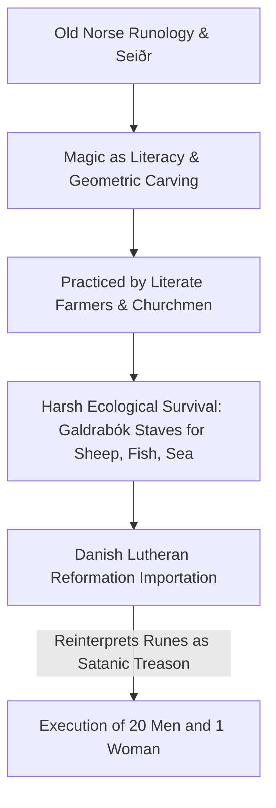

Across early modern Europe, witch trials targeted elderly, marginalized women accused of satanic pacts. However, on the volcanic, frozen frontier of Iceland, the witch craze took a radical demographic turn: **over 90% of those executed and burned at the stake were men**.

In *The Island of WITCHES*, Horses deconstructs why this inversion occurred: in Iceland, magic was never conceptualized as a submissive covenant with the Devil; it was a continuation of pre-Christian Norse runic scholarship, poetry, and practical survival.

---

### The Mechanism: Textual Magic vs European Demonology

#### The Galdrabók & Practical Staves (*Galdrastafir*)
The *Galdrabók* was not a book of demonic orgies; it was a farmer's emergency manual:
- *Veiðistafur:* Staves drawn on fishing boats to guarantee a catch in icy fjords.
- *Sauðastafur:* Staves carved on barn doors to prevent livestock from freezing during Arctic storms.
- *Vegvísir:* A navigational compass stave so the traveler would not lose their way in whiteout blizzards.

#### The Philosophy of *Hugr* (Mind & Intentionality)
In Norse cognitive philosophy, *Hugr* is the active, shaping will. Magic was the rigorous technical concentration of *Hugr* through rhythmic alliteration, geometric symbols, and somatic commitment. It treated human willpower as an active, defiant tool against an indifferent, brutal climate.
