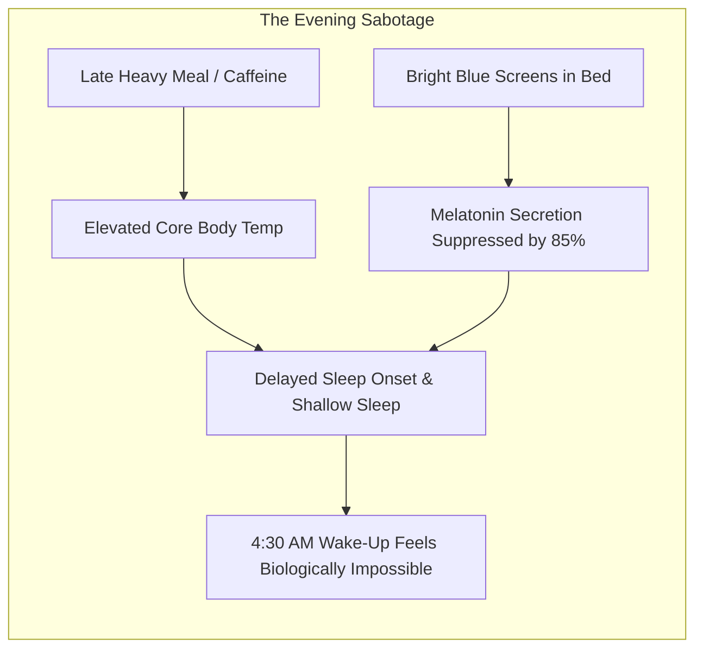
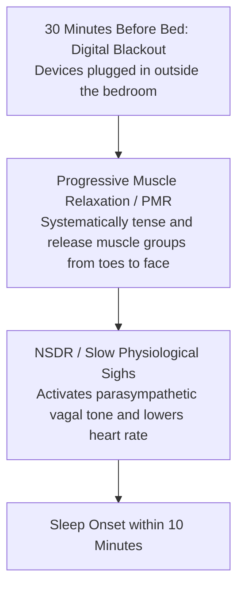
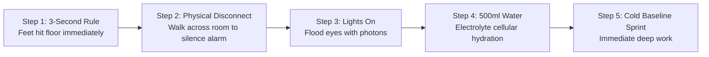

Waking up early is almost universally framed as a test of raw willpower and moral discipline: *"You just have to force yourself out of bed."*

In chronobiology and neuroscience, **waking up at 4:30 AM is not a willpower contest; it is a circadian and systems engineering problem**. If you attempt to conquer your mornings without managing your evening biological de-escalation, you are fighting millions of years of evolutionary physiology—and your primal brain will choose comfort every single time.

Waking up effortlessly requires aligning three interrelated biological systems: **the Adenosine Sleep-Drive Curve**, **the Evening Melatonin Release Window**, and **the Morning Cortisol Awakening Response (CAR)**.

---

### The Biological Engine: The Circadian Cycle

```mermaid
graph TD
    subgraph SG_1_Phase_1__Evenin ["Phase 1: Evening De-escalation (9:00 PM - 10:00 PM)"]
        E1[Light Dimmed · Blue Light Eliminated] --> E2[Melatonin Surge & Core Body Temp Drops]
        E2 --> E3[Progressive Muscle Relaxation / PMR & NSDR]
        E3 --> E4[Rapid Sleep Onset & Deep Delta Waves]
    end

    subgraph SG_2_Phase_2__Adenos ["Phase 2: Adenosine Clearance (10:00 PM - 4:30 AM)"]
        A1[Glymphatic System Clears Metabolic Waste & Adenosine]
        --> A2[Restorative Sleep Cycles Completed]
    end

    subgraph SG_3_Phase_3__Mornin ["Phase 3: Morning Ignition (4:30 AM - 5:30 AM)"]
        M1["Alarm-Action Chain: Feet on Floor"] --> M2[500ml Hydration + Bright Photon Exposure]
        M2 --> M3[Melatonin Crushed · Cortisol Awakening Response Channels into Deep Craft]
    end

    Phase 1 --> Phase 2 --> Phase 3

```

---

### Why Early Waking Fails: The Evening Root Cause

The fatal mistake most people make is focusing 100% of their discipline on the morning alarm while completely ignoring the preceding night. **Your 4:30 AM morning is biologically determined by 9:30 PM the night before.**



1. **The Screen & Light Trap**: Exposure to blue and white LED light after 9:00 PM tricks the suprachiasmatic nucleus (the brain's master clock) into believing it is midday, suppressing melatonin secretion by up to 85%.
2. **The Thermal Barrier**: To initiate deep sleep, your core body temperature must drop by approximately $1^\circ\text{C}$ ($2^\circ\text{F}$). Late-night digestion of heavy meals or intense late-night workouts keeps core temperature elevated, preventing rapid sleep onset.
3. **The Multi-Alarm Pathology**: Setting 5 recurring alarms at 5-minute intervals (e.g., 4:30, 4:35, 4:40, 4:45) is neurological self-sabotage. It trains your subconscious brain to treat your alarm as optional background noise rather than an immediate non-negotiable command.

---

### The Evening De-escalation Protocol (The 30-Minute Anchor)

To guarantee effortless early waking, install a strict 30-minute wind-down ritual before sleep:



* **The Digital Airgap**: Charge your phone across the room or in another room. This eliminates late-night blue light and forces you out of bed to turn off your morning alarm.
* **Progressive Muscle Relaxation (PMR)**: For those with racing bedtime thoughts, systematically tense each muscle group for 5 seconds and release for 10 seconds. This forces physical relaxation signals up the spinal cord to the brain, halting cognitive rumination.
* **NSDR (Non-Sleep Deep Rest)**: A 10-minute session of slow diaphragmatic breathing and sensory release drops brainwave activity into the restorative theta/delta boundary.

---

### The Morning Ignition System: The 5-Step Chain

The moment your alarm rings at 4:30 AM, you have a 3-second neurobiological window to initiate the **Alarm-Action Chain**:



1. **The 3-Second Launch**: Count *3... 2... 1...* and swing your feet onto the floor before your limbic system can rationalize staying under the blankets.
2. **Single-Alarm Commitment**: Delete all secondary alarms. Treat your single alarm with absolute finality.
3. **Photon Inundation**: Turn on overhead lights immediately. Bright light striking your retinal ganglion cells instantly signals the brainstem to suppress any remaining melatonin and trigger wakefulness.
4. **Hydration Ignition**: Drink 500ml of room-temperature water with a pinch of sea salt to rehydrate tissues and kickstart digestive motility.
5. **The Cold Baseline Deep Sprint (The Sanctuary)**: Protect the first 60 minutes from digital feeds and begin your single highest-priority cognitive task while your executive focus is unpolluted.

---

### The Core Takeaway to Remember
> Early waking is an engineering problem, not a character test. Win the evening by clearing blue light and dropping your core temperature, eliminate the snooze trap with a single across-the-room alarm, ignite your biology with light and water, and turn the quiet morning hours into your unfair competitive advantage.
