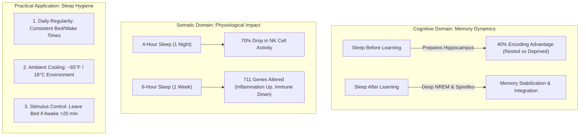

# Chapter 46: The Neurobiology of Sleep — Learning, Memory Consolidation & the Cost of Sleep Loss

> **First-Principles Kernel**: Sleep is a fundamental biological state that supports learning, memory consolidation, and multiple physiological processes. In cognitive function, sleep operates bi-directionally: prior sleep prepares neural circuits to encode new information, while subsequent sleep stabilizes and integrates those memories. Walker argues that because voluntary sleep restriction is unique to modern humans, our physiology has not evolved an effective compensatory mechanism for chronic sleep debt.
>
> **Source Context**: Matthew Walker, Ph.D. (Director, Center for Human Sleep Science, UC Berkeley), *Sleep Is Your Superpower* (TED).
> **Pedagogical Note**: This chapter presents the laboratory findings, explanatory models, and behavioral recommendations summarized in Walker's presentation, distinguishing between direct experimental observations and speaker interpretations.

---

## 1. Cognitive Architecture: Sleep, Learning & Memory

### A. Sleep Before Learning (Encoding Capacity)
* **What the Evidence Shows**: In a controlled fMRI study at UC Berkeley, participants who were deprived of sleep for one night showed a **40% deficit in their ability to encode new facts** the following day compared to an 8-hour sleep control group. Neuroimaging revealed that sleep-deprived subjects lacked the healthy learning-related activation in the hippocampus observed in rested subjects.
* **What It Means**: Adequate sleep before learning helps the hippocampus effectively encode new information. Without prior sleep, neural encoding is significantly compromised.
* **Simplified Mental Models (Analogies)**:
  * *The Dry Sponge*: A rested brain behaves like a dry sponge ready to absorb new data; without sleep, memory circuits become saturated and reject new inputs.
  * *The Memory Inbox*: The hippocampus functions conceptually like an incoming inbox; under acute deprivation, incoming files cannot be registered and bounce.

### B. Sleep After Learning (Consolidation & Protection)
* **What the Evidence Shows**: Polysomnographic EEG recordings during deep non-REM (NREM Stage 3/4) sleep reveal powerful slow brainwaves accompanied by bursts of synchronized electrical activity called **sleep spindles**.
* **What It Means**: Sleep after learning, particularly deep NREM sleep involving slow waves and spindles, supports the stabilization and integration of newly learned information, protecting it from retroactive forgetting.
* **Simplified Mental Model (Analogy)**:
  * *The Nocturnal File Transfer*: Conceptually, this can be pictured like a nocturnal file-transfer process: information that is initially fragile becomes more stable and integrated during sleep.

---

## 2. Somatic Consequences: The Cost of Sleep Loss

```
[4-Hour Acute Restriction]  ───> 70% Drop in Natural Killer Cell Activity
[6-Hour Weekly Restriction] ───> Altered Expression in 711 Genes (Inflammation Up, Immune Down)
[Total Night Deprivation]   ───> 40% Deficit in Hippocampal Memory Encoding
```

### A. Immune Defense (Natural Killer Cells)
* **What the Evidence Shows**: Restricting healthy individuals to **4 hours of sleep for a single night** produced a **70% reduction in Natural Killer (NK) cell activity** in laboratory blood assays.
* **What It Means**: Acute sleep loss rapidly impairs the responsiveness of immune cells that provide frontline defense against abnormal cellular growth and viral challenges.

### B. Genomic Regulation (711 Genes Altered)
* **What the Evidence Shows**: Restricting sleep to 6 hours per night for one week significantly altered the expression profile of **711 genes** in healthy adults.
* **What It Means**: Sleep restriction downregulated genes associated with immune regulation, while upregulating genes linked to chronic inflammation, cellular stress response, and cardiovascular strain.

### C. Cardiovascular Observations & Population Patterns
* **What the Evidence Shows**: In large epidemiological datasets analyzing Daylight Saving Time shifts across 1.6 billion people, losing one hour of sleep in spring correlates with a **24% increase in heart attacks** the next day, while gaining an hour in autumn correlates with a **21% reduction**.
* **What It Means**: Cardiovascular physiology is sensitive to acute disruptions in sleep duration and circadian alignment.

---

## 3. Walker's Evolutionary Hypothesis: The Limits of Sleep Debt

### The Question: Can Sleep Debt Be "Repaid"?
A common assumption is that sleep can be borrowed during workdays and repaid on weekends, like a financial debt.

### The Evolutionary Hierarchy:
1. **Observed Finding**: Restricting sleep produces immediate, measurable cognitive and somatic deficits.
2. **Walker's Evolutionary Argument**: Humans are the only species that regularly deprives itself of sleep without external threats. Walker proposes that humans lack a robust physiological adaptation to habitual voluntary sleep restriction, offering this as an evolutionary explanation for why accumulated sleep loss produces substantial effects.
3. **Epistemic Boundary**: The evolutionary absence of a safety net is Walker's explanatory model for why sleep loss causes rapid systemic disruption, rather than a direct laboratory-proven mechanism.

---

## 4. Visual Concept Map



---

## 5. Senior Auditor Annotations & Epistemic Boundaries

> [!NOTE]
> **Key Epistemic Distinctions**:
> * **Correlation vs. Causation in Aging**: Deep sleep disruption is interrelated with memory decline in aging and Alzheimer's disease. While sleep loss is an acknowledged contributing factor, age-related cognitive decline involves multiple interconnected variables (vascular, metabolic, and genetic).
> * **Electrical Stimulation Status**: Direct current brain stimulation synchronized with slow waves doubled memory retention benefits in young lab subjects. Walker explicitly frames the potential application of this technology to restore memory in older adults or dementia patients as an experimental research goal, not an established clinical therapy.
> * **Sedatives vs. Naturalistic Sleep**: Walker notes that prescription sleeping pills act as sedatives that do not replicate the natural slow-wave and spindle architecture of restorative physiological sleep.

---

## 6. Actionable Recommendations (What I Should Do)

### Walker's Behavioral Sleep Guidelines
1. **Circadian Regularity**: Go to bed and wake up at the same time every day, including weekends. Regularity stabilizes the circadian timing system and improves overall sleep quality.
2. **Ambient Thermal Management**: Walker notes that core body temperature normally falls before and during sleep and recommends a cool bedroom, around **$65^\circ\text{F}$ ($18^\circ\text{C}$)**.
3. **Stimulus Control (The 20-Minute Egress Rule)**: If lying awake in bed for more than 20 minutes, get out of bed and engage in a quiet activity in dim light in another room. Return to bed only when sleepy.
   * *Analogy (The Dinner Table Rule)*: You would not sit at the dining table waiting to become hungry; similarly, do not lie in bed waiting to become sleepy. This prevents conditioned associations between the bed and wakefulness.

### The Metacognitive Check
> *"Am I treating sleep as an expendable resource to trade for waking hours, or as the foundational biological requirement that enables my cognitive and physical capacity?"*

---

## 7. Cross-Topic Linkages

* **Builds On**:
  * `[[the-second-brain-and-the-gut-mind-axis]]`: Somatic signaling and autonomic physiological baselines.
* **Contrasts With**:
  * `[[the-pathology-of-comfort-and-progressive-friction]]`: While physical and mental capacities adapt to progressive hormetic friction, basic sleep requirement possesses no adaptive buffer or training adaptation.
* **Applies To**:
  * `[[the-morning-architecture-and-discipline]]`: Connects nocturnal memory consolidation and recovery with daytime execution and morning discipline.
