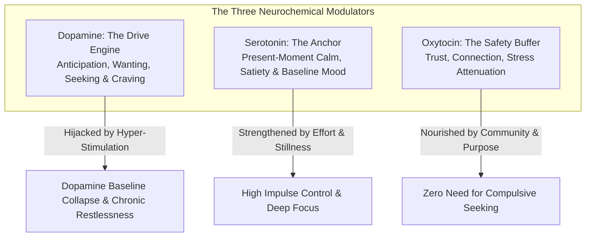
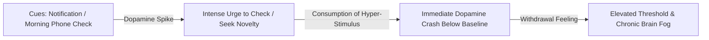
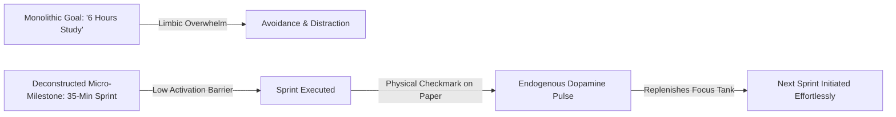
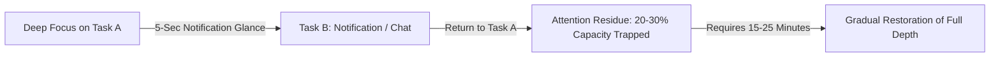
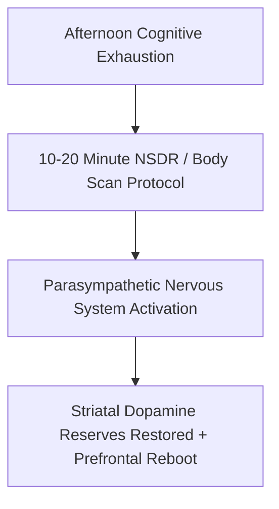

Modern culture treats chronic distraction as a personal failure of discipline. In cognitive neurobiology, distraction is actually a **neurochemical miscalibration** of the brain's anticipation and reward circuitry.

Your ability to sustain deep focus, resist instant gratification, and feel genuine satisfaction is governed by three primary neurotransmitters: **Dopamine** (the molecule of pursuit and anticipation), **Serotonin** (the molecule of presence and emotional stability), and **Oxytocin** (the molecule of safety and connection).

Understanding the interplay between these chemicals allows you to transition your nervous system from frenetic, shallow stimulation into calm, sustained concentration.

---

### The Neurochemical Triad of Attention

---

### The Dopamine Paradox: Wanting vs. Liking

A foundational discovery of modern neuroscience is that **dopamine is not the molecule of pleasure; it is the molecule of anticipation and pursuit**.

1. **The Pursuit Circuit**: Dopamine surges when your brain expects a potential reward (such as seeing a notification badge or scrolling a new video feed). It generates an acute, energetic feeling of *wanting*.
2. **The Post-Spike Deficit**: The moment you consume high-stimulation, low-effort content, the dopamine spike immediately collapses **below your original baseline**.
3. **The Restless Loop**: This deficit creates an uncomfortable biological state of restlessness and subtle agitation. Your brain interprets this discomfort as a signal to seek another rapid hit, locking you into a continuous cycle of compulsive distraction.

---

### The "Dopamine Loading" Method (Hard Work First)

The single greatest mistake in daily cognitive management is **front-loading high-dopamine inputs into the morning**.

```mermaid
graph TD
    subgraph SG_1_Toxic_Sequence_ ["Toxic Sequence: Morning Hyper-Stimulation"]
        T1[Wake Up & Check Social Media / Videos] 
        --> T2[Artificial Dopamine Peak Established]
        --> T3[Normal Study / Analytical Work Feels Painfully Boring]
        --> T4[Severe Attention Fragmentation All Day]
    end

    subgraph SG_2_Sovereign_Seque ["Sovereign Sequence: Dopamine Loading via Effort"]
        S1[Wake Up & 2-Hour Digital Blackout]
        --> S2[Deep Analytical Block on Cold Baseline]
        --> S3[Dopamine Released Through Effort & Mastery]
        --> S4[High Energy & Natural Focus Sustained]
    end

```

* **The Threshold Effect**: If you expose your brain to ultra-high stimulation (videos, social feeds, news feeds) within the first hour of waking, you set an artificially elevated dopamine baseline. All subsequent low-stimulation, high-friction cognitive work (reading dense chapters, writing code, solving math) will be perceived by the brain as an intolerable "dopamine desert."
* **The Dopamine Loading Protocol**: Protect your baseline by enforcing a **2-Hour Digital Blackout** upon waking. When you tackle your most demanding analytical problems on a cold, quiet baseline, the brain experiences an *endogenous dopamine surge* born out of problem-solving and competence. This turns challenging study into an intrinsically engaging, addictive state.

---

### The Micro-Milestone Dopamine Cascade

Large, monolithic study goals (e.g., *"Study quantitative aptitude for 6 hours"*) trigger immediate limbic resistance and procrastination.

1. **Break Sessions into 30 to 45-Minute Sprints**: Give each sprint one discrete, measurable objective (e.g., *"Solve 15 probability questions"*).
2. **Physical Checkmark Logging**: Keep a physical notebook beside your desk and draw an ink checkmark the moment a sprint ends. The tactile physical act of checking off a completed milestone triggers a micro-pulse of dopamine that recharges cognitive stamina for the next block.

---

### The Protected Evening Reward Window

Discipline is not about ascetic deprivation; it is about **temporal quarantine**.

* **The Pavlovian Contract**: Quarantine all high-dopamine recreation (gaming, watching shows, social communication) to a strictly bounded **evening window (e.g., 8:00 PM – 10:00 PM)**.
* **The Psychological Effect**: When the brain knows that guaranteed, guilt-free relaxation awaits at night, daytime resistance diminishes. You no longer need to sneak micro-distractions during deep-work blocks because your reward is guaranteed upon completion of the day's commitments.

---

### Attention Residue & The Myth of Context Switching

Every time you glance away from deep work to check a notification for 5 seconds, your attention does not switch cleanly.

* **The Research**: Studies in cognitive science demonstrate that a substantial portion of your prefrontal processing power remains "stuck" on the interrupted stimulus (**Attention Residue**).
* **The Cost**: Jumping between messages and deep study reduces effective cognitive IQ, creates rapid mental exhaustion, and prevents the brain from entering theta/gamma synchrony (the flow state).

---

### Non-Sleep Deep Rest (NSDR): Restoring Striatal Dopamine

When mental fatigue accumulates in the afternoon, most people turn to caffeine or digital scrolling, which further depletes the nervous system.

* **The Biological Mechanism**: Non-Sleep Deep Rest (NSDR / Yoga Nidra) is a structured 10 to 20-minute protocol of sensory withdrawal, slow rhythmic breathing, and progressive body scanning.
* **The Neurochemical Yield**: Clinical imaging reveals that 20 minutes of NSDR restores striatal dopamine reserves and resets prefrontal cognitive stamina without the sleep inertia or grogginess of daytime naps.

---

### The Gap Protocol: Breaking Neural Shortcuts

Whenever you finish a demanding task or experience a brief pause in your day, notice the instinctive reflex to grab your phone for immediate relief.

* **The Mechanism**: This reflex reinforces a neural shortcut that pairs any minor cognitive discomfort with instant digital stimulation.
* **The Practice**: Insert an intentional **60-to-120-second "gap of zero input"** before transitioning between tasks. Stare at a wall, breathe, or stretch without consuming any information. This brief pause allows your dopamine receptors to reset without triggering a sharp deficit.

---

### The Three Laws of Sustainable Attention

1. **Decouple Effort from Instant Payoffs**: Train yourself to enjoy the friction of the process rather than relying on external rewards. When you attach reward to the effort itself, dopamine is released during the work, providing infinite internal fuel.
2. **Eliminate Variable-Reward Traps**: Social media feeds and algorithmic platforms use variable-ratio reinforcement schedules (the same mechanic as slot machines). Remove infinite scroll feeds from your primary work devices.
3. **Embrace Low-Stimulation Stillness**: Allow yourself to experience pure boredom for 10 minutes every day. Boredom is not wasted time; it is the biological incubation chamber where dopamine sensitivity is restored and creative insights emerge.

---

### The Core Takeaway to Remember
> Distraction is not a character flaw; it is an addiction to dopamine anticipation. Sequence your day with effort first, isolate the morning from digital inputs, load your dopamine through micro-milestones, restore your reserves through NSDR, and quarantine high-stimulation rewards to a protected evening window.
