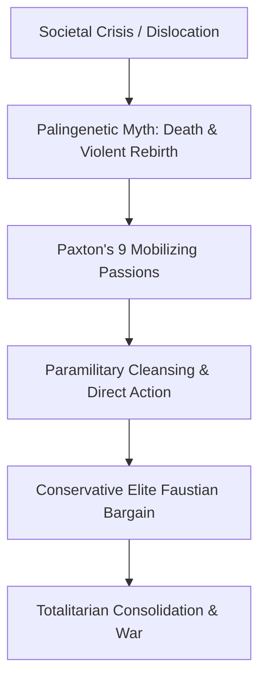

Fascism is the most overused, diluted political insult of the modern era, yet it remains one of the least understood political phenomena in human history.

Unlike Liberalism (rooted in John Locke and Adam Smith) or Marxism (rooted in Karl Marx), **fascism has no coherent philosophical holy book, no consistent theoretical doctrine, and no commitment to rational consistency**. Fascism is not an ideology derived from first principles; it is an **anti-intellectual, mythic political practice powered entirely by subterranean emotional currents and visceral mobilizing passions**.

---

### The Scholarly Consensus: Griffin, Payne, and Paxton

1. **Roger Griffin — Palingenetic Ultranationalism:**  
   Griffin distilled fascism down to its mythic core: **Palingenesis** (national rebirth) fused with **Ultranationalism**. The central narrative is an apocalyptic drama: *Our glorious ancient nation was once pure and supreme. Decadent liberals and internal traitors poisoned us. Only through violent awakening and purge can the nation be reborn.*
2. **Stanley G. Payne — The Fascist Negations:**  
   Payne demonstrated that fascism is defined by what it violently rejects:
   - *Anti-Liberalism:* Rejection of individualism, human rights, and democratic procedure.
   - *Anti-Communism:* Violent opposition to class consciousness and internationalism.
   - *Anti-Conservatism:* While forming tactical alliances with elites, fascists demand a revolutionary "New Man" and radical societal restructuring.
3. **Robert O. Paxton — The Anatomy of Fascism & 9 Mobilizing Passions:**  
   Fascist party platforms are tactical illusions. The core engine consists of gut passions: overwhelming crisis, group primacy, group victimhood, dread of decline, closer integration, absolute authority, leader intuition over logic, the beauty of violence, and the right of the chosen people to dominate others.

---

### Epistemic Hygiene: The Palingenetic Detection Razor

Whenever a political movement replaces policy debate and institutional checks with a 3-act apocalyptic drama—promising that national humiliation can be solved only by purging 'internal enemies'—you are witnessing the core architecture of fascism. Protect your attention from algorithmic rage loops designed to inflame tribal hysteria.
