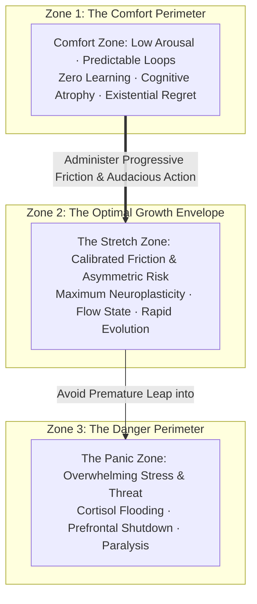
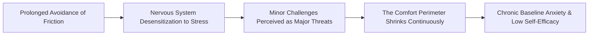
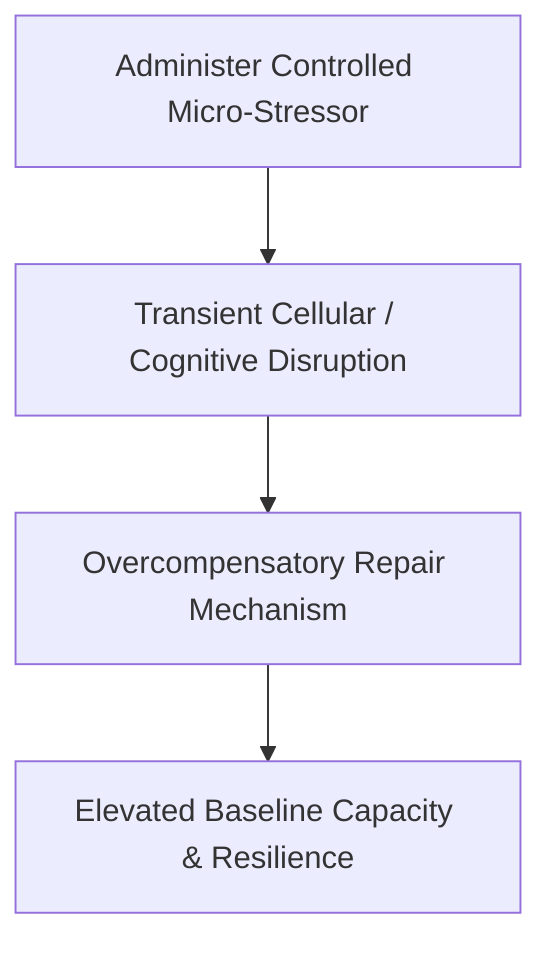
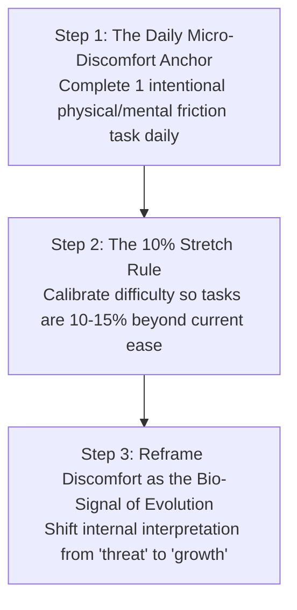

Most people who believe they are "lazy" are suffering from a biological misdiagnosis.

What you experience as laziness is not a character flaw or a deficiency of moral character. It is your ancient mammalian brain executing its default evolutionary directive: **energy conservation, risk minimization, and homeostasis**.

For hundreds of thousands of years, conserving calories and avoiding unknown risks were essential for biological survival. In the modern world—where calories, entertainment, and climate-controlled shelter are instantly accessible—the brain's instinct for safety becomes an **incubator of cognitive and existential atrophy**.

True growth occurs only when you understand that **"playing it safe" is the single greatest risk in human existence**, dismantle false humility, and systematically administer **Progressive Friction**.

---

### The Three Concentric Zones of Human Capacity

Human performance and neuroplastic adaptation are governed by the **Yerkes-Dodson Law of Optimal Arousal**:



1. **The Comfort Zone (Stagnation & Atrophy)**: A state of psychological and biological security where behavior is automatic and predictable. Because there is zero discrepancy between expectation and reality, the brain produces no *Error-Related Negativity (ERN)* signals, and neural pathways remain static.
2. **The Stretch Zone (Peak Adaptation)**: The precise boundary where a task exceeds current capability by roughly **10% to 15%**. In this zone, the nervous system is stimulated enough to trigger focused alertness (norepinephrine) and dopamine anticipation without overwhelming the prefrontal cortex.
3. **The Panic Zone (Burnout & Paralysis)**: When the challenge is excessively overwhelming, the amygdala activates fight-or-flight chemistry, shutting down higher-order problem-solving.

---

### The Paradox of Safety & False Humility

```mermaid
graph LR
    subgraph The Illusion of Safety (Guaranteed Decay)
        S1['Playing It Safe' / Risk Avoidance] 
        --> S2[Cloaked in 'False Humility' & 'Realism'] 
        --> S3[Guaranteed Long-Term Regret & Shrinking Capacity]
    end

    subgraph The Sovereign Leap (High Agency)
        L1[Audacious Asymmetric Action] 
        --> L2[Embraces Temporary Discomfort] 
        --> L3[Exponential Growth & Self-Transcendence]
    end
```

#### 1. Paradox of "Playing It Safe"
* We avoid bold moves because we fear failure, looking foolish, or experiencing financial/social friction.
* **The Reality**: Playing it safe does not eliminate risk; it merely exchanges sharp, short-term discomfort for **a guaranteed lifetime of quiet regret and unfulfilled potential**. Playing it safe is the highest-risk strategy in life because its downside is absolute mediocrity.

#### 2. The Cloak of False Humility
* Society conditions individuals to disguise fear of judgment as "humility," "caution," or "being realistic."
* Saying *"I am not ready"* or *"I'm just being humble"* is often ego-armor protecting against the vulnerability of putting your work in public.
* **The Sovereign Reframe**: True humility is seeing reality objectively and acting with maximum effort regardless of outcome; false humility is cowardice masquerading as virtue.

---

### The Hidden Danger of Prolonged Comfort

When an individual remains inside the comfort zone for months or years, the perimeter does not stay fixed—**it shrinks**:



* **Stress Intolerance**: The less voluntary discomfort you experience, the lower your threshold for adversity becomes. Ordinary life demands begin to trigger acute panic.
* **The Existential Penalty**: Deep within your consciousness, you know what you are capable of achieving. When your daily actions fail to match your latent capacity, your subconscious registers chronic guilt and self-betrayal, eroding baseline self-worth.

---

### The Law of Hormesis: Strength Through Calibrated Poison

In toxicology and physiology, **Hormesis** is the biological phenomenon whereby a beneficial effect (improved health, stress resistance, longevity) results from exposure to low, intermittent doses of an otherwise toxic or stressful agent.



* **Physical Hormesis**: Weight training micro-tears muscle fibers; the body repairs them stronger. Fasting stresses cells; the body activates autophagy. Cold exposure spikes norepinephrine; the body increases mitochondrial density.
* **Cognitive Hormesis**: Engaging with hard, confusing problems produces temporary mental frustration; the brain responds by thickening synaptic myelination, making that complex domain intuitive over time.

---

### The 3-Step Progressive Friction Protocol

To systematically expand your comfort perimeter without triggering panic paralysis, implement the **Progressive Friction Protocol**:



#### 1. The Daily Micro-Discomfort Anchor
Every morning, deliberately introduce **one non-negotiable point of friction** that your primal brain wishes to avoid:
* A 60-second ice-cold shower at the end of your wash.
* Tackling the hardest analytical problem or chapter before checking any notifications.
* Performing a set of strenuous physical exercises immediately upon waking.
* *The Result*: Conquering friction within the first hour inoculates your nervous system against reactive comfort-seeking for the rest of the day.

#### 2. The 10% Stretch Rule
Never attempt a chaotic, 100% lifestyle overhaul that throws you directly into the Panic Zone. Always target the immediate perimeter of your current capability. If you study for 2 hours daily, stretch to 2 hours and 20 minutes; if you solve level-1 problems, attempt level-2 problems.

#### 3. Cognitive Re-framing of Internal Resistance
When you feel the physical sensation of dread, awkwardness, or strain, immediately label it accurately:
> *"This physical resistance is not a signal that something is wrong; it is the biological sensation of my capacity expanding."*

---

### The Core Takeaway to Remember
> Comfort is not peace; comfort is the quiet decay of your potential. Playing it safe is the single greatest risk you can take with your finite existence. Strip away the cloak of false humility, administer voluntary friction daily, lean into the stretch zone, and watch your boundaries expand.
