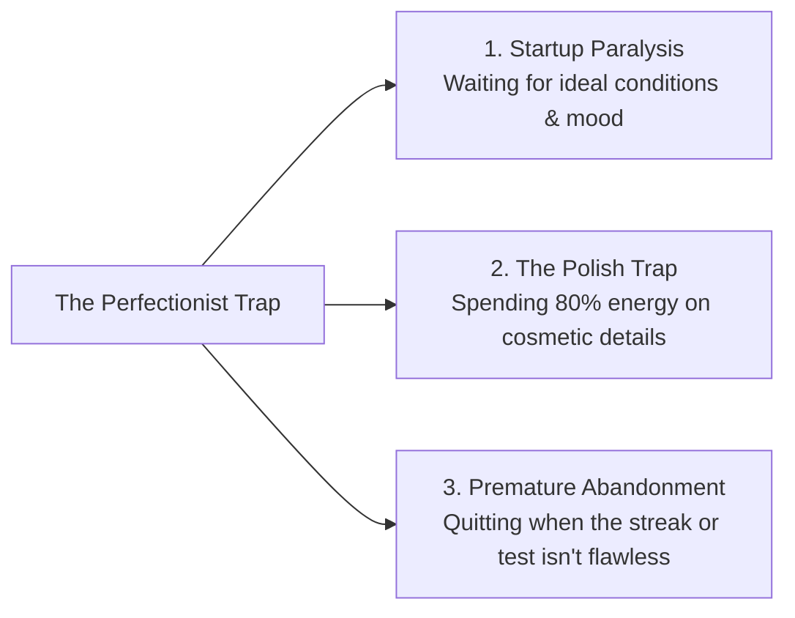
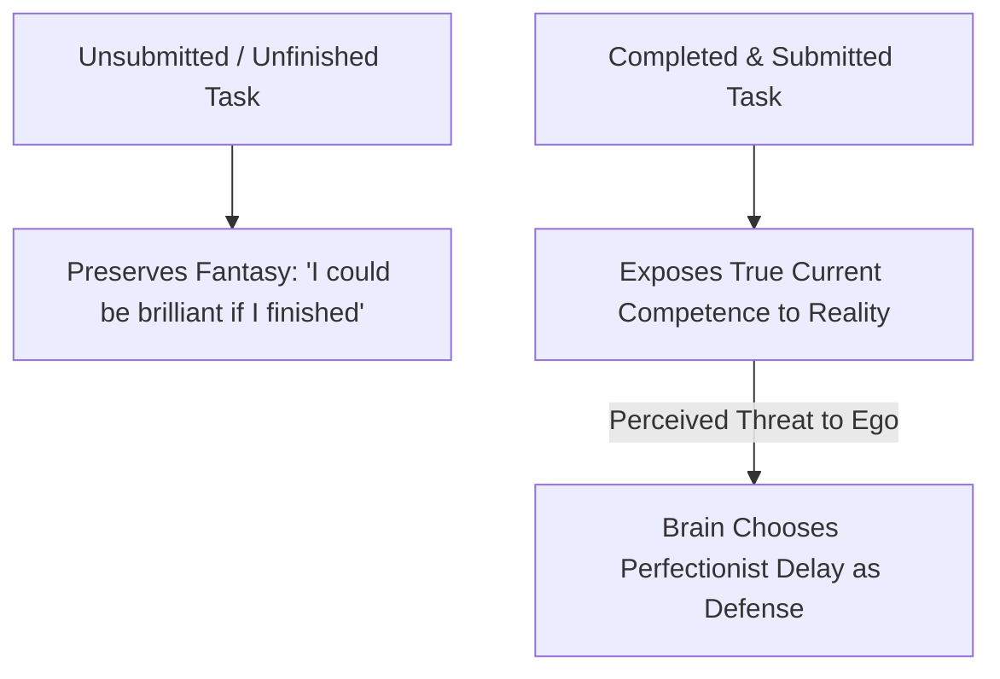
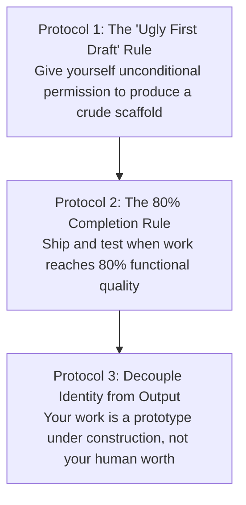

Perfectionism is perhaps the only psychological dysfunction that people wear as a badge of honor.

In interviews, academic discussions, and daily life, individuals frequently disguise perfectionism as evidence of a superior work ethic: *"I just have extremely high standards"* or *"I am too much of a perfectionist to do sloppy work."*

In cognitive psychology and behavioral neuroscience, **perfectionism is not a pursuit of excellence; it is an anxiety-driven avoidance mechanism designed to protect a fragile ego from vulnerability and judgment**.

When you spend hours color-coding study notes, rewriting an introductory paragraph ten times, or abandoning a practice test the moment you get two questions wrong, you are not being "hardworking." You are using meticulous busywork as **an emotional shield against real-world feedback**.

---

### Excellence vs. Neurotic Perfectionism

To escape this trap, you must first distinguish between genuine high standards and neurotic perfectionism:

```mermaid
graph TD
    subgraph Genuine Excellence (Healthy High Standards)
        E1[Focus: Growth & Learning] --> E2[Embraces Messy Drafts & Friction]
        E2 --> E3[Iterates Based on Real Feedback]
        E3 --> E4[Rapid Output & High Agency]
    end

    subgraph Neurotic Perfectionism (Fear Armor)
        P1[Focus: Ego Defense & Image] --> P2[Demands Flawless Starting Conditions]
        P2 --> P3[Paralysis & Endless Cosmetic Polishing]
        P3 --> P4[Avoids Testing to Protect Self-Image]
    end
```

* **The Striving for Excellence**: Focuses on the *process* and maximizing value. Mistakes are welcomed as necessary diagnostic data points for iteration.
* **Neurotic Perfectionism**: Focuses on *perception* and avoiding embarrassment. Any flaw is perceived as an existential indictment of personal intelligence and worth.

---

### The Three Pathologies of the Perfectionist



1. **Startup Paralysis (The Ideal Conditions Myth)**:
   * The perfectionist delays starting until everything is "ready": the room is clean, the perfect playlist is playing, and four uninterrupted hours are available. Because ideal conditions rarely exist, action is perpetually postponed.
2. **The Polish Trap (Friction Avoidance via Cosmetic Busywork)**:
   * The perfectionist spends hours formatting note templates, reorganizing folders, or rewriting clean copies of notes. This provides the *feeling* of hard work while avoiding the raw cognitive strain of solving hard diagnostic problems.
3. **Premature Abandonment (All-or-Nothing Sabotage)**:
   * If a study session starts 15 minutes late or a test begins with three incorrect answers, the perfectionist abandons the entire session (*"Today is already ruined, I will start fresh tomorrow"*).

---

### The Root Cause: The Shield of the "Unfinished Masterpiece"

Why does the subconscious brain prefer endless perfectionist delay over direct completion?



* **The Psychological Payoff**: As long as your project, essay, or exam preparation remains "in progress" and unexposed, you preserve the internal illusion: *"If I actually finished this, it would be a masterpiece."*
* **The Fear of Exposure**: The moment you finish and submit your work to a timed test or public evaluation, your true current capability is measured objectively. Perfectionism is the subconscious mechanism that protects you from discovering that your current skill level is merely average.

---

### The Three Protocols for Action-First Excellence



#### 1. The "Ugly First Draft" Rule (The Scaffold Phase)
Never attempt to make something good on the first attempt; make it **exist** first.
* When writing an essay, synthesis note, or code architecture, produce a crude, unformatted scaffold as rapidly as possible.
* Once a tangible object exists in physical reality, your prefrontal cortex can edit and refine it with ease. Editing is metabolically cheap; creating from a blank page is expensive.

#### 2. The 80% Completion Rule (The Law of Diminishing Polish)
* The first 80% of effort captures almost all functional utility. The final 20% spent chasing cosmetic perfection consumes four times the time with near-zero added learning value.
* Establish a standard: **When a study note, solution, or system is 80% clear and functionally complete, stop polishing and move immediately to the next challenge.**

#### 3. Decouple Identity from Performance
* A poor test score or clumsy draft does not mean *you* are incompetent; it simply means your *current method* requires a 15-degree calibration.
* Approach your craft like a scientist observing an experiment in a laboratory: with neutral curiosity, relentless execution, and zero emotional fragility.

---

### The Core Takeaway to Remember
> Perfectionism is fear disguised as virtue. Stop hiding behind endless preparation and cosmetic polishing. Give yourself permission to produce messy first drafts, execute at 80% completeness, and realize that real competence is forged through fast, imperfect iterations in the real world.
