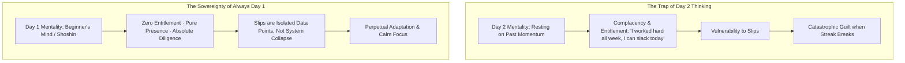
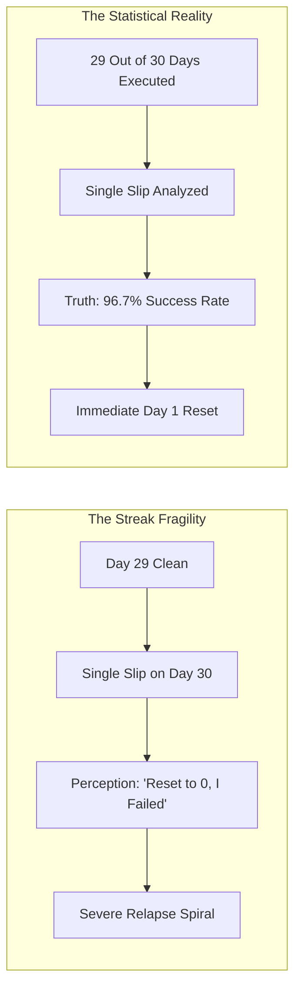
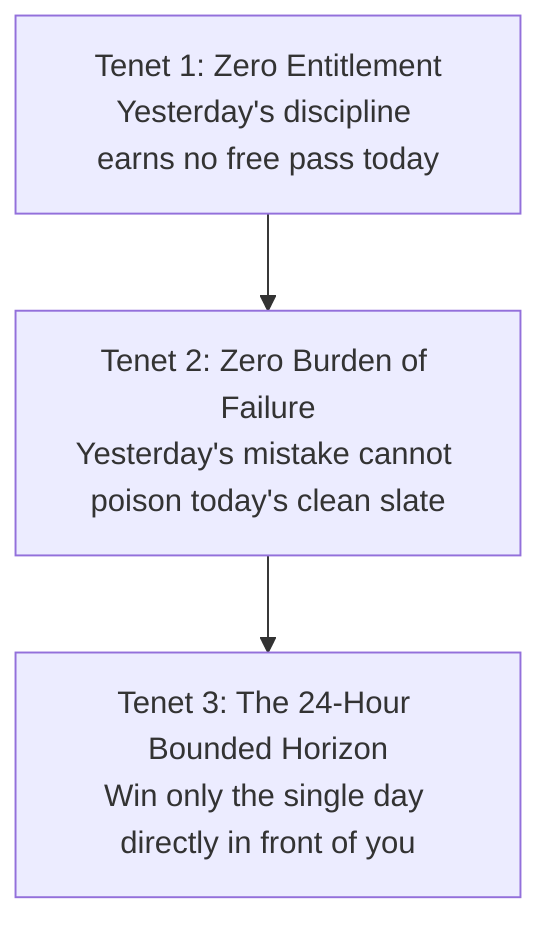

One of the most dangerous psychological traps in personal development is the **Obsession with the Streak**.

When individuals embark on building a habit, studying for a major exam, or overcoming a compulsive addiction, they typically measure success by counting consecutive days (*"I am on Day 30"* or *"I haven't missed a study session in 6 weeks"*).

While streaks initially provide gamified motivation, they introduce a catastrophic psychological vulnerability: the moment a single slip occurs, the brain experiences the **"What-the-Hell Effect"** (catastrophic surrender). Because the streak is broken from 30 back to 0, the individual feels that all previous progress has been wiped out, spiraling into days or weeks of bingeing and self-loathing.

To achieve permanent mastery, you must replace streak accounting with the **Philosophy of "Always Day 1"**.

---

### The Pathology of Day Two (Complacency & Decay)

In organizational systems and cognitive psychology, **"Day 2"** represents the arrival of stasis, entitlement, and creeping complacency.

* **The Illusion of Accumulated Credit**: On "Day 40," the ego whispers that you have banked enough discipline to afford a micro-compromise. This subtle entitlement is the exact crack through which indiscipline enters.
* **The Day 1 Posture**: On Day 1, there is no past glory to justify laziness, and no past momentum to coast upon. Day 1 is characterized by humility, alertness, fierce intention, and a clean slate.

---

### The "What-the-Hell" Effect vs. The Percentage Paradigm

When an individual views progress as an all-or-nothing streak, a single mistake destroys the entire psychological structure:

* **The Mathematical Reality**: If you execute a habit 29 out of 30 days and stumble once, your biological and neurological progress is **96.7% intact**. Your synaptic pathways did not vanish overnight.
* **The Psychological Lie**: Streak thinking tells you that you are back at square one. This false despair is what causes the multi-day relapse, not the slip itself.

---

### The Three Tenets of the "Always Day 1" Operating System

1. **Zero Entitlement (Humble Diligence)**: It does not matter if you studied 10 hours yesterday or worked out for 6 months straight. Today requires its own execution on its own terms.
2. **Zero Burden of Failure (Instant Slate Cleansing)**: If you slipped, procrastinated, or ate poorly yesterday, carrying shame into today does not build discipline—it only fuels the next dopamine craving. Acknowledge the error, extract the diagnostic lesson, wipe the emotional ledger clean, and treat today as your very first day.
3. **The 24-Hour Bounded Horizon**: You do not need to figure out how you will maintain discipline for the next 10 years or the next 6 months. You only have to govern the **next 12 to 16 waking hours**. When you shrink the temporal horizon to today alone, cognitive overwhelm dissolves.
4. **The Beginner's Mind (Shoshin)**: Zen philosophy asserts that in the beginner's mind there are many possibilities, but in the expert's mind there are few. Approaching your craft every morning as a beginner guarantees acute observation, fresh curiosity, and flawless execution of fundamentals.

---

### The Core Takeaway to Remember
> Do not live for the streak; live for the standard. Yesterday's victory cannot carry you, and yesterday's defeat cannot bind you. Every sunrise is Day 1—step onto the field with humility, focus purely on the next 24 hours, and execute your craft from a clean slate.
