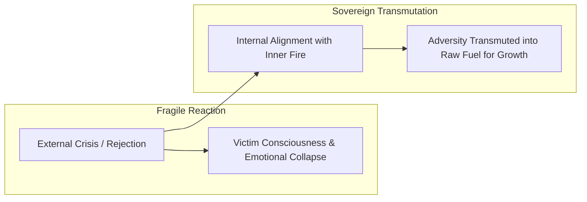
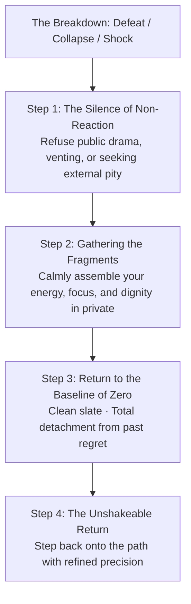
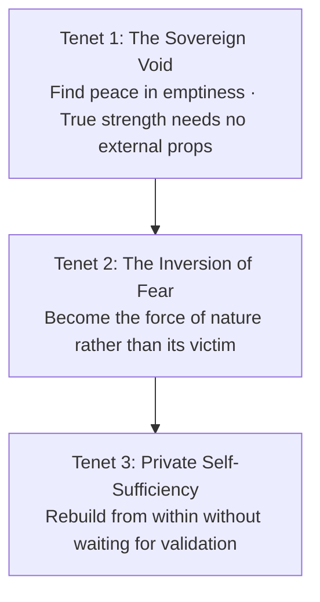

The greatest psychological freedom in human existence is not the possession of immense wealth, status, or acclaim. It is the realization that **when you are anchored in Zero (*Shunya*), you cannot be diminished by any loss**.

Most people live in perpetual fear because they are playing **defense**: defending fragile reputations, defending comfort, defending ego, and defending social expectations. This defensive posture breeds anxiety, hesitance, and vulnerability to external circumstance.

When you master the **Philosophy of the Void**, you transition from fragile defensiveness into radical, unshakeable sovereignty. You realize that zero is not an empty void of defeat; it is the **infinite, unbreakable foundation from which all creation and fearless action arise**.

---

### The Anatomy of Loss Aversion vs. The Power of Zero

```mermaid
graph TD
    subgraph The Fragile Identity (Playing Not to Lose)
        A1[Possession of Fragile Status / Social Approval]
        --> A2[Intense Loss Aversion & Fear of Judgment]
        --> A3[Hesitant, Timid Action & Fragility]
        --> A4[Devastation upon Setback or Public Failure]
    end

    subgraph The Sovereign Void (Riding the Zero)
        B1[Anchored in Inner Emptiness / Shunya]
        --> B2[Zero Fear of Loss · Nothing to Defend]
        --> B3[Audacious, Uncompromising Execution]
        --> B4[Calm Self-Reconstruction after any Defeat]
    end
```

* **The Trap of False Accumulation**: The more you derive your self-worth from external markers (applause, titles, possessions), the more terrified you become of losing them. You become a prisoner of the very things you built.
* **The Sovereign Anchor**: When you recognize that you entered this world with nothing and will leave with nothing, external circumstances lose their power to intimidate you. You stand on bedrock.

---

### The Alchemy of Calamity: Becoming the Fire

When adversity, rejection, or crisis strikes, human beings react through two distinct psychological orientations:



* **The Victim Stance**: Cursing external difficulties and pleading for life to be gentler. This posture keeps you frail and dependent on favorable winds.
* **The Stoic Transmutation**: Meeting hardship with the internal posture: *"Why should I fear difficulties when my spirit is capable of enduring and outlasting any storm?"* Adversity is not an enemy to escape; it is the raw fuel that hardens your resolve.

---

### The Art of Self-Reconstruction (*Sametna*)

In life's inevitable moments of defeat—when plans collapse, relationships end, or years of effort appear wasted—the untrained mind fragments into panic and self-pity. The self-mastered individual executes the **Art of Quiet Self-Reconstruction**:



1. **The Dignity of Silence**: Refuse the impulse to complain, beg for sympathy, or explain yourself to the crowd. True resilience is forged in quiet, private resolve.
2. **Gathering the Pieces**: Take inventory of what remains: your character, your mind, your breath, your capacity to act.
3. **The Clean Slate Reset**: Forgive yourself for what went wrong, shed the dead weight of regret, and return to the unburdened posture of Day 1.

---

### The Three Tenets of Radical Sovereignty



1. **Find Peace in Emptiness**: When stripped of everything, what remains is your pure, indivisible consciousness. That center can never be broken by circumstance.
2. **The Inversion of Fear**: When facing intimidating odds or terrifying changes, do not shrink. Lean directly into the resistance and realize that your capacity to endure is greater than any obstacle.
3. **Private Self-Sufficiency**: Never outsource your peace of mind to external approval. Stand firmly in your own skin, proud of your quiet discipline and unyielding courage.

---

### The Core Takeaway to Remember
> Do not fear starting from nothing; fear living a life trapped in the defense of illusions. When you are willing to ride the zero, you hold the ultimate power. Gather your scattered pieces in silence, transform every trial into fuel, and walk the earth with the calm ferocity of someone who has nothing to lose and everything to master.
