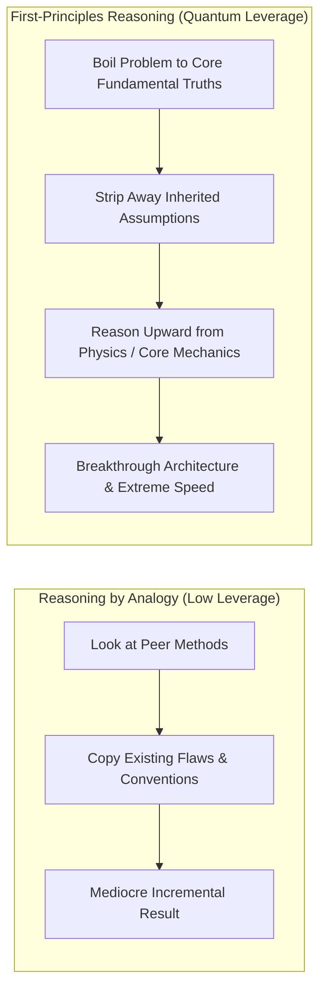
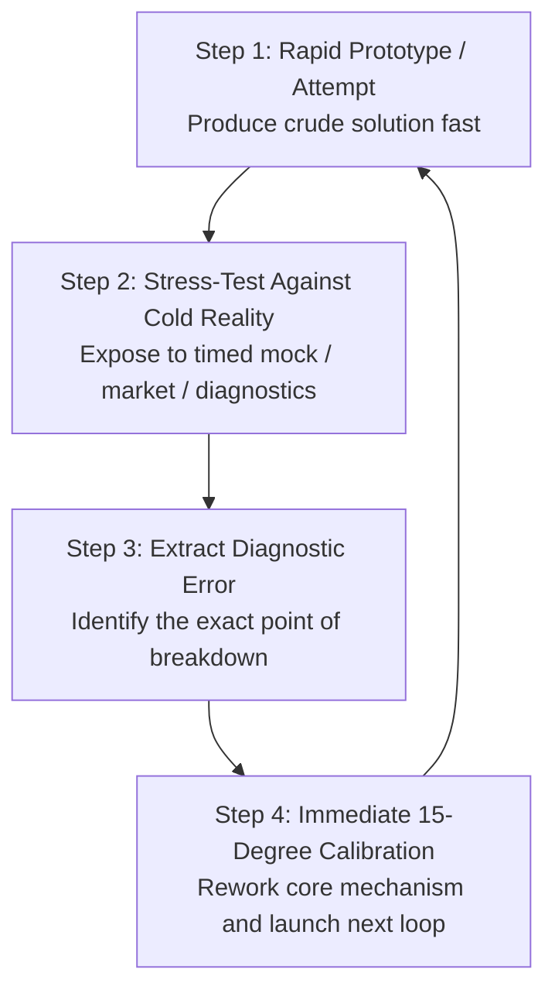
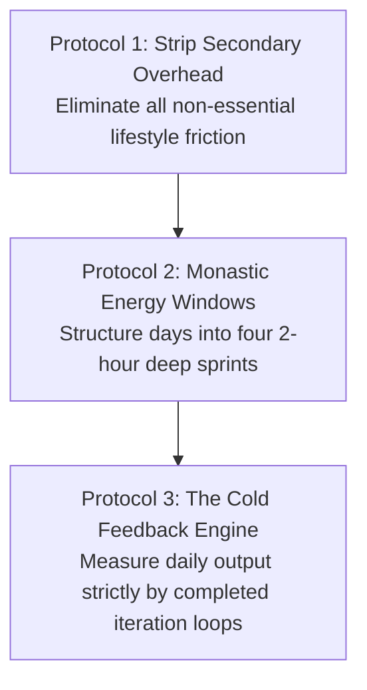
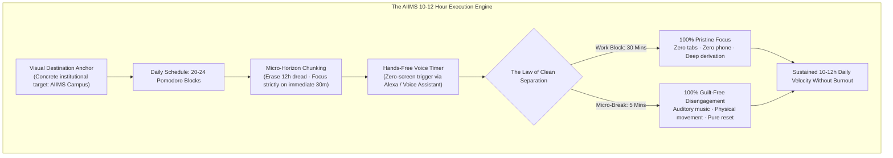

In modern culture, the concept of hard work is often debated through polar extremes: either praised blindly as mindless hustle or dismissed as inefficient burnout.

In systems engineering and mathematical strategy, **relentless effort is an asymmetric multiplier of iteration velocity**. Talent, luck, and intelligence are valuable assets, but they are static initial conditions. The speed at which you test reality, absorb corrective feedback, and build physical prototypes is a direct mathematical function of your **focused weekly hours and iteration frequency**.

When you combine **First-Principles Thinking** (reasoning from fundamental truths rather than analogy) with **Uncompromising Execution Volume**, you compress years of career and cognitive growth into months.

---

### The Mathematics of Iteration Velocity

* **The Compression Law**: If two entities start with identical capabilities, and Entity B executes twice as many focused hours as Entity A, Entity B accomplishes in **six months what takes Entity A an entire year**.
* **Compounding Iterations**: Output is not merely additive. Every completed iteration produces proprietary diagnostic data that makes the next iteration smarter and faster. Over a 5-year window, a 2x work volume leads to a **10x divergence in real-world mastery and market leverage**.

---

### First-Principles Thinking vs. Reasoning by Analogy

The primary obstacle to extraordinary execution is **Reasoning by Analogy**: copying what everyone else is doing with slight cosmetic variations (*"We should study/build this way because that is how it has always been done"*).

1. **Deconstruct to Bedrock Truths**: What are the absolute, undeniable constraints of the problem? (e.g., *“What does this exam actually test?”* or *“What is the raw material cost of this system?”*).
2. **Eliminate Consensus Dogma**: Discard traditional advice that exists solely due to institutional inertia.
3. **Build Upward from Zero**: Construct your study system, product, or workflow from pure logic and empirical testing.

---

### The Architecture of the Rapid Feedback Loop

True "outworking" is not staring blankly at a screen until exhaustion; it is maximizing the frequency of **tight, closed feedback loops**.

* **The Velocity Advantage**: The person who makes 100 imperfect attempts and corrects each error in real-time will always demolish the perfectionist who spends six months polishing a single untested plan.
* **Embrace the Friction of Reality**: Seek out harsh, objective feedback early. A failed test score or broken prototype is the fastest way to download reality's source code.

---

### The Protocols for Sustainable Extreme Execution

#### 1. Strip Secondary Overhead
* High-volume execution requires ruthless lifestyle simplicity. Automate food choices, eliminate trivial social obligations, and remove decorative busywork so that 100% of cognitive RAM is reserved for core craft.

#### 2. Monastic Energy Windows
* Do not attempt to work 12 hours in a chaotic, unstructured blur. Segment your day into **four distinct 90-to-120 minute monastic deep-work blocks**, separated by physical walks, hydration, and short NSDR resets.

#### 3. The Cold Feedback Metric
* At the end of the day, do not measure hours spent sitting in a chair. Ask: **"How many complete iteration loops did I close today? How much closer to bedrock truth is my understanding?"**

---

### The Tactical Architecture of 10–12 Hour Execution: The AIIMS High-Volume Engine

While theoretical physics illustrates the geometric compounding of outworking, practical execution across high-stakes competitive examinations requires an empirical protocol. **Dr. Aditya Sanjay Gupta** (AIIMS New Delhi AIR 10 UG, AIR 17 PG, and DM Pediatric Oncology) deconstructs how an ordinary or above-average student can sustainably maintain 10 to 12 hours of deep cognitive work daily without burning out.

#### 1. The Equalizer Invariant: Dismantling the Genius Myth
In top-tier examinations where hundreds of thousands compete for dozens of seats, relying solely on baseline intellect is dangerous.
* **The Prodigy Fallacy**: The student who studies only 4 hours daily and secures Rank 1 is a rare cognitive outlier. Attempting to replicate their low-volume schedule is fatal for most examinees.
* **Volume as an Equalizer**: Dr. Gupta candidly frames himself as an average or slightly above-average intellect. In his multi-decade clinical and academic journey through AIIMS New Delhi, relentless 10-to-12-hour daily execution served as the ultimate leveling mechanism, outworking the competition through pure repetition density.

#### 2. The Zero-Screen Voice Pomodoro Protocol (The Alexa Method)
* **The Screen Trigger Vulnerability**: Traditional Pomodoro timers managed on smartphones create a fatal failure vector: reaching for the device to start, pause, or check a timer exposes the visual cortex to lock-screen notifications, messaging badges, and dopamine hooks.
* **Voice-Activated Isolation**: Dr. Gupta managed his entire DM preparation using hands-free voice commands via a smart speaker (Amazon Echo / Alexa):
  > *"Alexa, set a timer for 30 minutes."*
* **The Tactile Shield**: At no point does the student touch a glass screen. When the timer chimes, the student speaks aloud (*"Alexa, play Linkin Park"*), listens for 4 to 5 minutes while stretching, and immediately gives the verbal command to initiate the next 30-minute block. The visual field remains permanently anchored to the study desk.

#### 3. The Law of Clean Separation: Eradicating the Half-Study Twilight Zone
The primary cause of student exhaustion is not the volume of study, but **the absence of boundary integrity**.
* **The Twilight Zone**: Students spend 6 hours seated at their desks, but allow 3 hours of that time to bleed into passive daydreaming, social media checking, and mounting guilt. They experience neither the intellectual gains of deep study nor the neurobiological recovery of real rest.
* **The Sovereign Rule**:
  $$\text{100\% Uncompromising Cognitive Focus (30 mins)} \quad \longleftrightarrow \quad \text{100\% Guilt-Free Disengagement (5 mins)}$$
* During the 30-minute block, you do not exist to the external world. During the 5-minute break (or structured 30-minute recreational meal breaks), you completely let go of the syllabus without guilt. Because the brain knows genuine rest is guaranteed every 30 minutes, it willingly tolerates intense cognitive strain.

#### 4. Micro-Horizon Chunking: Erasing the 12-Hour Mountain
* **Cognitive Horizon Compression**: Looking at the day as an intimidating 12-hour mountain triggers immediate limbic task aversion and avoidance.
* **The Chunking Mechanism**: Erase hours 2 through 12 from working memory. The only unit of reality is **the single 30-minute block currently running**. By reducing the cognitive challenge down to conquering a simple half-hour sprint, psychological resistance collapses. Repeating this sequence 20 to 24 times across morning, afternoon, and evening blocks accumulates 10 to 12 hours of pure output seamlessly.

#### 5. The Immutable Visual Destination Anchor
* **Discipline with Purpose**: Discipline is the mechanical engine, but long-term endurance requires a high-resolution visual anchor.
* **The Institutional View**: Throughout nearly a decade of rigorous training, Dr. Gupta anchored his motivation to the physical vista of AIIMS New Delhi: *"This beautiful view has been my reality for the past nine years... If you want this view, you must pay the daily price in discipline."*
* Anchoring grueling daily Pomodoros to a concrete institutional finish line transforms abstract sacrifice into purposeful craftsmanship.

---

### The Core Takeaway to Remember
> Talent sets the floor; iteration velocity dictates the ceiling. Strip away the consensus dogma, boil every challenge down to its first principles, out-iterate the competition with relentless execution volume, and let the compounding mathematics of hard work do the rest.

