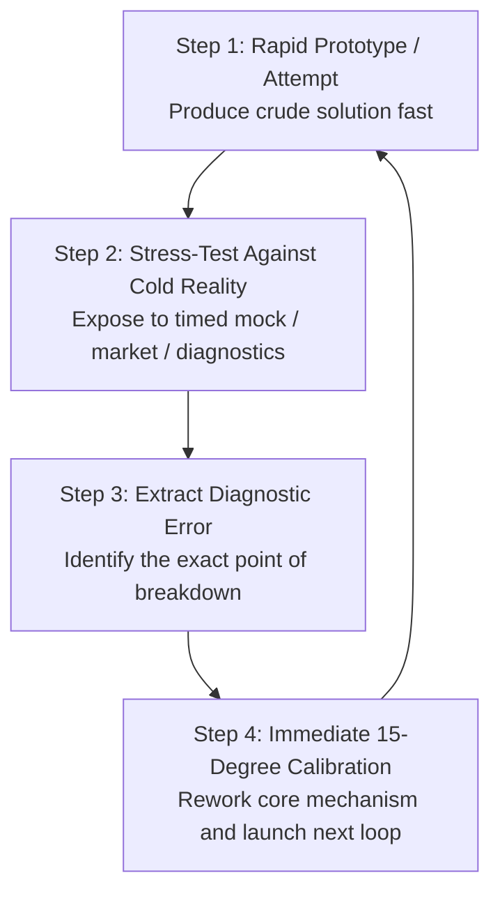
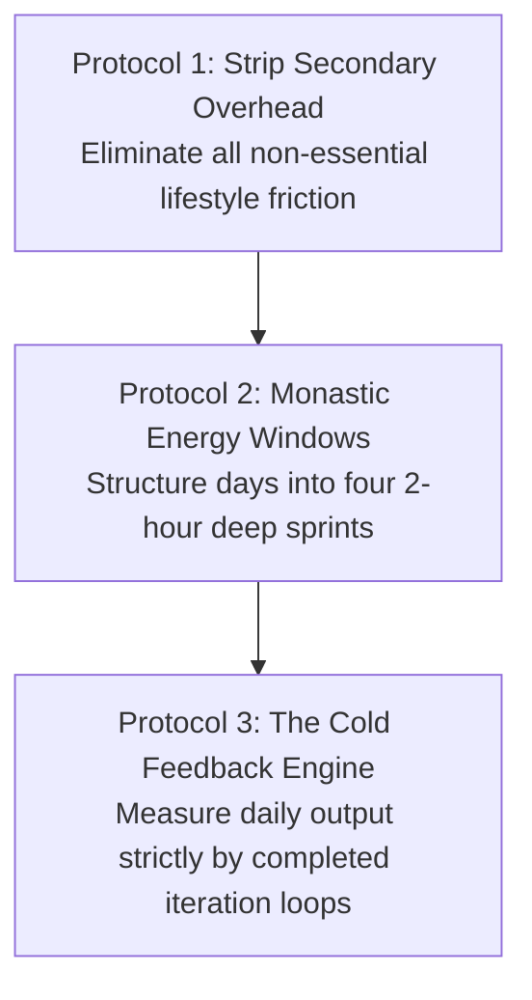

In modern culture, the concept of hard work is often debated through polar extremes: either praised blindly as mindless hustle or dismissed as inefficient burnout.

In systems engineering and mathematical strategy, **relentless effort is an asymmetric multiplier of iteration velocity**. Talent, luck, and intelligence are valuable assets, but they are static initial conditions. The speed at which you test reality, absorb corrective feedback, and build physical prototypes is a direct mathematical function of your **focused weekly hours and iteration frequency**.

When you combine **First-Principles Thinking** (reasoning from fundamental truths rather than analogy) with **Uncompromising Execution Volume**, you compress years of career and cognitive growth into months.

---

### The Mathematics of Iteration Velocity

```mermaid
graph TD
    subgraph Competitor A (Standard 40-Hour Week)
        A1[40 Hours Focused Execution / Week] 
        --> A2[2,000 Hours / Year]
        --> A3[50 Iteration Loops / Year]
        --> A4[Baseline Linear Growth]
    end

    subgraph The Asymmetric Performer (80-Hour Focused Block)
        B1[80 Hours Monastic Execution / Week]
        --> B2[4,000 Hours / Year]
        --> B3[100+ Iteration Loops / Year]
        --> B4[2x Compound Velocity Every 365 Days]
    end
```

* **The Compression Law**: If two entities start with identical capabilities, and Entity B executes twice as many focused hours as Entity A, Entity B accomplishes in **six months what takes Entity A an entire year**.
* **Compounding Iterations**: Output is not merely additive. Every completed iteration produces proprietary diagnostic data that makes the next iteration smarter and faster. Over a 5-year window, a 2x work volume leads to a **10x divergence in real-world mastery and market leverage**.

---

### First-Principles Thinking vs. Reasoning by Analogy

The primary obstacle to extraordinary execution is **Reasoning by Analogy**: copying what everyone else is doing with slight cosmetic variations (*"We should study/build this way because that is how it has always been done"*).

```mermaid
graph LR
    subgraph Reasoning by Analogy (Low Leverage)
        A1[Look at Peer Methods] --> A2[Copy Existing Flaws & Conventions] --> A3[Mediocre Incremental Result]
    end

    subgraph First-Principles Reasoning (Quantum Leverage)
        F1[Boil Problem to Core Fundamental Truths] 
        --> F2[Strip Away Inherited Assumptions] 
        --> F3[Reason Upward from Physics / Core Mechanics] 
        --> F4[Breakthrough Architecture & Extreme Speed]
    end
```

1. **Deconstruct to Bedrock Truths**: What are the absolute, undeniable constraints of the problem? (e.g., *“What does this exam actually test?”* or *“What is the raw material cost of this system?”*).
2. **Eliminate Consensus Dogma**: Discard traditional advice that exists solely due to institutional inertia.
3. **Build Upward from Zero**: Construct your study system, product, or workflow from pure logic and empirical testing.

---

### The Architecture of the Rapid Feedback Loop

True "outworking" is not staring blankly at a screen until exhaustion; it is maximizing the frequency of **tight, closed feedback loops**.



* **The Velocity Advantage**: The person who makes 100 imperfect attempts and corrects each error in real-time will always demolish the perfectionist who spends six months polishing a single untested plan.
* **Embrace the Friction of Reality**: Seek out harsh, objective feedback early. A failed test score or broken prototype is the fastest way to download reality's source code.

---

### The Protocols for Sustainable Extreme Execution



#### 1. Strip Secondary Overhead
* High-volume execution requires ruthless lifestyle simplicity. Automate food choices, eliminate trivial social obligations, and remove decorative busywork so that 100% of cognitive RAM is reserved for core craft.

#### 2. Monastic Energy Windows
* Do not attempt to work 12 hours in a chaotic, unstructured blur. Segment your day into **four distinct 90-to-120 minute monastic deep-work blocks**, separated by physical walks, hydration, and short NSDR resets.

#### 3. The Cold Feedback Metric
* At the end of the day, do not measure hours spent sitting in a chair. Ask: **"How many complete iteration loops did I close today? How much closer to bedrock truth is my understanding?"**

---

### The Core Takeaway to Remember
> Talent sets the floor; iteration velocity dictates the ceiling. Strip away the consensus dogma, boil every challenge down to its first principles, out-iterate the competition with relentless execution volume, and let the compounding mathematics of hard work do the rest.
