In modern culture, the concept of hard work is often debated through polar extremes: either praised blindly as mindless hustle or dismissed as inefficient burnout.

In systems engineering and mathematical strategy, **relentless effort is an asymmetric multiplier of iteration velocity**. Talent, luck, and intelligence are valuable assets, but they are static initial conditions. The speed at which you test reality, absorb corrective feedback, and build physical prototypes is a direct mathematical function of your **focused weekly hours and iteration frequency**.

When you combine **First-Principles Thinking** (reasoning from fundamental truths rather than analogy) with **Uncompromising Execution Volume**, you compress years of career and cognitive growth into months.

---

### The Mathematics of Iteration Velocity

* **The Compression Law**: If two entities start with identical capabilities, and Entity B executes twice as many focused hours as Entity A, Entity B accomplishes in **six months what takes Entity A an entire year**.
* **Compounding Iterations**: Output is not merely additive. Every completed iteration produces proprietary diagnostic data that makes the next iteration smarter and faster. Over a 5-year window, a 2x work volume leads to a **10x divergence in real-world mastery and market leverage**.

---

### First-Principles Thinking vs. Reasoning by Analogy

The primary obstacle to extraordinary execution is **Reasoning by Analogy**: copying what everyone else is doing with slight cosmetic variations (*"We should study/build this way because that is how it has always been done"*).

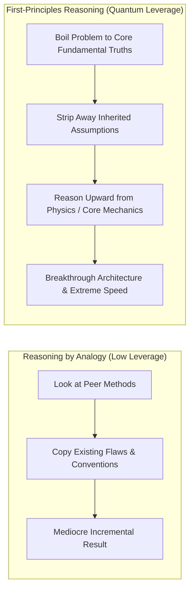

1. **Deconstruct to Bedrock Truths**: What are the absolute, undeniable constraints of the problem? (e.g., *“What does this exam actually test?”* or *“What is the raw material cost of this system?”*).
2. **Eliminate Consensus Dogma**: Discard traditional advice that exists solely due to institutional inertia.
3. **Build Upward from Zero**: Construct your study system, product, or workflow from pure logic and empirical testing.

---

### The Architecture of the Rapid Feedback Loop

True "outworking" is not staring blankly at a screen until exhaustion; it is maximizing the frequency of **tight, closed feedback loops**.

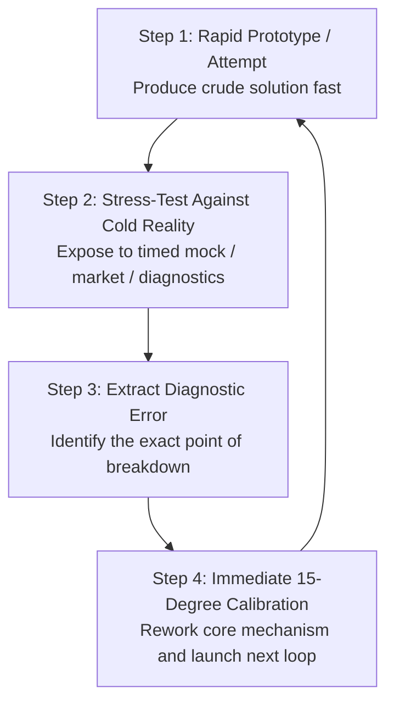

* **The Velocity Advantage**: The person who makes 100 imperfect attempts and corrects each error in real-time will always demolish the perfectionist who spends six months polishing a single untested plan.
* **Embrace the Friction of Reality**: Seek out harsh, objective feedback early. A failed test score or broken prototype is the fastest way to download reality's source code.

---

### The Protocols for Sustainable Extreme Execution

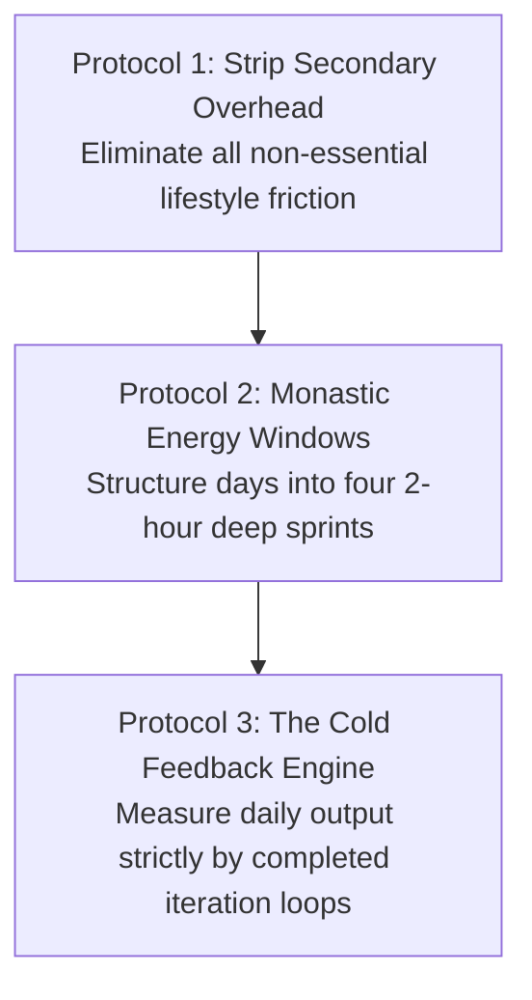

#### 1. Strip Secondary Overhead
* High-volume execution requires ruthless lifestyle simplicity. Automate food choices, eliminate trivial social obligations, and remove decorative busywork so that 100% of cognitive RAM is reserved for core craft.

#### 2. Monastic Energy Windows
* Do not attempt to work 12 hours in a chaotic, unstructured blur. Segment your day into **four distinct 90-to-120 minute monastic deep-work blocks**, separated by physical walks, hydration, and short NSDR resets.

#### 3. The Cold Feedback Metric
* At the end of the day, do not measure hours spent sitting in a chair. Ask: **"How many complete iteration loops did I close today? How much closer to bedrock truth is my understanding?"**

---

### The Tactical Architecture of 10–12 Hour Execution: The AIIMS High-Volume Engine

While theoretical physics illustrates the geometric compounding of outworking, practical execution across high-stakes competitive examinations requires an empirical protocol. **Dr. Aditya Sanjay Gupta** (AIIMS New Delhi AIR 10 UG, AIR 17 PG, and DM Pediatric Oncology) deconstructs how an ordinary or above-average student can sustainably maintain 10 to 12 hours of deep cognitive work daily without burning out.

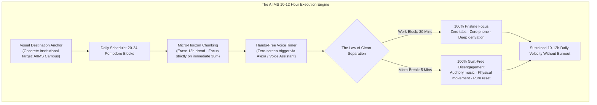

#### 1. The Equalizer Invariant: Dismantling the Genius Myth
In top-tier examinations where hundreds of thousands compete for dozens of seats, relying solely on baseline intellect is dangerous.
* **The Prodigy Fallacy**: The student who studies only 4 hours daily and secures Rank 1 is a rare cognitive outlier. Attempting to replicate their low-volume schedule is fatal for most examinees.
* **Volume as an Equalizer**: Dr. Gupta candidly frames himself as an average or slightly above-average intellect. In his multi-decade clinical and academic journey through AIIMS New Delhi, relentless 10-to-12-hour daily execution served as the ultimate leveling mechanism, outworking the competition through pure repetition density.

#### 2. The Zero-Screen Voice Pomodoro Protocol (The Alexa Method)
* **The Screen Trigger Vulnerability**: Traditional Pomodoro timers managed on smartphones create a fatal failure vector: reaching for the device to start, pause, or check a timer exposes the visual cortex to lock-screen notifications, messaging badges, and dopamine hooks.
* **Voice-Activated Isolation**: Dr. Gupta managed his entire DM preparation using hands-free voice commands via a smart speaker (Amazon Echo / Alexa):
  > *"Alexa, set a timer for 30 minutes."*
* **The Tactile Shield**: At no point does the student touch a glass screen. When the timer chimes, the student speaks aloud (*"Alexa, play Linkin Park"*), listens for 4 to 5 minutes while stretching, and immediately gives the verbal command to initiate the next 30-minute block. The visual field remains permanently anchored to the study desk.

#### 3. The Law of Clean Separation: Eradicating the Half-Study Twilight Zone
The primary cause of student exhaustion is not the volume of study, but **the absence of boundary integrity**.
* **The Twilight Zone**: Students spend 6 hours seated at their desks, but allow 3 hours of that time to bleed into passive daydreaming, social media checking, and mounting guilt. They experience neither the intellectual gains of deep study nor the neurobiological recovery of real rest.
* **The Sovereign Rule**:
  $$\text{100\% Uncompromising Cognitive Focus (30 mins)} \quad \longleftrightarrow \quad \text{100\% Guilt-Free Disengagement (5 mins)}$$
* During the 30-minute block, you do not exist to the external world. During the 5-minute break (or structured 30-minute recreational meal breaks), you completely let go of the syllabus without guilt. Because the brain knows genuine rest is guaranteed every 30 minutes, it willingly tolerates intense cognitive strain.

#### 4. Micro-Horizon Chunking: Erasing the 12-Hour Mountain
* **Cognitive Horizon Compression**: Looking at the day as an intimidating 12-hour mountain triggers immediate limbic task aversion and avoidance.
* **The Chunking Mechanism**: Erase hours 2 through 12 from working memory. The only unit of reality is **the single 30-minute block currently running**. By reducing the cognitive challenge down to conquering a simple half-hour sprint, psychological resistance collapses. Repeating this sequence 20 to 24 times across morning, afternoon, and evening blocks accumulates 10 to 12 hours of pure output seamlessly.

#### 5. The Immutable Visual Destination Anchor
* **Discipline with Purpose**: Discipline is the mechanical engine, but long-term endurance requires a high-resolution visual anchor.
* **The Institutional View**: Throughout nearly a decade of rigorous training, Dr. Gupta anchored his motivation to the physical vista of AIIMS New Delhi: *"This beautiful view has been my reality for the past nine years... If you want this view, you must pay the daily price in discipline."*
* Anchoring grueling daily Pomodoros to a concrete institutional finish line transforms abstract sacrifice into purposeful craftsmanship.

---

### The Quad-Block 4x3 Daily Protocol: Circadian Energy Matching & Modality Rotation

While zero-screen voice automation and boundary integrity establish tactical focus, orchestrating a full 12-hour study day across weeks demands a macro structural blueprint. In the **Quad-Block 4x3 Architecture**, daily volume is segmented into four distinct 3-hour sessions governed by the **50/10 micro-cadence** and **Circadian Energy Matching**.

```mermaid
flowchart TD
    subgraph SG_Quad_Block ["The Quad-Block 4x3 Daily Blueprint (12 Hours)"]
        S1["Session 1 (08:00 - 11:00) · 3 Hours<br/>Morning Peak: Hardest derivations, problem solving, complex theory"] --> B1["Macro Break 1 (11:00 - 12:00) · 1h Lunch & Decompression"]
        B1 --> S2["Session 2 (12:00 - 15:00) · 3 Hours<br/>Midday Practice: High-volume question sets & structured testing"]
        S2 --> B2["Macro Break 2 (15:00 - 16:00) · 1h Walk, Snack & Somatic Reset"]
        B2 --> S3["Session 3 (16:00 - 19:00) · 3 Hours<br/>Afternoon Review: Lighter reading, synthesis, conceptual cross-linking"]
        S3 --> B3["Macro Break 3 (19:00 - 20:00) · 1h Dinner & Relaxation"]
        B3 --> S4["Session 4 (20:00 - 23:00) · 3 Hours<br/>Night Retrieval: Flashcards, active recall drills & verbal teaching"]
        S4 --> SL["Sleep (23:00 - 07:00) · 8 Hours Non-Negotiable Recovery"]
    end
```

#### 1. The 4x3 Macro Structure & The 50/10 Micro-Cadence
Never sit down with the vague intention to "study all day." That destroys psychological stamina before you begin.
* **The Macro Segmentation**: Divide the 12-hour requirement into **four independent 3-hour sessions** separated by **1-hour restoration buffers**. 
* **The 50/10 Micro-Cadence**: Inside each 3-hour session, divide time into three 50-minute focused work blocks separated by 10-minute active breaks ($3 \times 50\text{m} = 150\text{m}$ study $+ 30\text{m}$ breaks $= 180\text{m} = 3\text{h}$).
* **Psychological Safety**: The brain never feels trapped. You are never more than 50 minutes away from a short break, and never more than 3 hours away from a full 1-hour meal or restorative walk.

#### 2. Circadian Energy-Task Matching
Cognitive processing is not uniform across 24 hours; working memory and executive stamina follow diurnal metabolic curves:
* **Morning Block (08:00–11:00 — Peak Cognitive Alertness)**: Reserved strictly for the highest-friction material—complex mathematical derivations, difficult analytical problem-solving, or original essay composition.
* **Midday Block (12:00–15:00 — Structured Execution)**: Allocated to standardized practice question drills and timed test sections.
* **Late Afternoon Block (16:00–19:00 — Conceptual Synthesis)**: Devoted to reading textbooks, reviewing missed mock questions, and organizing notes.
* **Evening Block (20:00–23:00 — Active Retrieval)**: Dedicated to low-cognitive-load testing methods—Anki flashcard retrieval, blank-page syllabus recall, and Socratic self-explanation aloud.
* **The Rule**: Never waste morning high-energy hours on passive administrative notes, and never torture an exhausted brain with new complex formulas late at night.

#### 3. Cognitive Modality Switching
Attempting to spend 12 hours exclusively reading or writing causes rapid sensory saturation and mental collapse within 3 to 4 hours.
* **The Mechanism**: Keep neural networks agile by deliberately rotating learning modalities across blocks:
  $$\text{Problem Sets} \quad \longrightarrow \quad \text{Flashcard Retrieval} \quad \longrightarrow \quad \text{Reading Synthesis} \quad \longrightarrow \quad \text{Verbal Self-Explanation}$$
* Shifting modalities recruits distinct neurological pathways, allowing one cognitive circuit to recover while another executes.

#### 4. Environmental Lockdown & Somatic Energy Protection
* **Visible Countdown Timer**: Position a large physical countdown clock or digital timer displaying the 50-minute block. Seeing the countdown maintains healthy temporal urgency without checking a phone.
* **Somatic Fueling Invariants**:
  * 7 to 8 hours of sleep is an unbreakable biological constraint.
  * Light, protein-rich meals at lunch to avoid postprandial glucose crashes.
  * Physical movement during the 10-minute micro-breaks: push-ups, stretching, and brisk walking physically flush extracellular adenosine and reset dopamine sensitivity.

#### 5. The 1-to-4 Block Progressive Ramp
Do not attempt a 12-hour study schedule on Day 1. The unconditioned nervous system will revolt, inducing multi-day burnout.
* **Week 1**: Master a single 3-hour block (three 50/10 cycles) with 100% adherence.
* **Week 2**: Introduce Session 2 (6 hours total).
* **Week 3**: Add Session 3 (9 hours total).
* **Week 4+**: Lock in Session 4 (12 hours peak velocity).
* Progressive loading conditions mental endurance just like progressive resistance in athletic strength training.

---

### Clinical Burnout Prevention & High-Volume Sustainable Cadence: The Pachhel Protocols

Beyond micro-timers and 24-hour macro grids, sustaining 8 to 14 hours of study across medical school and officer-level competitive exams requires **clinical burnout prophylaxis**. **Dr. Anuj Pachhel** (MBBS, GMC Nagpur) synthesizes empirical strategies derived from grueling medical residency and multi-year high-volume academic preparation, establishing the boundary between high-yielding endurance and toxic neural exhaustion.

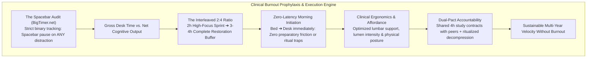

#### 1. The Spacebar Audit Principle: Net Throughput vs. Gross Desk Vanity
The most common psychological trap in competitive study is equating **gross physical chair time** with **actual cognitive assimilation**.
* **The Self-Delusion Trap**: An aspirant sits at a desk for 10 hours, yet spends 4 hours daydreaming, checking phone screens, or rereading sentences in a brain fog, congratulating themselves on a "10-hour day" while real neural acquisition was less than 3 hours.
* **The Spacebar Audit Mechanism**: Use a clean, distraction-free countdown timer (such as `BigTimer.net` or a dedicated physical countdown unit). Set a 2-hour target block and hit the spacebar.
  * The second an intrusive thought occurs (*"I should hit the gym later," "Let me check this notification"*), **immediately tap the spacebar to pause the timer**.
  * The timer runs *only and exclusively* when working memory is actively processing the syllabus.
  * Only when the timer reaches zero has the session succeeded.
* Exposing the raw disparity between gross desk presence and net cognitive focus dismantles procrastination rationalize-loops instantly.

#### 2. The Interleaved 2:4 Ratio: Beating the Law of Diminishing Returns
The brain's prefrontal cortex exhibits **diminishing marginal cognitive returns**:
* In hour 1, reading velocity may reach 40–50 pages with high conceptual synthesis.
* By hour 5 of an uninterrupted marathon, reading velocity collapses to 10 pages, working memory slips, and limbic friction spikes exponentially.
* **The Interleaved Counter-Architecture**: Instead of attempting a single uninterrupted 6-to-8 hour marathon that leads to multi-day neural collapse, interleave intense 2-hour sprints with expansive recovery intervals:
  $$\text{2h Deep Study} \quad \longrightarrow \quad \text{3–4h Rest/Active Living} \quad \longrightarrow \quad \text{2h Deep Study} \quad \longrightarrow \quad \text{Rest/Gym} \quad \longrightarrow \quad \text{2h Deep Study}$$
* Spacing three 2-hour bouts across 16 waking hours yields **6 hours of pure, pristine cognitive throughput** with zero burnout or systemic fatigue.

#### 3. Zero-Latency Morning Initiation
A critical vulnerability in student daily architecture is **preparatory friction**.
* **The Ritual Delay Fallacy**: Aspirants construct elaborate morning requirements (*"I must wake up, stretch, prepare a healthy breakfast, drink matcha, shower, and then study"*). Each intermediary step introduces a potential derailment vector where willpower is drained or devices are checked.
* **Zero-Latency Principle**: Wake up, splash cold water on the face, and immediately sit at the desk to open the book or test module.
* In the immediate post-waking state, executive resolve is at peak capacity and the mind is free from daytime sensory noise. Completing the first 90-to-120 minute block before the world wakes up locks in psychological momentum for the entire day.

#### 4. Clinical Ergonomics: The Subconscious Drain of Poor Affordance
Physical discomfort silently degrades mental stamina long before conscious pain registers.
* **Environmental Interaction**: Ergonomics is the dynamic interaction between human physiology and physical architecture. Slouching in a soft bed or balancing a laptop on a dining chair forces the spinal erectors and cervical spine to sustain isometric tension, continuously siphoning metabolic glucose away from the cerebral cortex.
* **The Invariant Setup**:
  * Invest in an unyielding, high-support ergonomic chair and desk positioned at neutral elbow height.
  * Optimize lumen illumination: poor lighting strains the optic nerve, accelerating ocular fatigue and triggering premature melatonin production.
  * If home environment lacks ergonomic discipline, relocate immediately to an institutional or college library whose architecture is designed exclusively for cognitive labor.

#### 5. Recognizing Early Burnout Markers & The Strategic Reset
Burnout does not occur overnight; it presents with distinct diagnostic symptoms:
1. **Severe Attentional Degradation**: Inability to sustain focus even across simple, familiar tasks.
2. **Chronic Somatosensory Exhaustion**: Pervasive mental and physical lethargy accompanied by acute visceral resistance (*"Mujhe nahi karna"* / *"I cannot look at this syllabus"*).
3. **Anhedonia Toward High-Interest Domains**: Complete loss of intrinsic motivation even for subjects or milestones previously enjoyed.
* **The Strategic Inoculation**: When these clinical signs manifest, doubling down with brute willpower causes cognitive shutdown. Enforce an **acute 24-to-48 hour decompression reset**—complete physical detachment from study materials, travel, outdoor nature exposure, or novel creative hobbies. You return with doubled cognitive receptivity, converting what would have been weeks of sluggish half-effort into high-velocity execution.

---

### The Seasonal Hustle Paradigm & Modular Timetable Architecture: The IIT Kharagpur Protocol

Complementing micro-focus timers and clinical burnout management, **Tharun Speaks** (IIT Kharagpur / Quantum Project) deconstructs the macro-psychology and scheduling mechanics of extreme study volume, reframing relentless execution through **Seasonal Hustling** and the **Modular Timetable Principle**.

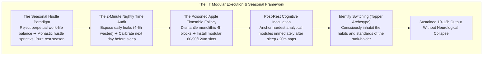

#### 1. The Seasonal Hustle Paradigm: Rejecting the Balance Trap
In high-stakes competitive examinations (JEE, NEET, SBI PO, UPSC), attempting to maintain a static, symmetrical "work-life balance" year-round guarantees mediocrity across all fronts.
* **The Fallacy**: Believing that one must simultaneously advance hobbies, social life, entertainment, and peak competitive exam preparation in equal daily measures.
* **The Seasonal Realignment**: High performers view life through **distinct macro seasons**:
  * **The Hustle Season (Sprint Window)**: A 3-to-6 month monastic phase where non-essential activities, social outings, and digital entertainment are stripped away. Execution volume is dialed to 10–14 hours daily.
  * **The Recovery Season**: Dedicated intervals post-examination where restorative travel, creative leisure, and somatic decompression take precedence.
* Acknowledging that intense sacrifice is a *temporary, season-bound campaign* eradicates existential resentment and sustains ruthless daily commitment.

#### 2. The Poisoned Apple Timetable Fallacy: Monolithic vs. Modular Scheduling
Most students design schedules that look flawless on paper but are biologically catastrophic:
* **The Poisoned Apple**: Planning rigid, monolithic 4-hour blocks:
  $$\text{08:00 – 12:00: Physics} \quad \big| \quad \text{14:00 – 18:00: Mathematics} \quad \big| \quad \text{19:00 – 23:00: Chemistry}$$
  Like an apple containing a hidden blade, this structure appears healthy on paper, but in practice, reading a single subject for 4 uninterrupted hours induces acute cognitive saturation, daydreaming, and abandonment by hour two.
* **The Modular Solution**: Deconstruct daily time into flexible, high-leverage **60, 90, or 120-minute modular blocks**. 
* Ensure that you have 3 to 4 discrete modular blocks daily, interspersed with purposeful recovery.

#### 3. Post-Rest Cognitive Inoculation
The placement of demanding work blocks determines whether effort yields mastery or exhaustion:
* **Post-Rest Anchoring**: Position the most conceptually brutal syllabus modules (e.g., advanced problem derivations, timed full mocks) **immediately after restorative sleep**—either right after waking in the morning, or immediately following a **structured 20-minute afternoon power nap** (or "caffeine nap" / nappuccino).
* Taking advantage of post-nap neural reset clears adenosine and prefrontal fatigue, allowing you to attack peak-friction material with maximum cognitive torque.

#### 4. The 2-Minute Nightly Time Audit
A student cannot optimize what they refuse to measure.
* **The Hidden Hemorrhage**: The average competitive aspirant unconsciously bleeds 3 to 5 hours every single day into algorithmic social media scrolling, aimless chatting, and passive browsing—surrendering 30% of waking life (equivalent to 15+ years across a lifetime).
* **The Nightly Audit Ritual**: Spend exactly 2 minutes every night before sleep with a physical notepad.
  * Audit gross waking hours against net productive output.
  * Pinpoint exactly where attentional leaks occurred.
  * Lock down the exact 3 to 4 modular targets for the following morning *before* your head touches the pillow. Waking up with pre-determined directional intent eliminates morning choice paralysis.

#### 5. Identity Switching: Embodying the Topper Archetype
Willpower alone inevitably buckles under prolonged friction; long-term consistency requires **Identity Transformation**.
* **The Mechanism**: Inhabit the cognitive archetype of the ultimate rank-holder (*"I am the topper of this exam"*).
* **The Behavior Filter**: Filter every micro-decision throughout the day through this identity anchor:
  * *"Would a top rank-holder spend 45 minutes mindlessly scrolling reels in bed?"*
  * *"Would a topper surrender to sleep during a scheduled focus block?"*
  * *"Would a top performer operate without control over their daily schedule?"*
* By aligning daily micro-actions with the non-negotiable operational standards of an elite performer, resistance dissolves and high-volume discipline becomes subconscious nature.

---

### The Napoleonic Executive Architecture: Energy of Thought & Action

In studying the operational records of history's most extreme outworkers, few archetypes embody high-velocity leverage more completely than **Napoleon Bonaparte** (*Founders #432: The Mind of Napoleon*). Napoleon combined two traits that rarely co-exist in equal measure: **extreme theoretical analytical rigor and ferocious physical execution velocity**.

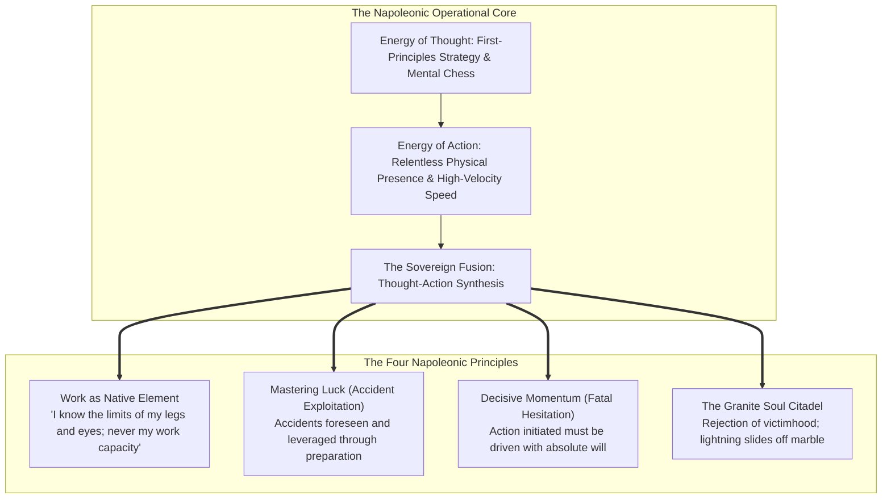

#### 1. Work as Native Element: Transcendence of the Martyrdom Complex
Most examinees and creators view intense intellectual labor as a painful sacrifice—a tax paid to achieve a future goal. This framing creates an ongoing metabolic drain: every hour worked requires willpower to resist the urge to stop.

Napoleon inverted this premise entirely:
> *"Work is my element. I am born and built for work. I have known the limitations of my legs, I have known the limitations of my eyes; I have never been able to know the limitations of my working capacity."*

When high-volume output is recognized as your **native biological element**, fatigue ceases to function as a psychological stopping cue. You no longer measure how much you have suffered; you operate continuously because execution is the highest expression of your existence.

#### 2. Mastering "Luck" Through Accident Exploitation
The common observer attributes consecutive victories to luck or fortuitous timing. Napoleon rejected this vulgar rationalization:
> *"A consecutive series of great actions is never the result of chance and luck; it is always the product of planning and genius. Is it because they are lucky that great men become great? No, but being great, they have been able to master luck. What is luck? The ability to exploit accidents: The vulgar would call this luck, but in fact it is the characteristic of genius."*

In competitive examinations and market competition, unexpected surprises (a brutal syllabus surprise, an atypical question format, an abrupt change in schedule) destroy operators who rely on fragile, rigid routines. The sovereign performer anticipates variance: they prepare so comprehensively that when an accident occurs, they **exploit the disorder while competitors freeze**.

#### 3. The Decisive Momentum Invariant: Fatal Hesitation
> *"Hesitation is fatal; once an action is begun, it must be followed through with the utmost exertion of the will."*

Perfectionists often mistake hesitation for prudence. They deliberate at the starting line, pausing to doubt their approach or endlessly polish secondary details. Napoleon recognized that once strategic direction is set, **velocity is armor**. Hesitation dissipates kinetic energy and gives friction time to compound. Drive the action through with complete commitment.

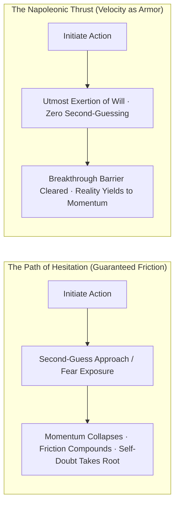

#### 4. Instrumental Knowledge Acquisition: Conquering vs. Studying
A major pathology of intellectual work is collecting vast quantities of theoretical trivia that produces zero leverage:
> *"I have read your letter. It is utterly worthless. There are too many words and not enough ideas."*
> *"History I conquered rather than studied. That is to say, I wanted from it, and retained of it, only what could add to my ideas. I spurned what was of no use, and I seized upon certain conclusions that pleased me."*

* **The Sovereign Reader's Razor**: Do not read passively to check off pages. Read as a conqueror: interrogate the text strictly for actionable mechanisms, mental models, and strategic rubrics. Anything that cannot be synthesized into high-leverage execution is ruthlessly discarded.

#### 5. The Granite Soul Citadel: Total Ego Immunity
Under high-stakes pressure—where competitors, critics, or adverse exam conditions seek to shake internal poise—Napoleon maintained an impenetrable psychological citadel:
> *"My soul is made of marble. Lightning has found no grip on it and had to slide off of it. I have no fear of becoming their victim. They will be biting into granite."*

When external storms strike (a bad mock score, unfair conditions, overwhelming competition), refuse the posture of the fragile victim. An operator with a granite soul treats setbacks as friction against marble: lightning slides off, leaving the core will pristine and indomitable.

---

### The 5-Book Intellectual Architecture of Napoleon: Beyond the Myth

To move past one-dimensional pop-culture portrayals and extract the complete operating system of history's most prolific administrator and commander, **Vashik Armenikus** synthesizes five distinct biographic masterworks (*What I Learned from Napoleon After Reading 70+ Books*). Each volume unlocks a distinct layer of cognitive leverage:

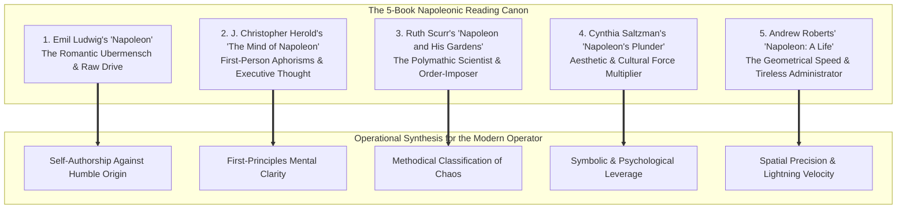

#### 6. The Polymathic Operator: Science, Geometry & Systematic Order (Ruth Scurr)
A fatal misconception is viewing Napoleon merely as a man of blood and gunpowder. Napoleon considered himself, first and foremost, a **man of science and letters**—he was an elected member of the mathematics section of the prestigious *Institut de France*, often signing his military orders with the title *"Member of the Institute, General-in-Chief"*.

* **Botanical and Spatial Classification**: In *Napoleon and His Gardens*, Ruth Scurr reveals how Napoleon approached nature and civil statecraft with the same taxonomic precision. From planting extensive gardens in exile at Saint Helena to designing the metric administrative geography of France, he sought to bring mathematical order out of untamed wilderness.
* **The Legislative First Principle (Code Napoléon)**: Rather than accepting 300+ fragmented, contradictory regional legal codes across France, Napoleon gathered jurists, sat through over 50 exhaustive drafting sessions himself, and demanded a unified, plain-language legal framework grounded in reason and meritocracy.
* **The Modern Invariant**: When confronting a massive, unstructured domain (such as an enormous competitive syllabus or complex engineering architecture), the elite operator does not panic. They adopt the scientific mindset: break the domain into its component taxons, classify its governing laws, and impose clean, systematic structure upon the chaos.

#### 7. The Geometrical Speed Invariant: Maneuver as Armor (Andrew Roberts)
In *Napoleon: A Life*, Andrew Roberts details the mathematical foundation of Napoleon's battlefield dominance. Napoleon was trained as an artillery officer; he viewed human conflict not as brute brawling, but as **geometry in dynamic motion**.

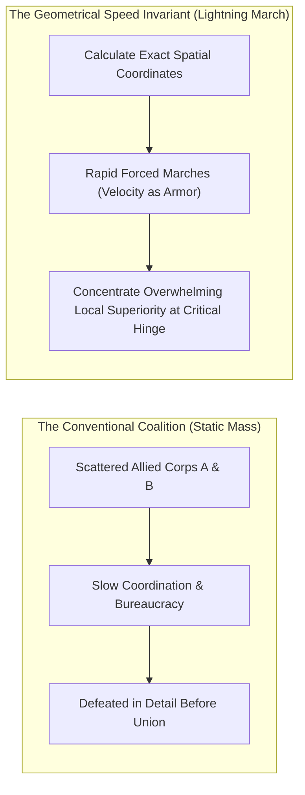

* **Defeat in Detail**: When facing coalitions with double his numbers (such as the Austrians and Russians at Austerlitz, or the Italian campaigns), Napoleon did not meet their combined weight head-on. He used rapid march speed to place his army between the divided enemy wings, turning a 2:1 numerical disadvantage into a 2:1 local advantage against each separated fraction.
* **Maneuver Replaces Casualties**: *"The Emperor has discovered a new way of waging war; he makes use of our legs instead of our bayonets."* Speed was not a cosmetic attribute; it was his primary defensive and offensive shield.
* **The Preparation Invariant**: In high-stakes intellectual races, speed of syllabus coverage and iteration does not come from rushing or skimming; it comes from **geometrical precision**—eliminating wasted transit time between focus blocks, cutting administrative fluff, and focusing 100% of available cognitive force at the single high-yield conceptual hinge.

#### 8. The Architecture of Self-Authorship: Plutarch to Empire (Emil Ludwig)
In Emil Ludwig's classic biography, the defining question is how an impoverished, accented outsider from the backwater island of Corsica climbed to the mastery of Europe. 

* **The Consumption of Classical Exemplars**: As an impoverished young lieutenant living on one meal a day in a cold garrison, Napoleon spent his spare hours devouring Plutarch's *Lives*, Caesar's *Commentaries*, and the military histories of Frederick the Great. He did not read for entertainment; he **modeled their minds**, internalizing their decisiveness, stoicism, and grand historical perspective.
* **Self-Authorship Over Pedigree**: Napoleon rejected the hereditary aristocratic dogma of his era. He proved that an individual can self-author their destiny from zero by acquiring rare, indispensable competence, cultivating iron will, and refusing to accept social or circumstantial limitations as permanent boundaries.

---

### The 13 Laws of Operational Power & Mental Sovereignty (Nic Munoz)

Building on the biographical record, **Nic Munoz** (*Napoleon's Personal 13 Laws of Power*) deconstructs the tactical habits that allowed Napoleon to sustain peak prefrontal velocity across decades of unrelenting crisis:

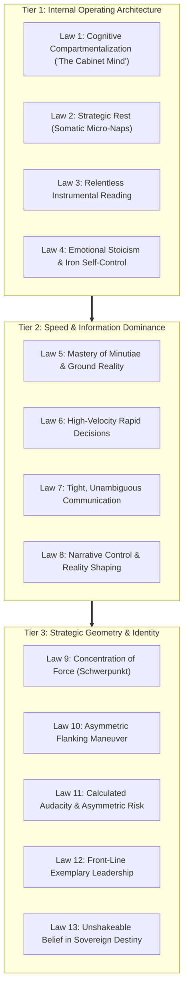

#### 9. The Cognitive Compartmentalization Wardrobe: The "Cabinet Mind"
The fatal leak in modern intellectual execution is **Attention Residue**—the lingering cognitive drag of previous tasks bleeding into current focus. Napoleon solved this through a deliberate cognitive architecture:
> *"Different subjects and different affairs are arranged in my head as in a cupboard. When I wish to interrupt one train of thought, I shut up that drawer and open another. Do I wish to sleep? I close all drawers, and behold, I am asleep."*

* **The Mechanism**: When engaged in problem-solving or deep synthesis, mentally lock every other problem outside the immediate visual and neural field. No anxiety regarding tomorrow's tasks is permitted inside the open drawer.
* **Instant Disengagement**: By closing all drawers at once, an operator halts recursive rumination instantly, allowing clean, restorative recovery on demand.

#### 10. Strategic Rest & Somatic Reset (Micro-Naps as Leverage)
Contrary to the toxic myth of sleep deprivation, Napoleon understood that executive failure stems from neurotransmitter exhaustion.
* **On-Demand Somatic Reset**: Rather than waiting for total nervous breakdown or sleeping 9 unbroken hours, Napoleon deployed tactical **15-to-20 minute power naps**. He could sleep on a folded cloak amidst artillery roar and wake up completely refreshed with crisp working memory.
* **The Study Protocol**: In intensive 12-hour preparation regimes, a 20-minute midday somatic reset clears adenosine receptors and flushes cognitive fatigue, restoring morning-level executive function for afternoon and evening blocks.

#### 11. The Asymmetric Flanking Maneuver: The Indirect Approach
In problem-solving, exam strategy, and competition, frontal attacks against entrenched obstacles waste immense energy:
* **The Principle**: Never attack the adversary's strongest point directly. Pin their attention in front with a credible secondary force, then swing the decisive mass around the flank to sever supply lines and shatter morale.
* **Application to Difficult Material**: When a subject or conceptual block offers fierce resistance, do not grind against it fruitlessly. Pin it with light daily active recall drills, while flanking it indirectly through foundational first principles, analogical models, and prerequisite mastery from an unexpected angle.

---

### The Core Takeaway to Remember
> Talent sets the floor; iteration velocity dictates the ceiling. Strip away the consensus dogma, boil every challenge down to its first principles, out-iterate the competition with relentless execution volume, and let the compounding mathematics of hard work do the rest.

