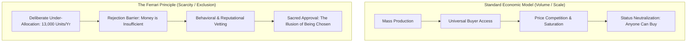
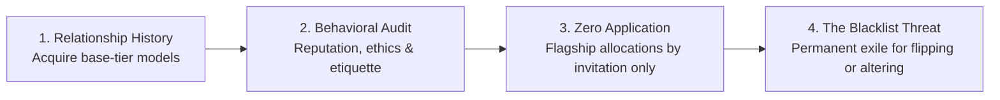

Imagine having half a million dollars in liquid cash, walking into a dealership, sliding the money across the mahogany desk, and having the executive look you in the eye and say: **"No."**

Not *"we are currently out of stock."* Not *"please join our waiting list."* Simply: **You are not the right kind of person.**

In a standard transaction, the prospective buyer would walk away in fury. In the architecture of elite status games, the exact opposite occurs: the buyer goes home and spends the next three years curating their public reputation, acquiring entry-level models, and performing deference to prove they are worthy.

That dynamic is not a customer service failure. It is the most sophisticated psychological strategy in the history of luxury capital: **The Economics of Rejection**.

---

### The Anatomy of Approval vs. The Commodity Transaction

Mass consumer capitalism operates on a simple premise: **if you possess the financial capital, you possess the right to consume.** 

Elite luxury and social hierarchy operate on a contradictory sociological law: **if anyone with money can buy it, it possesses zero status value.**

In 2024, Ford manufactured approximately 13,000 F-150 trucks every single day. Ferrari shipped just 13,752 vehicles across the entire planet for the entire year—yet commanded an enterprise valuation exceeding **$80 billion**. 

Ferrari does not operate in the automotive sector; it operates in the **approval economy**. And human approval possesses astronomical market value only when it is genuinely, ruthlessly difficult to obtain.

---

### The Enzo Paradigm: Indifference as supreme leverage

In 1947, Enzo Ferrari did not construct Maranello as a commercial venture. He was not an advertising strategist or a market researcher. He was something far more dangerous to consumer ego: **a creator who genuinely did not care whether customers bought his cars or not.**

His contemporaries described him as cold, aloof, and openly contemptuous of customer critiques. When wealthy industrialist Ferruccio Lamborghini waited hours outside Enzo’s office in 1963 to offer engineering solutions for a failing clutch, Enzo dismissed him outright:

> *"You are a tractor manufacturer. You will never know how to handle a Ferrari properly."*

That insult provoked Lamborghini to hire Ferrari’s defecting engineers and manufacture his own supercar line. Yet the cultural effect on Ferrari was even more profound: it demonstrated to global elites that Ferrari was an institution capable of making a multi-millionaire industrialist feel inadequate. 

The moment a brand demonstrates that it can reject wealth without flinching, its brand equity transcends economics and becomes **priceless**.

---

### The Four Pillars of the Rejection Architecture

How does an institution systematically engineer this dynamic without bankrupting itself? Through four rigid gates of asymmetric allocation:

1. **The Loyalty Escalator**: You cannot enter an authorized showroom and purchase an SP3 Daytona or LaFerrari. You must build a verified multi-year transaction history purchasing secondary, entry-level models. In 2024, **81% of Ferrari purchasers were repeat customers**—not because outsiders lacked funds, but because insiders held the gate.
2. **Reputational Vetting**: The institution audits personal reputation, public behavior, and social standing. Capital alone grants no access; the candidate must demonstrate social alignment.
3. **The Unsolicited Invitation**: For halo releases (such as the Daytona SP3 or 500-unit LaFerrari), there is no waiting list. The entire production run is pre-allocated before public disclosure. If you must ask for an application, you are already disqualified.
4. **The Sovereign Injunction (The Blacklist)**: To preserve the sanctity of the circle, deviation from behavioral dogma is met with permanent exile. Billionaire casino mogul Steve Wynn was permanently stripped of dealership allocation rights for flipping a LaFerrari for secondary profit. Celebrities, influencers, and pop icons who modified body panels or repainted vehicles without authorization found themselves publicly banned from factory allocations.

---

### Psychological Mechanisms: Why Elites Beg to Be Controlled

Why do individuals who control corporate empires, sovereign wealth, and political influence submit to the humiliating restrictions of a luxury manufacturer?

#### 1. The Asymmetry of Currencies
As established in Pierre Bourdieu’s sociology, **economic capital is common; social and cultural recognition is scarce**. When an individual amasses immense financial liquidity, money ceases to provide psychological differentiation. What the wealthy crave is an arena where their money is rendered powerless, forcing them to compete on **taste, patience, and institutional favor**.

#### 2. The Association Multiplier
Human beings do not evaluate objects or status in isolation; we evaluate them through relational proximity. When Lewis Hamilton announced his transition to the Ferrari Formula 1 team, Ferrari's market capitalization expanded by **$7 billion in a single trading session** prior to a single race being driven. The market was pricing the mutual elevation of prestige: elite talent validated the institution, and the institution conferred immortality upon the driver.

#### 3. The Secular Church of Exclusion
Every religious and fraternal hierarchy throughout human history has derived its internal cohesion from **exclusion**. If salvation, enlightenment, or entry is granted indiscriminately, devotion collapses. Ferrari established a secular church where the car is merely the communion wafer—the actual sacrament is being told: *"Yes, you are the caliber of human being who is permitted to exist here."*

---

### Sovereign Takeaway: The Deepest Social Need

Tesla manufactures over 1.7 million vehicles annually to scale clean transportation to civilization. Ferrari manufactures 13,000 to determine who is worthy.

The uncomfortable sociological reality is that while the rational mind praises universal utility, human status psychology remains tethered to the quiet, primal urge: **the desire to be chosen.**

True social sovereignty requires recognizing this psychological trap. When you understand that prestige brands and exclusive clubs manufacture scarcity through staged rejection, you liberate yourself from their spell. You stop spending your life, capital, and emotional energy seeking validation from institutions whose power exists solely because they have convinced you that their approval matters.
