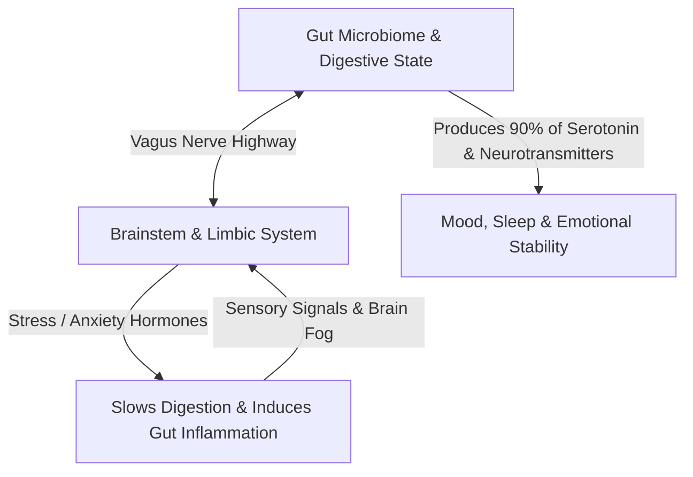

We often think of our thoughts, moods, and mental clarity as phenomena that exist strictly between our ears. However, modern biology reveals that your emotional state and cognitive focus are anchored just as heavily in your digestive system. 

Running along the walls of your gastrointestinal tract is a network of over 100 million neurons known as the **Enteric Nervous System**. It operates so independently and communicates so constantly with the cranial brain that science refers to it as the body’s "second brain."

---

### The Superhighway: How Your Gut Talks to Your Brain

Your brain and your gut are linked through a bidirectional communications network known as the **Gut-Brain Axis**. The primary physical bridge between them is the **Vagus Nerve**—the longest cranial nerve in the body.

This communication is not a one-way street:
1. **The Top-Down Pathway**: When you experience psychological stress, acute worry, or anger, your brain releases adrenaline and cortisol. This slows down digestive motility, reduces blood flow to the stomach, and weakens the protective mucosal lining.
2. **The Bottom-Up Pathway**: More surprisingly, roughly **80% to 90% of the nerve fibers in the vagus nerve send signals *from* the gut *to* the brain**, not the other way around. An irritated, inflamed, or sluggish gut constantly fires distress signals upward, which your conscious mind interprets as anxiety, low mood, or general unease.

---

### The Neurochemical Factory: Where Mood is Made

A common misconception is that emotional neurochemicals are manufactured primarily in the brain. In reality:

* **Serotonin (The Stability Molecule)**: Around 90% of your body’s total serotonin is produced by specialized cells in the gut and modulated by your gut bacteria. Serotonin governs mood balance, sleep cycles, and feelings of satisfaction.
* **GABA (The Calming Molecule)**: Healthy strains of gut bacteria produce GABA (gamma-aminobutyric acid), a natural tranquilizer that prevents the nervous system from becoming overstimulated.
* **Dopamine (The Drive Molecule)**: Approximately 50% of the body's dopamine is synthesized in the gut environment, directly influencing baseline motivation and energy levels.

When the bacterial ecosystem in the digestive tract is disrupted, your production of these stabilizing chemicals plummets. This is why chronic digestive discomfort is almost universally accompanied by brain fog, lethargy, and erratic emotional swings.

---

### The Two Roots of Mental Fog: Inflammation & Leaky Barriers

When people report struggling with focus, mental sluggishness, or memory recall, the root cause is frequently biochemical irritation rather than a lack of mental discipline.

#### 1. The Broken Barrier
The lining of your intestine is only one cell layer thick. It acts like a high-security border control: absorbing broken-down nutrients into the bloodstream while keeping out undigested food particles, toxins, and pathogenic bacteria.

When this barrier becomes irritated (through ultra-processed food, chronic unmanaged stress, or prolonged antibiotic exposure), microscopic gaps form. Undigested particles leak into the bloodstream.

#### 2. The Fire in the Brain
The immune system immediately attacks these foreign particles, triggering systemic, low-grade inflammation. Inflammatory molecules travel through the blood and cross the blood-brain barrier. 

In the brain, this inflammation slows down synaptic transmission. The subjective experience of this biological event is what we call **"brain fog"**—an inability to focus, slow decision-making, and mental exhaustion.

---

### Core Principles for Restoring Gut-Mind Harmony

To maintain sustained mental energy and emotional composure, your daily lifestyle should protect the digestive ecosystem through four simple rules:

#### 1. Establish Rhythm in Meal Timing
The gut has its own cleansing cycle called the *Migrating Motor Complex* (MMC). This cleaning wave only activates when your stomach has been completely empty for 3 to 4 hours. Constant snacking interrupts this natural self-cleaning process, causing fermentation, bloating, and sluggishness. Allow clean fasting windows between meals.

#### 2. Diversify Whole-Plant Fibers
Your beneficial bacteria feed on prebiotic fiber that your own stomach enzymes cannot break down. A diet rich in diverse whole foods, leafy greens, legumes, and fermented items creates a resilient bacterial colony that produces short-chain fatty acids (which repair the gut wall and reduce brain inflammation).

#### 3. Practice Pre-Meal Nervous System Down-Regulation
Eating while stressed, distracted, or working forces your body into a sympathetic ("fight-or-flight") state. In this state, your stomach produces significantly less digestive acid and enzymes. Taking three deep, slow breaths before eating flips the nervous system into the parasympathetic ("rest-and-digest") state, ensuring complete digestion without metabolic waste.

---

### The Core Takeaway to Remember
> Your mental clarity is not isolated to your thoughts. When the gut is inflamed, the mind feels anxious and foggy; when the gut is nourished and calm, the mind naturally returns to ease, focus, and sustained energy.
