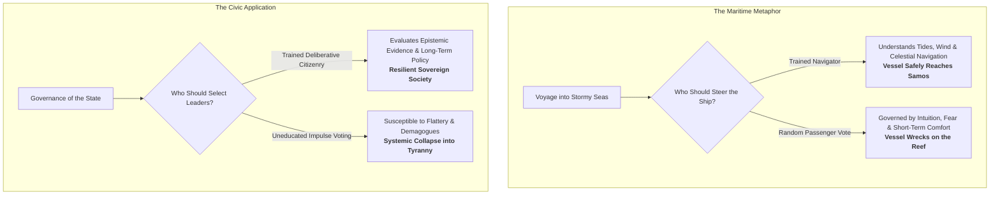
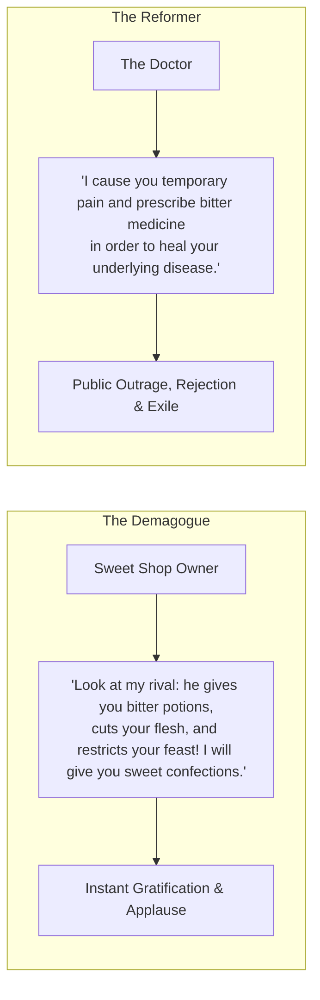

Modern society tends to view democracy as an unambiguous, self-evident moral good.

However, the founding father of Western philosophy—**Socrates**—was deeply pessimistic about unconditional majoritarian rule. Having observed the political turbulence of 5th-century BC Athens, Socrates argued in Book VI of Plato's *Republic* that **voting is an intellectual skill, not an innate birthright**.

When a society grants universal suffrage without ensuring universal philosophical education, democratic systems predictably degenerate into **demagoguery**—a state where charismatic entertainers exploit emotional vulnerabilities to seize power.

---

### The Ship of State: Skill vs. Intuition

In Plato's dialogue with Adeimantus, Socrates constructs the foundational metaphor for political epistemology:

* **The Fallacy of Intuitive Wisdom**: We would never entrust the navigation of a warship sailing through a tempest to popular ballot among untrained passengers. Yet societies routinely assume that any individual, regardless of their capacity for critical reasoning or historical literacy, is naturally equipped to evaluate complex economic, geopolitical, and ethical policies.
* **Intellectual vs. Birthright Democracy**: Socrates was not an elitist advocating for an aristocratic oligarchy based on wealth or lineage. He advocated for an **Intellectual Democracy**—insisting that voting must be treated as a cultivated civic craft requiring deep, dispassionate reflection.

---

### The Demagogue’s Dilemma: Doctor vs. Sweet Shop Owner

To illustrate why uneducated electorates consistently reject wise leadership, Socrates presented a parable of an election debate between two candidates:

1. **The Structural Asymmetry**: The demagogue (like the Athenian aristocrat Alcibiades) promises effortless solutions, flattery, and immediate pleasure.
2. **The Reformer's Handicap**: The genuine statesman (the doctor) must prescribe fiscal restraint, painful structural reforms, and strategic discipline. 
3. **The Predictable Outcome**: When voters operate on immediate emotional intuition rather than long-term systemic analysis, the doctor cannot win. The sweet shop owner is elected, leading the state into catastrophic military and financial overextension.

---

### The Historical Warning: The Hemlock Verdict

Socrates's critique was not merely academic; it was confirmed by his own martyrdom in 399 BC.

Put on trial before a popular Athenian jury of 500 citizens on fabricated charges of "corrupting the youth," Socrates was condemned to death by hemlock by a narrow margin. An emotionally agitated majority executed the most critical intellectual asset of their civilization because his questioning produced uncomfortable cognitive friction.

---

### The Core Takeaway to Remember

> Governance is an art of navigation, not an intuition of birthright. When collective voting is severed from philosophical education and critical discernment, society rejects the necessary bitter medicine of the doctor and crowns the sweet shop owner—collapsing into demagoguery.
