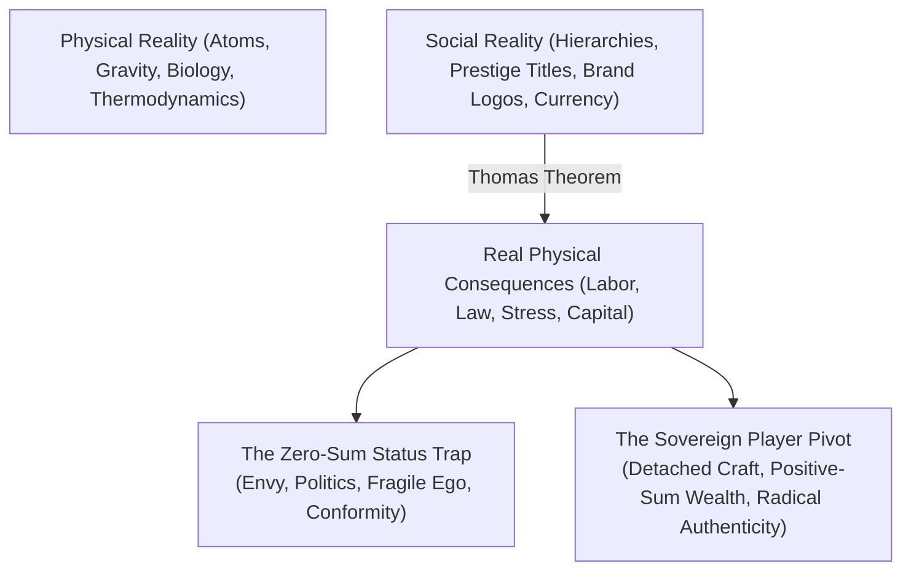
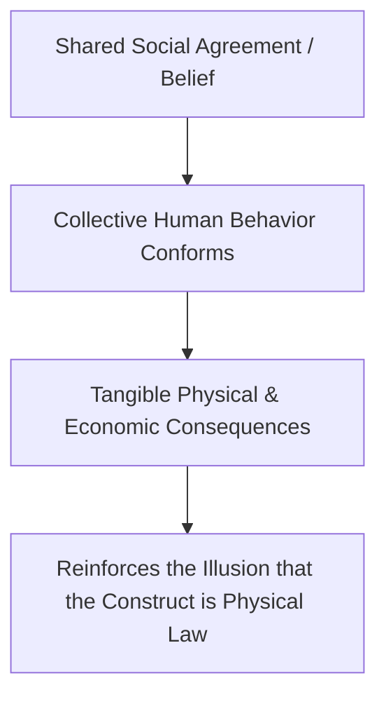
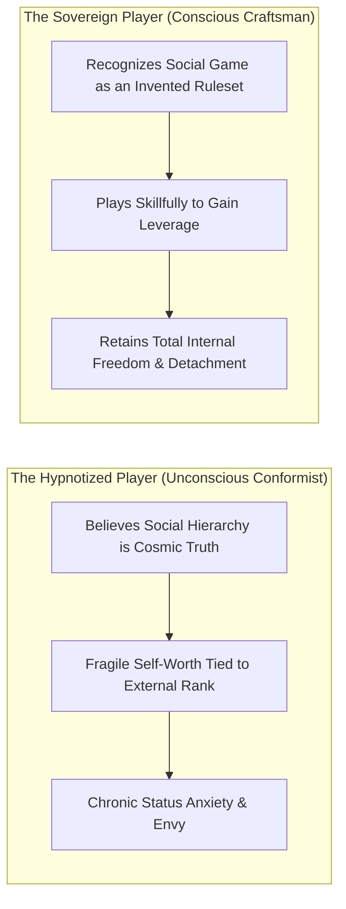
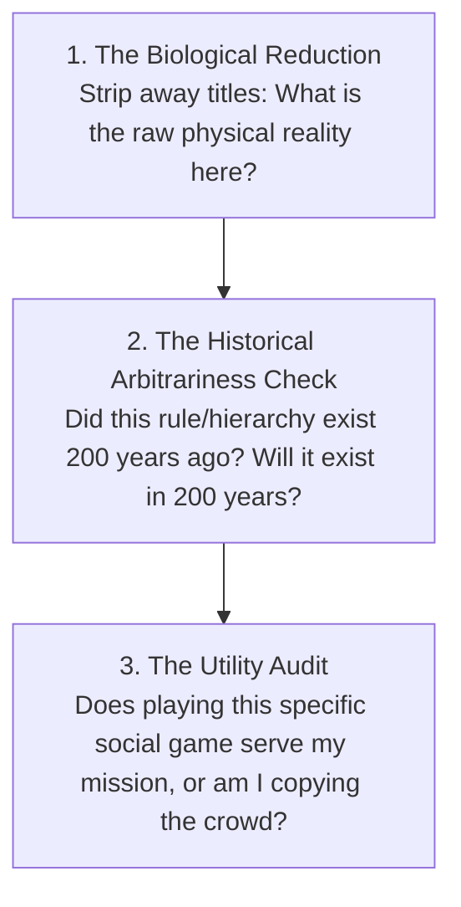
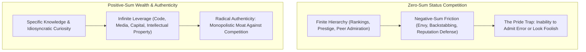
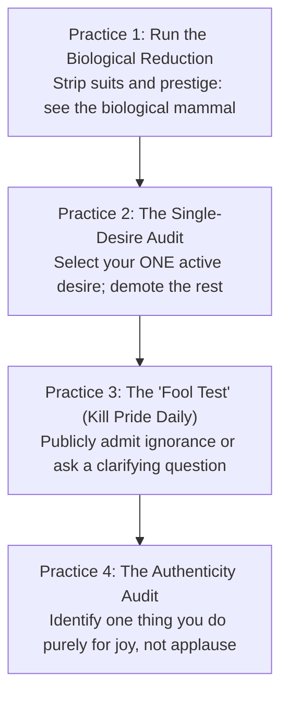

One of the most liberating cognitive breakthroughs in adulthood is the realization that **most of what human beings stress over is socially constructed**.

Physical reality consists of gravity, atoms, biology, hunger, and climate. Social reality, by contrast, consists of paper money, corporate hierarchies, prestige brands, job titles, social etiquette, and institutional ranks. These things do not exist in nature; they are **collective psychological fictions** that humans have agreed to treat as real.

When you fail to distinguish between physical reality and social reality, you become the victim of invisible social scripts. When you understand the **Social Fiction Matrix**, you acquire the ability to participate in social games effectively without ever mistaking them for ultimate truth.

---

### The Thomas Theorem: The Mechanics of Social Reality

Formulated by sociologists W.I. Thomas and Dorothy Swaine Thomas, the **Thomas Theorem** defines the operating law of human society:

> *"If human beings define situations as real, they are real in their consequences."*

* **The Currency Example**: A piece of paper currency has zero intrinsic physical value. But because millions of people share the psychological agreement that it represents purchasing power, you can exchange it for physical food and shelter. The moment collective belief collapses (hyperinflation), the paper returns to its physical reality: worthless wood pulp.
* **The Status Example**: A corporate title or luxury brand logo carries zero biological significance. Yet, because society assigns prestige to it, people endure decades of chronic stress and debt to obtain it.

---

### The Two Modes of Social Engagement

1. **The Hypnotized Player**: Takes every institutional rule, status marker, and social expectation with deadly seriousness. When they lose a job title, fail an exam, or lack a status symbol, their core identity collapses because they believe their worth *is* the social label.
2. **The Sovereign Player**: Treats human society like a strategic board game. They learn the rules, dress appropriately, communicate with high competence, and earn capital—but internally, they remain 100% detached. They know the game is an artificial construct.

---

### The Demystification Protocol: Testing Social Reality

Whenever you feel intimidated by an authority figure, an elite institution, or a high-status room, run the **3-Question Demystification Test**:

1. **The Biological Reduction**: Strip away the tailored suits, fancy titles, and mahogany desks. What remains is a biological mammal with insecurities, digestion, and a finite lifespan just like you. Intimidation evaporates when you see through the costume.
2. **The Historical Arbitrariness Check**: Most "unbreakable" social customs and career prestige ladders are less than a century old. Realizing how arbitrary they are prevents you from sacrificing your life to satisfy someone else's temporary tradition.
3. **The Utility Audit**: Never play a status game simply because everyone around you is playing it. Only engage with social games that provide direct asymmetric leverage for your true craft and family.

---

## 🏛️ Tier 1: The Jargon-Free Reality Bridge (Plain English Hook)
*Target: An intelligent 25-year-old graduate entering the corporate world or competitive social circles.*

- **The High School Cafeteria That Never Ends**: Most adults never leave high school; they just trade letterman jackets and cafeteria tables for corporate Vice President titles, luxury Swiss watches, and country club memberships. That is the **Status Game**. In every status game, the rule is brutal: *For you to be special, someone else must be ordinary. For you to win, someone else must lose.* If you spend your life fighting to sit at the "cool kids' table," you surrender your happiness to the opinions of strangers who do not care about you.
- **The Contrast with Real Wealth**: Wealth creation is completely different. When an engineer designs a clean water filter or a programmer creates software that saves a hospital 10,000 hours of labor, everyone wins. The pie gets larger. Status is about who gets credit; wealth is about creating things of genuine utility.
- **Why This Matters Today**: Social media has turned status competition into a 24/7 global gladiator arena. If you hook your self-worth to online follower counts, prestige titles, or corporate approval, you will live in perpetual envy and chronic anxiety. Freedom begins the second you realize status games are optional.

---

## 🔬 Tier 2: Modern Cognitive Science & Sociological Architecture Correlate
*Target: Grounding status dynamics in evolutionary psychology, game theory, and Naval Ravikant's philosophy of life.*

- **Game Theory of Status vs Wealth (Naval Ravikant)**:
  - *Status is an Old Evolutionary Hierarchy*: In ancestral tribes of 150 hunter-gatherers, resource allocation was determined by physical prowess and social pecking order. Status was life-or-death. In the modern industrial world, status games remain zero-sum: they do not create new goods; they merely distribute prestige.
  - *Wealth Games are Positive-Sum*: Wealth is the asset base that produces value automatically. It creates abundance. Playing positive-sum games allows long-term cooperation and compound relationships.
- **The Cognitive Tax of Pride & Identity**: Pride is cognitive rigidity. When an individual attaches their self-worth to being "the expert" or "the leader," admitting a mistake feels like an existential threat to the ego. In rapid technological shifts (such as the AI and digital revolution of 2026), the proud person defends their obsolete method, while the humble, detached learner changes their mind in 5 seconds and captures the new terrain.
- **Desire as an Unconscious Contract to Suffer**: Every desire you cultivate is an explicit promise you make to your nervous system to remain unhappy until you obtain it. When an ambitious individual juggles 15 simultaneous desires (more money, better body, higher status, more followers, peer praise), their attentional bandwidth is shredded. Naval’s rule: **Allow yourself exactly one overwhelming desire at any given moment; treat all other ambitions as secondary preferences.**
- **The Authenticity Moat (Escaping Competition)**: In traditional economic theory (Porter's Five Forces), competition erodes margins. When you copy an existing influencer, business model, or career path, you compete on pure brute-force discipline. But when you build around your genuine idiosyncrasies, authentic curiosities, and personal weirdness, you operate as a natural monopoly. Nobody can out-compete you at being you.

---

## ⚖️ Tier 3: The Skeptic’s Razor & Failure Mode Guardrails
*Target: Inoculating against cynical misanthropy, nihilistic disengagement, and social blindness.*

- **The Cynical Drop-Out Trap**: Realizing that status games are fictions does **not** mean you should become a bitter hermit, dress like a slob, or treat social etiquette with contempt. Basic manners, professional dress, and courteous communication are social lubricant. Rejecting the status game means you don't *worship* the rules; it does not give you permission to be an arrogant social wreck.
- **The "Enlightened Ego" Fallacy**: The fastest way to get trapped in a status game is to play the game of *"I am more spiritual and detached than everyone else."* Spiritual, philosophical, and minimalist status games are just as toxic and ego-driven as corporate titles. True sovereignty does not need to broadcast its detachment.
- **The Wealth-Without-Peace Paradox**: Escaping status games to accumulate money without internal peace is a lateral failure. If you obtain $10M but remain obsessed with checking other people's net worth or obsessing over peer gossip, you have merely upgraded the luxury of your prison cell.

---

## ⚡ Tier 4: The 24-Hour Behavioral Protocol ("The Homework")
*Target: The 4 Daily Practices to Neutralize Status Anxiety & Unleash Authenticity.*

1. **Practice 1: The Biological Reduction (Immediate Intimidation Antidote)**
   - *Action*: The next time you enter an intimidating room (a job interview, an executive boardroom, or a room of wealthy peers).
   - *Execution*: Silently look at the most intimidating person and mentally strip away their luxury watch, tailored suit, and title. Acknowledge: *"This is a finite biological organism whose heart is beating 70 times a minute, who has digestive issues, who fears death, and who will be dust in a blink."* Watch your autonomic nervous system instantly relax into grounded parity.
2. **Practice 2: The Single-Desire Audit**
   - *Action*: Write down everything you are currently stressing about or trying to achieve.
   - *Execution*: Pick **one single item** that is your absolute non-negotiable mission for the next 90 days (e.g., *Shipping my software prototype*). Cross out the other items and consciously make the internal declaration: *"I refuse to suffer over these other things right now. They are secondary preferences, not requirements for my peace."*
3. **Practice 3: The "Fool Test" (Vaccinate Against Pride)**
   - *Action*: In your next meeting or conversation, find an opportunity where you do not 100% understand a term, acronym, or concept.
   - *Execution*: Instead of nodding along to look smart, look the speaker in the eye and say: *"I'm unfamiliar with that concept—could you explain what you mean?"* Feel the micro-flinch of pride in your chest, and let it dissolve. You trade a 5-second hit to your vanity for permanent intellectual competence.
4. **Practice 4: The Authenticity Audit (Escape the Mimetic Trap)**
   - *Action*: Audit your weekly calendar and pastimes.
   - *Execution*: Identify one activity you engage in purely because it impresses other people or looks good on a resume, and **eliminate it**. Replace it with an activity or topic you would pursue obsessively even if you were forbidden from ever telling another human being about it. That is your specific knowledge baseline.

---

### The Core Takeaway to Remember
> Social hierarchies and status ladders are artificial games designed to keep mammals competing in zero-sum loops. Recognize the matrix, play with high skill when necessary, but keep your soul completely untethered. True freedom is playing positive-sum games, cultivating radical authenticity that eliminates competition, and keeping your inner peace sovereign from the applause or boos of the crowd.
