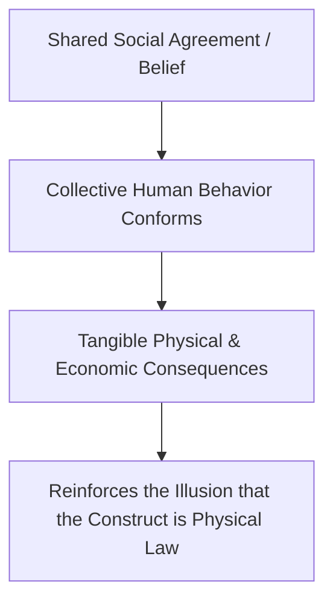
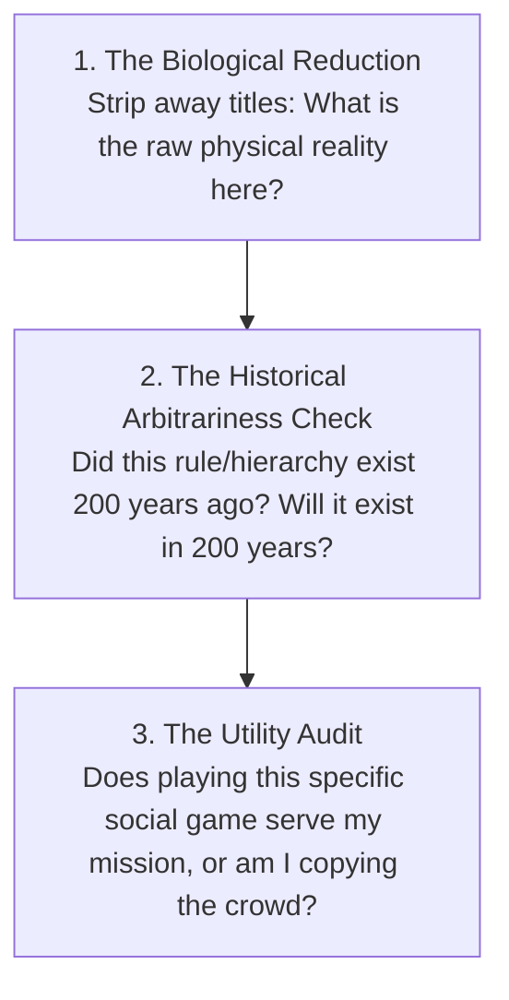

One of the most liberating cognitive breakthroughs in adulthood is the realization that **most of what human beings stress over is socially constructed**.

Physical reality consists of gravity, atoms, biology, hunger, and climate. Social reality, by contrast, consists of paper money, corporate hierarchies, prestige brands, job titles, social etiquette, and institutional ranks. These things do not exist in nature; they are **collective psychological fictions** that humans have agreed to treat as real.

When you fail to distinguish between physical reality and social reality, you become the victim of invisible social scripts. When you understand the **Social Fiction Matrix**, you acquire the ability to participate in social games effectively without ever mistaking them for ultimate truth.

---

### The Thomas Theorem: The Mechanics of Social Reality

Formulated by sociologists W.I. Thomas and Dorothy Swaine Thomas, the **Thomas Theorem** defines the operating law of human society:

> *"If human beings define situations as real, they are real in their consequences."*



* **The Currency Example**: A piece of paper currency has zero intrinsic physical value. But because millions of people share the psychological agreement that it represents purchasing power, you can exchange it for physical food and shelter. The moment collective belief collapses (hyperinflation), the paper returns to its physical reality: worthless wood pulp.
* **The Status Example**: A corporate title or luxury brand logo carries zero biological significance. Yet, because society assigns prestige to it, people endure decades of chronic stress and debt to obtain it.

---

### The Two Modes of Social Engagement

```mermaid
graph LR
    subgraph The Hypnotized Player (Unconscious Conformist)
        H1[Believes Social Hierarchy is Cosmic Truth]
        --> H2[Fragile Self-Worth Tied to External Rank]
        --> H3[Chronic Status Anxiety & Envy]
    end

    subgraph The Sovereign Player (Conscious Craftsman)
        S1[Recognizes Social Game as an Invented Ruleset]
        --> S2[Plays Skillfully to Gain Leverage]
        --> S3[Retains Total Internal Freedom & Detachment]
    end
```

1. **The Hypnotized Player**: Takes every institutional rule, status marker, and social expectation with deadly seriousness. When they lose a job title, fail an exam, or lack a status symbol, their core identity collapses because they believe their worth *is* the social label.
2. **The Sovereign Player**: Treats human society like a strategic board game. They learn the rules, dress appropriately, communicate with high competence, and earn capital—but internally, they remain 100% detached. They know the game is an artificial construct.

---

### The Demystification Protocol: Testing Social Reality

Whenever you feel intimidated by an authority figure, an elite institution, or a high-status room, run the **3-Question Demystification Test**:



1. **The Biological Reduction**: Strip away the tailored suits, fancy titles, and mahogany desks. What remains is a biological mammal with insecurities, digestion, and a finite lifespan just like you. Intimidation evaporates when you see through the costume.
2. **The Historical Arbitrariness Check**: Most "unbreakable" social customs and career prestige ladders are less than a century old. Realizing how arbitrary they are prevents you from sacrificing your life to satisfy someone else's temporary tradition.
3. **The Utility Audit**: Never play a status game simply because everyone around you is playing it. Only engage with social games that provide direct asymmetric leverage for your true craft and family.

---

### The Core Takeaway to Remember
> Social hierarchies, corporate titles, and prestige symbols are shared human fictions, not laws of physics. Learn their mechanics, respect their real-world consequences, and play the game skillfully—but never surrender your inner sovereignty to a game invented by someone else.
