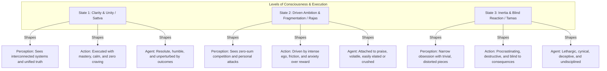
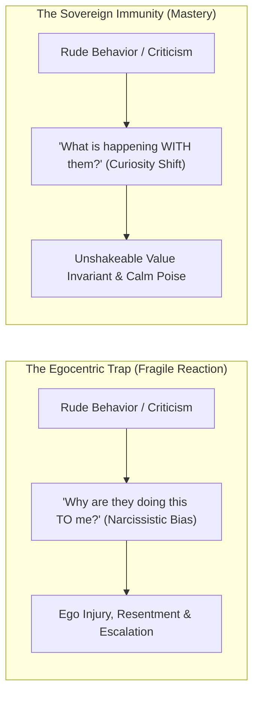
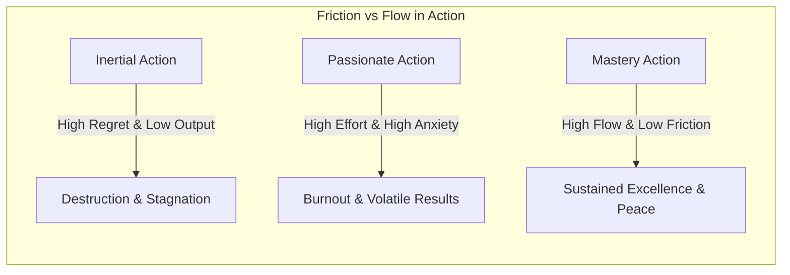
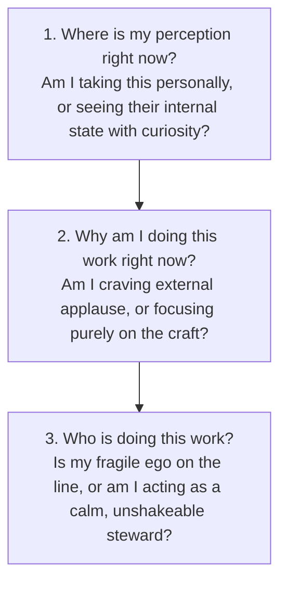

Every human endeavor—whether building a life's work, solving a difficult problem, or navigating interpersonal friction—is shaped by three fundamental internal variables:
1. **The Lens of Perception (How you see reality & interpret others)**
2. **The Nature of Action (How you execute your work)**
3. **The Identity of the Agent (Who you believe you are while doing it)**

Ancient analytical psychology (*Sānkhya*) and modern cognitive science converge on this truth: **your emotional peace is dictated not by external events or opinions, but by the state of your perception**.

When you master the **Three Modes of Execution** and cultivate **Existential Immunity (Not Taking Things Personally)**, you liberate yourself from outcome anxiety, dismantle defensiveness, and maintain supreme emotional equilibrium under any storm.

---

### The 3×3 Architecture of Human Execution

---

### Existential Immunity: The Psychology of Not Taking Things Personally

#### 1. The Egocentric Bias ("It Is Not About You")
* The human brain has an evolutionary flaw: it naturally centers itself in every external event. When someone is short-tempered, cold, or dismissive, we immediately invent a story: *"They don't respect me; they are attacking my worth."*
* **The Reality**: **95% of how people treat you is a direct projection of their internal state**—their private exhaustion, unresolved trauma, work stress, or hidden fears. It is an expression of their reality, not yours.

#### 2. The Inherent Value Invariant (The €20 Bill Metaphor)
* Take a pristine €20 note. If you crumple it, throw it on the ground, or stomp on it in the dirt, it does not lose a single cent of its value. You can still buy the exact same goods with it.
* **Your intrinsic worth as a sovereign human being is absolute.** Insults, online criticism, or unfair rejections are merely external mud thrown at the bill; they have zero mathematical power to diminish your inherent worth.

#### 3. The "Enemy Within" Law (Why Words Hurt)
* If a stranger walks up to you and calls you an alien with green scales, you do not feel insulted; you laugh, because you know with 100% certainty that it is absurd.
* An insult or critique only stings when **there is an unhealed doubt inside yourself that secretly fears the accusation is true**.
* **The Master Law**: *When there is no enemy within, no enemy outside can harm you.* Heal internal insecurities through undeniable daily execution, and external hostility loses all traction.

---

### Level 1: The Three Lenses of Knowledge (How You See)

The quality of your execution can never exceed the quality of your perception:

#### 1. The Fragmented Lens (Inertia)
* Clinging dogmatically to one isolated fragment of reality as if it were the whole truth, ignoring logic, context, or wider systemic factors.

#### 2. The Transactional Lens (Reactive Passion)
* Viewing the world strictly through divisions, zero-sum competition, and personal insults.

#### 3. The Unified Systems Lens (Pure Clarity)
* Seeing the underlying unity beneath surface diversity. Recognizing that people's outbursts are reflections of their suffering, and viewing challenges through objective systems thinking.

---

### Level 2: The Three Qualities of Action (How You Work)

1. **Inertial Action**: Work done haphazardly without regard for long-term consequences. Characterized by chronic procrastination and avoidance of difficult truths.
2. **Passionate Action**: Work undertaken with heavy craving for applause and validation. Produces short bursts followed inevitably by deep burnout and anxiety.
3. **Mastery Action**: Work performed as a matter of duty and craft, free from emotional attachment to the fruit, executed without resentment or frantic desire.

---

### Level 3: The Three Archetypes of the Doer (Who You Are)

| Dimension | The Inertial Doer | The Reactive / Passionate Doer | The Self-Mastered Doer |
| :--- | :--- | :--- | :--- |
| **Motivation** | Avoidance, fear, lethargy | Validation, greed, triumph over rivals | Dedication to duty, truth, and craft |
| **Response to Praise/Insult** | Indifference or cynicism | Volatile; elation on praise, fury on insult | Unmoved; anchors in inherent value |
| **Response to Failure** | Blame, victimhood, depression | Rage, acute anxiety, self-pity | Objective reflection & immediate calibration |
| **Work Ethic** | Chronic delay, undisciplined | Frenetic, chaotic, over-straining | Steady, cheerful, resolute, unshakeable |

---

### How to Apply the Framework Daily (The Diagnostic Pivot)

Whenever you find yourself stressed, offended, or emotionally reactive, run this **3-Question Diagnostic Pivot**:

---

---

### The Naval Ravikant Execution Synthesis: In the Arena, Cult-Like Teams & Selling the Truth

Naval bridges ancient Stoic perception directly into modern high-stakes technological and entrepreneurial warfare:

```mermaid
flowchart TD
    subgraph Mindset["The Mindset of Sovereign Agency"]
        A1["Encounter Failure or Setback"] --> A2["Blame Yourself 100% (Preserve Complete Agency)"]
        A2 --> A3["Direct Arena Feedback (Theory Dies, Reality Tests)"]
    end

    subgraph Assembly["The Team & Product Engine"]
        T1["Recruit Geniuses Only (Extreme Talent Density)"]
        T2["Cult-Like Insular Focus (Throw Away 80% of Code)"]
        T3["Build Hard-to-Vary Products"]
        T1 --> T2 --> T3
    end

    subgraph Interface["The Commercial Reality"]
        S1["Sell the Truth (Reject Hype & Manipulation)"]
        S2["Charisma = Confidence + Love"]
        S3["Nonlinear Compounding Credibility"]
        S1 --> S2 --> S3
    end
```

1. **Life Is Lived in the Arena (Preserving Sovereign Agency)**: The spectator critiques from the stands with borrowed theories, but reality only reveals itself to those in the arena. When a project crashes, the victim looks for someone to blame (the economy, teammates, competitors) and thereby surrenders power. The sovereign operator blames themselves 100%: *"I chose the partners, I designed the timeline, I misjudged the risk."* By taking responsibility for everything, you retain total agency to change anything.
2. **Hard-to-Vary Products & Simplification by Elimination**: Great products are not created by adding features; they are discovered by stripping away everything that isn't essential until what remains is **hard to vary**. Elite teams throw away far more product code, designs, and features than they keep. If a feature can be removed without collapsing the core value proposition, it was bloat.
3. **On Recruiting: The Cult-Like Small Team**: Conventional management believes that hiring 500 people makes a company ten times stronger than hiring 50. Naval and Silicon Valley history prove the opposite: a small team of 5 to 10 obsessive geniuses operating with cult-like intensity, shared taste, and zero bureaucratic friction routinely outperforms legacy corporations. The best only want to work with the best; compromising on talent density is fatal.
4. **Sell the Truth (Charisma as Confidence + Love)**: In a hyper-connected world where information is free, salesmanship based on persuasion gimmicks or deceptive hype collapses into negative reputational debt. The only sustainable strategy is to **sell the truth**: find an undeniable reality, build an extraordinary product, and explain it with radical transparency. Combine unshakeable internal confidence with authentic love for the people you serve, and your credibility will compound nonlinearly.

---
### The Core Takeaway to Remember
> You cannot control the opinions, outbursts, or storms of the outside world, but you hold complete sovereignty over the vessel of your mind. Remember that other people's behavior is a reflection of their storm, your intrinsic value cannot be crumpled by external noise, and when there is no enemy within, no enemy outside can touch your peace.
