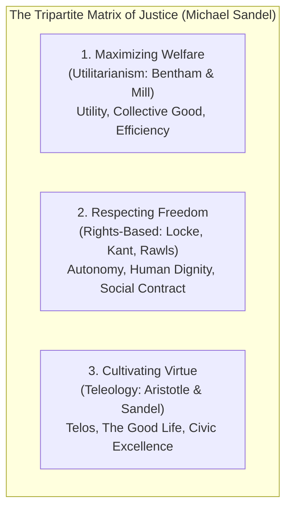

Justice is the foundation of institutional legitimacy. Throughout philosophical history, debates on justice divide into three competing paradigms:

---

### The Three Paradigms

#### 1. Welfare & Utilitarianism
* **Jeremy Bentham**: The right action maximizes pleasure and minimizes pain. Every pleasure is quantitatively equal (*"Push-pin is as good as poetry"*).
* **The Fatal Flaw**: The Tyranny of the Majority (e.g., throwing Christians to the lions in the Roman Coliseum for the crowd's pleasure; torture of a terrorist's innocent child to extract coordinates).
* **John Stuart Mill’s Revision**: Distinguished higher pleasures from lower ones (*"Better to be Socrates dissatisfied than a fool satisfied"*), attempting to anchor human dignity in long-term societal utility.

#### 2. Freedom, Rights & Autonomy
* **Libertarianism (Nozick)**: Self-ownership. Redistributive taxation is morally equivalent to forced labor.
* **Immanuel Kant**: Moral worth comes strictly from the **Motive of Duty**. You act autonomously only when you act according to laws you give yourself through pure practical reason—the **Categorical Imperative** (Act only on maxims that can be universalized; never treat persons as mere instruments).
* **John Rawls**: Justice as Fairness. Under the **Veil of Ignorance**, we would structure society to protect the vulnerable through the Difference Principle.

#### 3. Virtue, Telos & The Common Good
* **Aristotle**: To distribute goods fairly, understand their **Telos** (purpose). Who should get the finest flutes? Not the richest or most powerful, but the best flute players, because that is what flutes are for.
* **The Modern Synthesis**: A purely neutral procedural state is impossible. Meaningful justice must address character, civic friendship, and mutual solidarity.
