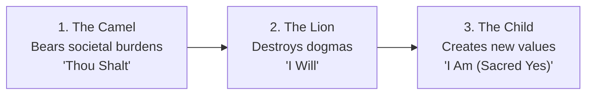

Nietzsche’s philosophy is an intellectual hammer designed to test the hollow idols of human culture:

---

### Core Nietzschean Frameworks

#### 1. The Will to Power (*Der Wille zur Macht*)
Life is not driven merely by the *Will to Live* (Schopenhauer) or *Survival* (Darwin). All living entities seek to overcome resistance, discharge vitality, and impose creative form upon chaos. The highest expression is **Sublimation**: channeling primal drives into artistic mastery, physical discipline, and intellectual creation.

#### 2. Master Morality vs. Slave Morality
* **Master Morality**: Originates among the strong and generative. Good = noble, courageous, powerful; Bad = petty, cowardly, deceitful.
* **Slave Morality**: Originates in oppressed envy (*Ressentiment*). Inverts strength into "evil" and weakness into "holy virtue" (poverty = purity, cowardice = peace).

#### 3. The Eternal Recurrence (*Die ewige Wiederkunft*)
The ultimate psychological litmus test: If a demon declared you must relive this exact life, with every tear, triumph, and mistake, for an infinite cycle—would you curse the demon or worship it? To say yes is to achieve **Amor Fati** (unconditional love of one's destiny).
