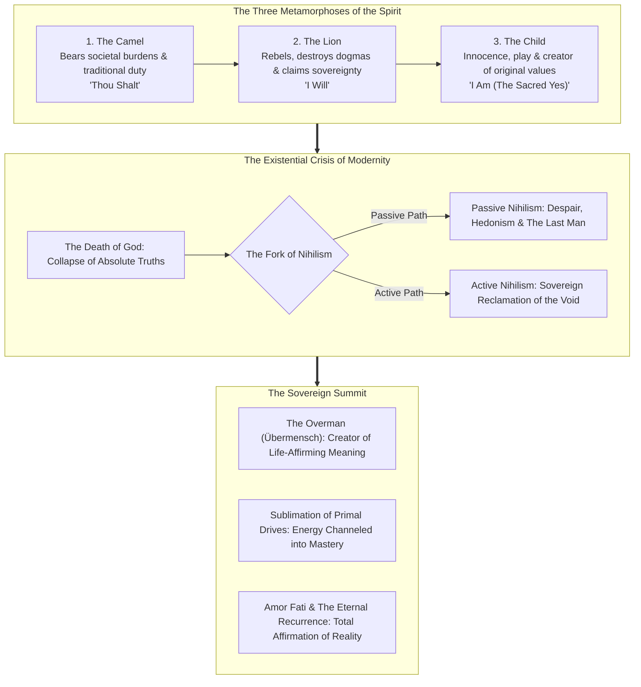
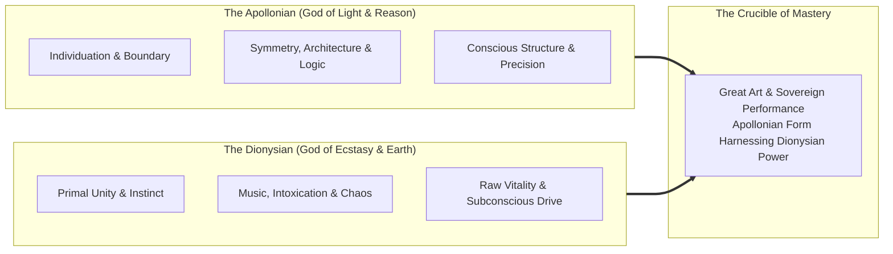
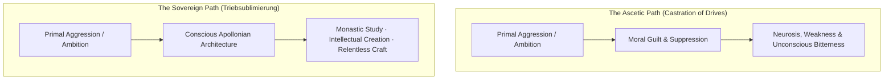

Nietzsche’s philosophy is an intellectual hammer designed to test the hollow idols of human culture. He did not write comfort literature; he wrote an existential obstacle course for sovereign minds who refuse the tranquilizer of consensus mediocrity.

---

### The Architecture of the Spirit: Beyond the Herd

#### 1. The Three Metamorphoses (*Die drei Verwandlungen*)
In *Thus Spoke Zarathustra*, Nietzsche outlines the three developmental thresholds required to transcend inherited conditioning:
* **The Camel**: The beast of burden. It voluntarily kneels to receive the heaviest loads of society—tradition, religious dogmas, parental expectations, and academic consensus. It carries this weight into the desolate desert. You cannot skip the Camel stage: true rebellion without rigorous mastery of foundational knowledge is merely shallow arrogance.
* **The Lion**: In the loneliness of the desert, the Camel encounters the Great Dragon whose scales glitter with *"Thou Shalt"*. To survive, the Camel transforms into the Lion. The Lion’s purpose is to roar the **Sacred "No"** (*Unheiliges Nein*), destroying the Dragon's moral monopoly and winning the freedom to create new possibilities.
* **The Child**: The Lion can destroy, but it cannot create. Rage and defiance remain tethered to the enemy they fight. The spirit must make its final leap into the Child: an innocent, forgetting, new beginning, a self-rolling wheel, and the **Sacred "Yes"**. The Child does not create out of spite; it creates out of pure generative joy.

#### 2. The Apollonian vs. Dionysian Dialectic
In *The Birth of Tragedy*, Nietzsche discovered that ancient Greek culture achieved civilizational supremacy because it refused to divorce human rationality from instinct:

* **The Pathology of Pure Apollo**: When a society or student relies solely on cold logic, hyper-analysis, and sterile routine, the spirit suffocates. The intellect becomes a museum of dead facts without vitality.
* **The Pathology of Pure Dionysus**: Unbounded emotional surrender, chaotic impulse, and undisciplined passion lead to self-destruction and manic instability.
* **The Sovereign Synthesis**: Peak intellectual and creative mastery occurs when **rigid Apollonian discipline channels ferocious Dionysian fire**.

#### 3. The Death of God & The Two Nihilisms
Nietzsche's famous proclamation—*"God is dead, and we have killed him"*—was not a triumphant atheistic cheer; it was a **catastrophic diagnostic warning**.
* **The Crisis of Absolutes**: The Enlightenment destroyed belief in cosmic design and objective moral facts. Without a supernatural foundation, European civilization faced an abyss of meaninglessness.
* **Passive Nihilism**: The response of the exhausted mind. Unable to find pre-packaged cosmic meaning, the passive nihilist surrenders to apathy, cynicism, escapism, and the pursuit of petty pleasures.
* **The Last Man (*Der Letzte Mensch*)**: The terminal symptom of passive nihilism. The Last Man wants nothing more than comfort, warmth, entertainment, and safety. He eliminates all risk, medicates every ache, despises exceptionalism, and asks with a blink: *"What is love? What is creation? What is a star?"*
* **Active Nihilism**: The weapon of the strong. The active nihilist views the destruction of objective meaning not as a tragedy, but as **the ultimate liberation**. If the universe provides no script, you are not a bound actor; you are the sovereign author of your own values, discipline, and purpose.

---

### The Mechanics of Power & Moral Deconstruction

#### 4. The Will to Power (*Der Wille zur Macht*)
Nietzsche rejected Schopenhauer's passive "Will to Live" and Darwin's purely reactive "Survival of the Fittest":
> *"Physiologists should think twice before postulating the drive for self-preservation as the cardinal drive in an organic being. A living thing desires above all to vent its strength—life as such is will to power."*

* **The Fundamental Mechanism**: Every cell, organism, and mind seeks to overcome resistance, grow in capacity, and project its form onto reality.
* **Sublimation (*Triebsublimierung*) Over Repression**:
  * Weak, puritanical systems fear strong passions (rage, ambition, eros) and attempt to castrate them through guilt.
  * The sovereign performer practices **Sublimation**: taking chaotic, primal drives and redirecting their vector into supreme physical conditioning, rigorous study endurance, creative output, and iron self-command.

#### 5. Master Morality vs. Slave Morality & *Ressentiment*
In *On the Genealogy of Morality*, Nietzsche performed an archaeological dissection of human moral systems:

| Dimension | Master Morality (Noble / Active) | Slave Morality (Herd / Reactive) |
| :--- | :--- | :--- |
| **Origin Point** | Self-affirmation (*"I am noble, therefore what I do is good"*) | Reactive opposition (*"You are powerful, therefore you are evil"*) |
| **Primary Antithesis** | Good vs. Bad (Nobility vs. Baseness) | Good vs. Evil (Holy Impotence vs. Sinful Strength) |
| **Psychological Engine** | Direct vitality, generosity, pride, courage | *Ressentiment* (simmering, repressed envy and revenge) |
| **View of Suffering** | Necessary crucible for growth and distinction | An injustice that must be pitied, compensated, or abolished |
| **View of Weakness** | An unfortunate defect to be overcome through exertion | A holy virtue (*"Blessed are the meek"*) |

* **The Pathology of *Ressentiment***: When an individual lacks the strength to achieve excellence or dominate their circumstances, they invent a psychological defense mechanism: they demonize strength, ambition, and achievement as "arrogant" or "corrupt", while canonizing their own helplessness, cowardice, and poverty as "morality".

#### 6. Perspectivism & The Deconstruction of "Truth"
> *"There are no facts, only interpretations."*

* Nietzsche attacked the philosophical conceit of a "disinterested, objective truth". Every philosophy is an involuntary memoir of its creator's physiology and desires.
* **The Practical Utility**: Instead of asking *"Is this theory objectively, cosmically true?"*, the pragmatic operator asks: *"What type of life does this belief cultivate? Does holding this belief make me stronger, sharper, and more sovereign, or does it make me timid, reactive, and weak?"*

---

### The Sovereign Summit: The Ultimate Affirmation

#### 7. The Eternal Recurrence (*Die ewige Wiederkunft*)
In *The Gay Science*, Nietzsche presents the heaviest cognitive burden ever conceived:
> *"What if some day or night a demon were to steal after you into your loneliest loneliness and say to you: 'This life as you now live it and have lived it, you will have to live once more and innumerable times more; and there will be nothing new in it, but every pain and every joy and every thought and sigh and everything unutterably small or great in your life will have to return to you, all in the same succession and sequence...' Would you not throw yourself down and gnash your teeth and curse the demon who spoke thus? Or have you once experienced a tremendous moment when you would have answered him: 'You are a god and never have I heard anything more divine!'"*

* **The Function**: The Eternal Recurrence is not physics; it is the **ultimate existential mirror**.
* **The Question**: If every single minute of your daily schedule, every compromise, every hour of scrolling, every failure, and every triumph were frozen and repeated on an infinite loop for all eternity—could you celebrate it?
* **Amor Fati (Love of Fate)**: To pass the Demon's test requires **Amor Fati**:
  > *"My formula for greatness in a human being is amor fati: that one wants nothing to be different, not forward, not backward, not in all eternity. Not merely bear what is necessary, still less conceal it... but love it."*

---

### The Core Takeaway to Remember
> Man is not a finished monument to be preserved in comfortable safety; man is a bridge to be surpassed. Slay the dragon of consensus dogma, harness your darkest primal drives into pristine creative discipline, and live with such ferocious, unconditional devotion that you would gladly celebrate reliving your exact life an infinite number of times.
